# Big-Market 大营销平台 · 全量文档整合

> 本文档由项目学习 Agent 自动生成的所有文档整合而成，涵盖项目学习指南、学习笔记、面试准备、数据库分析、业务流程解析及接口走读解析，供一站式查阅。

> 生成日期：2026-03-31

---

## 目录

1. [项目学习指南（PROJECT_GUIDE）](#一项目学习指南)
2. [全量代码学习笔记（LEARNING_NOTES）](#二全量代码学习笔记)
3. [简历与面试准备指南（INTERVIEW_GUIDE）](#三简历与面试准备指南)
4. [面试深度准备手册（docs/interview-prep）](#四面试深度准备手册)
5. [项目全量遍历学习总结（docs/learning-summary）](#五项目全量遍历学习总结)
6. [数据库结构全面分析（docs/db-analysis）](#六数据库结构全面分析)
7. [业务流程解析（docs/01-业务流程解析）](#七业务流程解析)
   - 7.1 [总览](#71-总览)
   - 7.2 [策略装配](#72-策略装配)
   - 7.3 [抽奖计算](#73-抽奖计算)
   - 7.4 [规则引擎](#74-规则引擎)
   - 7.5 [库存管理](#75-库存管理)
   - 7.6 [订单发奖](#76-订单发奖)
   - 7.7 [行为返利](#77-行为返利)
   - 7.8 [积分账户](#78-积分账户)
8. [URL 走读解析（docs/02-URL走读解析）](#八url-走读解析)
   - 8.1 [总览](#81-总览)
   - 8.2 [抽奖策略接口](#82-抽奖策略接口)
   - 8.3 [抽奖活动接口](#83-抽奖活动接口)
   - 8.4 [运营管理接口](#84-运营管理接口)
   - 8.5 [配置中心接口](#85-配置中心接口)

---

## 一、项目学习指南

> *来源文件：PROJECT_GUIDE.md*

# Big-Market 大营销平台学习指南

> 作者：bugstack.cn @小傅哥  
> 文档整理：项目学习向导  
> 描述：本文档对 `big-market` 项目进行系统性梳理，涵盖各模块功能、设计思路、代码入口及主要流程走向，适合按模块逐步深入学习。

---

## 目录

1. [项目总体介绍](#1-项目总体介绍)
2. [工程模块结构](#2-工程模块结构)
3. [模块一：big-market-types（公共类型层）](#3-模块一big-market-types公共类型层)
4. [模块二：big-market-api（接口定义层）](#4-模块二big-market-api接口定义层)
5. [模块三：big-market-domain（领域层）](#5-模块三big-market-domain领域层)
   - [5.1 策略领域（strategy）](#51-策略领域strategy)
   - [5.2 活动领域（activity）](#52-活动领域activity)
   - [5.3 奖品领域（award）](#53-奖品领域award)
   - [5.4 积分领域（credit）](#54-积分领域credit)
   - [5.5 返利领域（rebate）](#55-返利领域rebate)
   - [5.6 任务领域（task）](#56-任务领域task)
   - [5.7 鉴权领域（auth）](#57-鉴权领域auth)
6. [模块四：big-market-infrastructure（基础设施层）](#6-模块四big-market-infrastructure基础设施层)
7. [模块五：big-market-trigger（触发器层）](#7-模块五big-market-trigger触发器层)
8. [模块六：big-market-querys（查询层）](#8-模块六big-market-querys查询层)
9. [模块七：big-market-app（应用启动层）](#9-模块七big-market-app应用启动层)
10. [核心流程走向](#10-核心流程走向)
    - [10.1 抽奖主流程](#101-抽奖主流程)
    - [10.2 活动下单充值流程](#102-活动下单充值流程)
    - [10.3 行为返利流程](#103-行为返利流程)
    - [10.4 奖品发放流程](#104-奖品发放流程)
    - [10.5 积分兑换抽奖次数流程](#105-积分兑换抽奖次数流程)
11. [设计亮点总结](#11-设计亮点总结)
12. [技术栈一览](#12-技术栈一览)

---

## 1. 项目总体介绍

`big-market` 是一个以 **DDD（领域驱动设计）** 为核心架构的大型营销抽奖平台，集成了抽奖策略、活动管理、奖品发放、积分体系、行为返利等完整业务链路。

**核心业务链路：**
```
用户行为（签到/支付）→ 返利 → 积分 → 购买抽奖次数 → 参与活动 → 抽奖 → 奖品发放
```

**整体架构图（分层）：**
```
┌──────────────────────────────────────────────────┐
│             big-market-trigger（触发器层）          │
│  HTTP Controller / MQ Listener / XxlJob / RPC    │
├──────────────────────────────────────────────────┤
│             big-market-domain（领域层）             │
│  strategy / activity / award / credit / rebate / │
│               task / auth                         │
├──────────────────────────────────────────────────┤
│         big-market-infrastructure（基础设施层）      │
│   Repository实现 / DAO / Redis / MQ / ES / RPC   │
├──────────────────────────────────────────────────┤
│   big-market-types   │   big-market-api           │
│   (公共类型/注解/枚举)  │  (接口定义/DTO)            │
└──────────────────────────────────────────────────┘
```

---

## 2. 工程模块结构

```
big-market/
├── big-market-api            # 对外接口定义（接口 + DTO）
├── big-market-app            # Spring Boot 启动入口、全局配置、AOP
├── big-market-domain         # 领域层（DDD 核心，业务逻辑全部在此）
├── big-market-infrastructure # 基础设施层（数据库、Redis、MQ、ES 实现）
├── big-market-trigger        # 触发器层（HTTP、Job、MQ消费、Dubbo RPC）
├── big-market-querys         # 查询服务（ElasticSearch 数据查询）
└── big-market-types          # 公共类型（注解、枚举、异常、事件基类）
```

---

## 3. 模块一：big-market-types（公共类型层）

### 功能说明
提供全工程通用的基础类型定义，包括注解、枚举、异常、事件基类等，无业务逻辑。

### 目录结构
```
big-market-types/
└── cn/bugstack/types/
    ├── annotations/
    │   ├── DCCValue.java                  # 动态配置中心注解（绑定 Zookeeper 配置）
    │   └── RateLimiterAccessInterceptor.java  # 限流拦截器注解
    ├── common/
    │   └── Constants.java                 # 全局常量（分隔符等）
    ├── enums/
    │   └── ResponseCode.java              # 统一响应码枚举
    ├── event/
    │   └── BaseEvent.java                 # MQ 事件消息基类
    └── exception/
        └── AppException.java              # 自定义业务异常
```

### 设计亮点
- **`@DCCValue`** 注解：标注在字段上后，`DCCValueBeanFactory` 会自动从 Zookeeper 读取配置并注入，支持动态刷新，无需重启服务。
- **`BaseEvent<T>`** 泛型事件：统一了所有 MQ 事件消息格式，含消息 ID、时间戳和泛型数据体，便于反序列化和幂等处理。

---

## 4. 模块二：big-market-api（接口定义层）

### 功能说明
定义所有对外暴露的接口（HTTP 接口 + Dubbo RPC 接口）及其请求/响应 DTO，不包含任何实现。

### 目录结构
```
big-market-api/
└── cn/bugstack/trigger/api/
    ├── IDCCService.java              # 动态配置中心接口
    ├── IErpOperateService.java       # ERP 运营管理接口
    ├── IRaffleActivityService.java   # 抽奖活动接口（核心）
    ├── IRaffleStrategyService.java   # 抽奖策略接口
    ├── IRebateService.java           # 返利服务接口（Dubbo RPC）
    ├── dto/                          # 请求/响应 DTO
    │   ├── ActivityDrawRequestDTO    # 抽奖请求
    │   ├── ActivityDrawResponseDTO   # 抽奖响应
    │   ├── RaffleAwardListRequestDTO # 查询奖品列表请求
    │   ├── SkuProductResponseDTO     # SKU商品响应
    │   └── ...
    ├── request/Request.java          # Dubbo RPC 通用请求包装（含 appId/appToken）
    └── response/Response.java        # 统一响应结构（code + info + data）
```

### 关键接口说明

| 接口 | 主要方法 | 说明 |
|------|----------|------|
| `IRaffleActivityService` | `armory`, `draw`, `calendarSignRebate`, `isCalendarSignRebate`, `queryUserActivityAccount`, `creditPayExchangeSku` | 活动抽奖全流程接口 |
| `IRaffleStrategyService` | `strategyArmory`, `randomRaffle`, `queryRaffleAwardList`, `queryRaffleStrategyRuleWeight` | 策略装配与抽奖接口 |
| `IRebateService` | `rebate` | 返利服务 Dubbo RPC 接口 |
| `IDCCService` | `updateConfig` | 动态配置修改接口 |
| `IErpOperateService` | `queryUserRaffleOrder`, `queryStageActivityList`, `updateStageActivity2Active` | 运营后台接口 |

---

## 5. 模块三：big-market-domain（领域层）

领域层是整个项目的**核心**，采用 DDD 分包，每个领域都遵循统一的内部结构：

```
domain/<领域名>/
├── adapter/
│   ├── event/          # 领域事件定义（MQ 消息 Topic 和消息体）
│   ├── repository/     # 仓储接口（domain 只依赖接口，不依赖实现）
│   └── port/           # 外部服务端口（调用第三方服务）
├── model/
│   ├── aggregate/      # 聚合对象（跨实体的事务边界）
│   ├── entity/         # 实体（有业务标识）
│   └── valobj/         # 值对象（无标识，不可变）
└── service/            # 领域服务（业务逻辑）
```

---

### 5.1 策略领域（strategy）

**代码路径：** `big-market-domain/src/main/java/cn/bugstack/domain/strategy/`

#### 功能说明
策略领域负责**抽奖概率计算**和**规则过滤**，是整个平台最核心的算法模块。

#### 核心服务接口

| 接口 | 实现类 | 功能 |
|------|--------|------|
| `IStrategyArmory` | `StrategyArmoryDispatch` | 策略装配（预热数据到 Redis）|
| `IStrategyDispatch` | `StrategyArmoryDispatch` | 策略抽奖调度（随机获取奖品）|
| `IRaffleStrategy` | `DefaultRaffleStrategy` | 执行抽奖（责任链 + 决策树）|
| `IRaffleAward` | `DefaultRaffleStrategy` | 查询奖品信息 |
| `IRaffleRule` | `DefaultRaffleStrategy` | 查询规则配置 |
| `IRaffleStock` | `DefaultRaffleStrategy` | 奖品库存管理 |

#### 模块设计

**（1）策略装配（Armory）**

> **代码入口：** `StrategyArmoryDispatch#assembleLotteryStrategy(Long strategyId)`

**流程：**
```
assembleLotteryStrategy(strategyId)
  → 查询策略奖品列表 (IStrategyRepository#queryStrategyAwardList)
  → 计算概率范围（最小精度至小数点后几位）
  → 调用算法装配（IAlgorithm#armoryAlgorithm）
       ├── O1Algorithm：构建概率查找表存入 Redis Hash
       └── OLogNAlgorithm：构建区间数组 + 多线程分段处理存入 Redis
  → 查询权重规则，对每个权重段额外装配概率表
```

**抽奖算法选择：**
```
AbstractAlgorithm.Algorithm 枚举
  ├── O1     → O1Algorithm   → O(1) 空间换时间，Hash 直接命中
  └── OLogN  → OLogNAlgorithm → O(logN) 区间二分查找，多线程装配
```

**（2）抽奖执行（Raffle）**

> **代码入口：** `AbstractRaffleStrategy#performRaffle(RaffleFactorEntity)`
> 
> **实现类：** `DefaultRaffleStrategy`

**流程（模板方法模式）：**
```
performRaffle(raffleFactorEntity)
  Step 1: 参数校验（userId、strategyId 非空）
  Step 2: 责任链抽奖 raffleLogicChain(userId, strategyId)
          ├── BlackListLogicChain  → 黑名单直接返回兜底奖品
          ├── RuleWeightLogicChain → 按权重区间抽奖
          └── DefaultLogicChain   → 默认随机抽奖（strategyDispatch.getRandomAwardId）
  Step 3: 如果责任链命中非默认逻辑，直接返回
  Step 4: 决策树过滤 raffleLogicTree(userId, strategyId, awardId, endDateTime)
          ├── RuleLockLogicTreeNode  → 次数锁（今日抽奖次数 >= N 才解锁奖品）
          ├── RuleStockLogicTreeNode → 库存扣减（Redis decrement，写入延迟队列）
          └── RuleLuckAwardLogicTreeNode → 兜底奖品（库存不足时替换）
  Step 5: 返回最终奖品实体
```

**（3）责任链模式（前置规则）**

```
DefaultChainFactory 管理责任链
  → 通过 Spring 按名称注入（@Component("rule_blacklist") 等）
  → 每次使用新建原型 Bean（@Scope(SCOPE_PROTOTYPE)）
  → ILogicChain.next() 串联下一个节点
```

| 责任链节点 | Bean 名称 | 规则说明 |
|-----------|-----------|----------|
| `BlackListLogicChain` | `rule_blacklist` | 黑名单用户，直接给兜底奖品 |
| `RuleWeightLogicChain` | `rule_weight` | 按用户累计抽奖次数命中权重段 |
| `DefaultLogicChain` | `rule_default` | 默认随机抽奖 |

**（4）决策树模式（后置规则）**

```
DefaultTreeFactory 根据策略奖品配置的规则树模型构建决策树
  → RuleTreeVO 描述整棵树的结构（节点 + 连线）
  → DecisionTreeEngine 递归遍历树节点
```

| 决策树节点 | Bean 名称 | 规则说明 |
|-----------|-----------|----------|
| `RuleLockLogicTreeNode` | `rule_lock` | 抽奖次数不足时锁定高价值奖品 |
| `RuleStockLogicTreeNode` | `rule_stock` | 扣减 Redis 库存，写延迟队列 |
| `RuleLuckAwardLogicTreeNode` | `rule_luck_award` | 库存不足兜底奖品 |

---

### 5.2 活动领域（activity）

**代码路径：** `big-market-domain/src/main/java/cn/bugstack/domain/activity/`

#### 功能说明
管理抽奖活动的生命周期，包括**活动装配**、**参与活动**（创建抽奖单）、**账户额度管理**（充值/消费次数）、**SKU 商品**、**活动库存**等。

#### 核心服务接口

| 接口 | 实现类 | 功能 |
|------|--------|------|
| `IActivityArmory` | `ActivityArmory` | 活动数据预热到 Redis |
| `IRaffleActivityPartakeService` | `RaffleActivityPartakeService` | 参与活动（创建抽奖单）|
| `IRaffleActivityAccountQuotaService` | `RaffleActivityAccountQuotaService` | 账户额度管理（充值/下单）|
| `IRaffleActivitySkuStockService` | 内嵌 | SKU 库存管理 |
| `IRaffleActivitySkuProductService` | `RaffleActivitySkuProductService` | SKU 商品列表查询 |
| `IRaffleActivityStageService` | `RaffleActivityStageService` | 上架活动查询 |

#### 模块设计

**（1）参与活动创建抽奖单**

> **代码入口：** `AbstractRaffleActivityPartake#createOrder(PartakeRaffleActivityEntity)`

```
createOrder(partakeRaffleActivityEntity)
  Step 1: 查询活动信息，校验活动状态（必须 open）及时间范围
  Step 2: 查询是否已有未使用的抽奖单（幂等，避免重复创建）
  Step 3: 调用子类 doFilterAccount → 查询并扣减账户额度（总/月/日）
  Step 4: 构建 UserRaffleOrderEntity（抽奖单）
  Step 5: 组装 CreatePartakeOrderAggregate，调用 repository 事务保存
  Step 6: 返回抽奖单
```

**（2）账户充值下单**

> **代码入口：** `AbstractRaffleActivityAccountQuota#createOrder(SkuRechargeEntity)`

```
createOrder(skuRechargeEntity)
  Step 1: 参数校验
  Step 2: 查询未支付订单（积分支付类型需要幂等）
  Step 3: 查询 SKU、活动、次数配置
  Step 4: 账户额度校验（积分支付时检查余额）
  Step 5: 责任链校验 ActionChain（ActivityBaseActionChain → ActivitySkuStockActionChain 扣减 SKU 库存）
  Step 6: 构建订单聚合对象 CreateQuotaOrderAggregate
  Step 7: 交易策略路由（ITradePolicy）
          ├── CreditPayTradePolicy    → 积分支付，扣减积分
          └── RebateNoPayTradePolicy  → 返利免支付，直接充值
  Step 8: 返回未支付订单信息
```

**活动 Action 责任链：**

| 节点 | 说明 |
|------|------|
| `ActivityBaseActionChain` | 校验活动状态、日期、库存 |
| `ActivitySkuStockActionChain` | 扣减 Redis SKU 库存，库存耗尽发 MQ 通知 |

**交易类型（OrderTradeTypeVO）：**

| 类型 | 说明 |
|------|------|
| `credit_pay_trade` | 积分支付购买次数 |
| `rebate_no_pay_trade` | 返利免支付充值次数 |

---

### 5.3 奖品领域（award）

**代码路径：** `big-market-domain/src/main/java/cn/bugstack/domain/award/`

#### 功能说明
负责**保存用户中奖记录**，并通过 MQ 事件触发**奖品分发**。

#### 核心服务接口

| 接口 | 实现类 | 功能 |
|------|--------|------|
| `IAwardService` | `AwardService` | 保存中奖记录 + 奖品分发 |
| `IDistributeAward` | 多种实现 | 具体奖品发放策略 |

#### 模块设计

**（1）保存中奖记录**

> **代码入口：** `AwardService#saveUserAwardRecord(UserAwardRecordEntity)`

```
saveUserAwardRecord(userAwardRecordEntity)
  → 构建 SendAwardMessage（发奖 MQ 消息体）
  → 构建 TaskEntity（MQ 任务记录，状态 create）
  → 组装 UserAwardRecordAggregate 聚合
  → awardRepository.saveUserAwardRecord（事务：写中奖记录 + 写任务记录）
```

**（2）奖品分发**

> **代码入口：** `AwardService#distributeAward(DistributeAwardEntity)`

```
distributeAward(distributeAwardEntity)
  → awardRepository.queryAwardKey(awardId) → 获取奖品 key（如 "openai_account"、"user_credit"）
  → 根据 awardKey 路由到对应的 IDistributeAward 实现
  → 调用 distributeAward.giveOutPrizes(distributeAwardEntity)
```

**奖品分发实现（策略模式）：**

| 实现类 | Bean Key | 功能 |
|--------|----------|------|
| `UserCreditRandomAward` | `user_credit_random` | 发放随机积分（最小值 ~ 最大值间随机）|
| `OpenAIAccountAdjustQuotaAward` | `openai_account` | 调用外部 OpenAI 账户充值 API |

---

### 5.4 积分领域（credit）

**代码路径：** `big-market-domain/src/main/java/cn/bugstack/domain/credit/`

#### 功能说明
管理用户**积分账户**的增减（正向/逆向交易），支持积分充值和积分消费。

#### 核心服务接口

| 接口 | 实现类 | 功能 |
|------|--------|------|
| `ICreditAdjustService` | `CreditAdjustService` | 创建积分交易订单 + 查询账户 |

#### 模块设计

> **代码入口：** `CreditAdjustService#createOrder(TradeEntity)`

```
createOrder(tradeEntity)
  Step 0: 逆向交易（扣积分）时，先查询账户余额是否充足
  Step 1: TradeAggregate.createCreditAccountEntity → 账户实体（增减积分）
  Step 2: TradeAggregate.createCreditOrderEntity   → 订单实体
  Step 3: 构建 MQ 事件消息（CreditAdjustSuccessMessageEvent）
  Step 4: 构建 TaskEntity（任务表记录）
  Step 5: 组装 TradeAggregate
  Step 6: creditRepository.saveUserCreditTradeOrder（事务保存）
  → 返回订单 ID
```

**交易类型（TradeTypeVO）：**

| 类型 | 说明 |
|------|------|
| `FORWARD` | 正向，增加积分（返利奖励）|
| `REVERSE` | 逆向，扣减积分（兑换商品）|

**交易名称（TradeNameVO）：**

| 名称 | 说明 |
|------|------|
| `REBATE` | 行为返利增加积分 |
| `CONSUME` | 消费积分兑换次数 |
| `AWARD` | 抽奖奖励积分 |

---

### 5.5 返利领域（rebate）

**代码路径：** `big-market-domain/src/main/java/cn/bugstack/domain/rebate/`

#### 功能说明
处理用户**行为返利**逻辑（如签到、完成任务等），根据配置生成返利订单并发送 MQ 消息触发奖励。

#### 核心服务接口

| 接口 | 实现类 | 功能 |
|------|--------|------|
| `IBehaviorRebateService` | `BehaviorRebateService` | 创建返利订单 + 查询订单 |

#### 模块设计

> **代码入口：** `BehaviorRebateService#createOrder(BehaviorEntity)`

```
createOrder(behaviorEntity)
  Step 1: 查询返利配置（DailyBehaviorRebateVO），含返利类型和金额
  Step 2: 构建返利订单 BehaviorRebateOrderEntity（含幂等 bizId）
  Step 3: 构建 SendRebateMessageEvent（MQ 消息体）
  Step 4: 构建 TaskEntity
  Step 5: 组装 BehaviorRebateAggregate
  Step 6: behaviorRebateRepository.saveUserRebateRecord（事务保存）
  Step 7: 返回订单 ID 列表
```

**返利类型（RebateTypeVO）：**

| 类型 | 说明 |
|------|------|
| `sku` | 返利直接充值抽奖 SKU 次数 |
| `integral` | 返利增加积分 |

**行为类型（BehaviorTypeVO）：**

| 类型 | 说明 |
|------|------|
| `SIGN` | 签到行为 |
| `OPEN_ACTIVITY` | 参与活动行为 |

---

### 5.6 任务领域（task）

**代码路径：** `big-market-domain/src/main/java/cn/bugstack/domain/task/`

#### 功能说明
提供 **Task 表扫描与 MQ 消息补偿**机制，保障消息至少投递一次（Outbox 模式）。

#### 核心服务接口

| 接口 | 实现类 | 功能 |
|------|--------|------|
| `ITaskService` | `TaskService` | 查询未发送任务、发送 MQ、更新状态 |

> **代码入口：** `TaskService`（被 `SendMessageTaskJob` 定时任务调用）

```
queryNoSendMessageTaskList() → 查询状态为 create/fail 的 task 记录
sendMessage(taskEntity)       → 调用 EventPublisher 发送 MQ
updateTaskSendMessageCompleted → 更新 task 状态为 completed
updateTaskSendMessageFail      → 更新 task 状态为 fail
```

---

### 5.7 鉴权领域（auth）

**代码路径：** `big-market-domain/src/main/java/cn/bugstack/domain/auth/`

#### 功能说明
提供基于 **JWT** 的 Token 校验与 OpenId 解析服务。

#### 模块设计

> **代码入口：** `AuthService`

```
checkToken(token) → AbstractAuthService#isVerify → HMAC256 验签
openid(token)     → AbstractAuthService#decode  → 解析 Claims.openId 字段
```

- Token 由外部（如微信登录服务）生成后传入，本系统只做校验
- 密钥通过 `AbstractAuthService` 中的静态字段配置，**生产环境必须替换为安全的随机密钥，建议通过配置中心或环境变量注入，不要硬编码在代码中**

---

## 6. 模块四：big-market-infrastructure（基础设施层）

**代码路径：** `big-market-infrastructure/src/main/java/cn/bugstack/infrastructure/`

### 功能说明
实现领域层定义的所有 `IXxxRepository` 接口，隔离技术细节，提供 MySQL、Redis、RabbitMQ、ElasticSearch 的访问能力。

### 目录结构
```
infrastructure/
├── adapter/
│   ├── repository/         # Repository 实现类（领域仓储实现）
│   │   ├── StrategyRepository.java       # 策略仓储
│   │   ├── ActivityRepository.java       # 活动仓储
│   │   ├── AwardRepository.java          # 奖品仓储
│   │   ├── BehaviorRebateRepository.java # 返利仓储
│   │   ├── CreditRepository.java         # 积分仓储
│   │   ├── TaskRepository.java           # 任务仓储
│   │   └── ESUserRaffleOrderRepository.java # ES查询仓储
│   └── port/
│       └── AwardPort.java                # 外部奖品发放端口实现（调用 OpenAI）
├── dao/                   # MyBatis DAO 接口
│   ├── po/                # 数据库持久化对象（PO）
│   ├── IStrategyDao.java
│   ├── IStrategyAwardDao.java
│   ├── IStrategyRuleDao.java
│   ├── IRuleTreeDao / IRuleTreeNodeDao / IRuleTreeNodeLineDao
│   ├── IRaffleActivityDao / IRaffleActivityCountDao / IRaffleActivitySkuDao
│   ├── IRaffleActivityAccountDao / IRaffleActivityAccountDayDao / IRaffleActivityAccountMonthDao
│   ├── IRaffleActivityOrderDao
│   ├── IUserRaffleOrderDao
│   ├── IUserAwardRecordDao
│   ├── IUserCreditAccountDao / IUserCreditOrderDao
│   ├── IUserBehaviorRebateOrderDao
│   ├── IDailyBehaviorRebateDao
│   ├── IAwardDao
│   └── ITaskDao
├── elasticsearch/
│   └── IElasticSearchUserRaffleOrderDao.java  # ES 数据访问
├── event/
│   └── EventPublisher.java                    # RabbitMQ 消息发布工具
├── gateway/
│   └── IOpenAIAccountService.java             # Retrofit2 调用 OpenAI 账户服务
└── redis/
    ├── IRedisService.java                     # Redis 操作接口
    └── RedissonService.java                   # Redisson 实现（含分布式锁、队列等）
```

### 核心数据库表

| 表名 | 对应领域 | 说明 |
|------|----------|------|
| `strategy` | 策略 | 抽奖策略基础信息 |
| `strategy_award` | 策略 | 策略奖品配置（概率、库存）|
| `strategy_rule` | 策略 | 策略规则值（黑名单、权重等）|
| `rule_tree / rule_tree_node / rule_tree_node_line` | 策略 | 决策树结构 |
| `raffle_activity` | 活动 | 活动基础信息（状态、日期）|
| `raffle_activity_count` | 活动 | 活动次数配置（总/月/日）|
| `raffle_activity_sku` | 活动 | 活动 SKU（商品 ID、库存）|
| `raffle_activity_order` | 活动 | 活动充值订单 |
| `raffle_activity_account` | 活动 | 用户活动账户（总额度）|
| `raffle_activity_account_day` | 活动 | 用户活动账户（日额度）|
| `raffle_activity_account_month` | 活动 | 用户活动账户（月额度）|
| `user_raffle_order` | 活动 | 用户抽奖单 |
| `user_award_record` | 奖品 | 用户中奖记录 |
| `award` | 奖品 | 奖品配置（key 绑定发放策略）|
| `user_credit_account` | 积分 | 用户积分账户 |
| `user_credit_order` | 积分 | 积分交易订单 |
| `user_behavior_rebate_order` | 返利 | 用户行为返利订单 |
| `daily_behavior_rebate` | 返利 | 每日行为返利配置 |
| `task` | 任务 | MQ 任务记录（Outbox 模式）|

### 关键设计

**Redis 缓存策略：**

| 缓存 Key | 说明 |
|----------|------|
| `strategy_award_list_{strategyId}` | 奖品列表缓存 |
| `strategy_rate_table_{strategyId}` | O(1) 概率查找表（Hash）|
| `strategy_rate_range_{strategyId}` | 概率范围总值 |
| `strategy_award_stock_key_{strategyId}_{awardId}` | 奖品库存（decrement）|
| `activity_sku_stock_key_{sku}` | SKU 库存（decrement）|
| `raffle_activity_account_quota_{userId}_{activityId}` | 用户账户额度 |

**分库分表：** 用户相关表（activity_account / raffle_order 等）通过 `db-router` 按用户 ID 分库分表，分散写入压力。

---

## 7. 模块五：big-market-trigger（触发器层）

**代码路径：** `big-market-trigger/src/main/java/cn/bugstack/trigger/`

### 功能说明
承接所有外部触发点：HTTP 接口、定时任务、MQ 消费、Dubbo RPC。是领域层的调用入口。

### 目录结构
```
trigger/
├── http/                     # HTTP RESTful 接口实现
│   ├── RaffleActivityController.java   # 活动抽奖接口（最核心）
│   ├── RaffleStrategyController.java   # 策略管理接口
│   ├── DCCController.java              # 动态配置中心接口
│   └── ErpOperateController.java       # ERP 运营管理接口
├── job/                      # XxlJob 定时任务
│   ├── SendMessageTaskJob.java          # 扫描 task 表补偿发送 MQ
│   ├── UpdateActivitySkuStockJob.java   # 消费队列更新 SKU 库存到 DB
│   └── UpdateAwardStockJob.java         # 消费队列更新奖品库存到 DB
├── listener/                  # RabbitMQ 消费者
│   ├── SendAwardCustomer.java           # 监听发奖消息，调用 AwardService.distributeAward
│   ├── RebateMessageCustomer.java       # 监听返利消息，充值 SKU 或积分
│   ├── CreditAdjustSuccessCustomer.java # 监听积分调整成功消息，更新活动订单状态
│   └── ActivitySkuStockZeroCustomer.java # 监听 SKU 库存耗尽，清空 Redis 缓存
└── rpc/
    └── RebateServiceRPC.java            # Dubbo 返利服务 RPC 实现
```

### HTTP 接口详解

#### RaffleActivityController（最核心入口）

| 请求路径 | 方法 | 功能 |
|----------|------|------|
| `GET /armory` | `armory` | 活动+策略数据预热（装配）|
| `POST /draw` | `draw` | **执行抽奖**（完整业务流程）|
| `POST /draw_by_token` | `draw` | 带 Token 鉴权的抽奖 |
| `POST /calendar_sign_rebate` | `calendarSignRebate` | 日历签到返利 |
| `GET /is_calendar_sign_rebate` | `isCalendarSignRebate` | 查询今日是否已签到 |
| `POST /query_user_activity_account` | `queryUserActivityAccount` | 查询用户活动账户信息 |
| `POST /credit_pay_exchange_sku` | `creditPayExchangeSku` | 积分兑换 SKU（购买次数）|
| `GET /query_sku_product_list_by_activity_id` | `querySkuProductListByActivityId` | 查询活动 SKU 商品列表 |
| `GET /query_stage_activity_id` | `queryStageActivityId` | 查询上架活动 ID |
| `GET /query_user_credit_account` | `queryUserCreditAccount` | 查询用户积分账户 |

#### `draw` 抽奖接口完整流程（核心）

```java
// 代码位置：RaffleActivityController#draw
POST /api/v1/raffle/activity/draw
Body: {"activityId": 100301, "userId": "xiaofuge"}

// 流程：
1. 限流校验（@RateLimiterAccessInterceptor，Guava RateLimiter + 黑名单）
2. 降级开关检查（@DCCValue("degradeSwitch") + Hystrix 熔断）
3. 参数校验
4. 创建抽奖单：raffleActivityPartakeService.createOrder
   → 检查活动状态/日期 → 扣减账户额度 → 保存抽奖单
5. 执行抽奖：raffleStrategy.performRaffle
   → 责任链（黑名单/权重/默认）→ 决策树（次数锁/库存/兜底）
6. 保存中奖记录：awardService.saveUserAwardRecord
   → 事务写 user_award_record + task 记录
7. 更新抽奖单状态（已使用）
8. 返回奖品信息
```

### 定时任务详解

| 任务类 | XxlJob 名称 | 触发机制 | 功能 |
|--------|-------------|----------|------|
| `SendMessageTaskJob` | `SendMessageTaskJob_DB1/DB2` | 定时（5s）+ 分布式锁 | 扫描 task 表，补偿发送 MQ |
| `UpdateActivitySkuStockJob` | `UpdateActivitySkuStockJob` | 定时（5s）+ 分布式锁 | 消费 SKU 库存扣减队列，更新 DB |
| `UpdateAwardStockJob` | `updateAwardStockJob` | 定时（5s）+ 分布式锁 | 消费奖品库存扣减队列，更新 DB |

**分布式锁机制：** 所有 Job 均使用 `Redisson.getLock().tryLock(3, 0, SECONDS)` 实现分布式互斥，防止多实例重复执行。

### MQ 消费者详解

| 消费者 | Topic 配置 | 功能 |
|--------|------------|------|
| `SendAwardCustomer` | `send_award` | 调用 `awardService.distributeAward` 发放奖品 |
| `RebateMessageCustomer` | `send_rebate` | 按返利类型充值 SKU 次数或积分 |
| `CreditAdjustSuccessCustomer` | `credit_adjust_success` | 更新积分支付订单状态 |
| `ActivitySkuStockZeroCustomer` | `activity_sku_stock_zero` | 清空 SKU 的 Redis 库存缓存和队列 |

---

## 8. 模块六：big-market-querys（查询层）

**代码路径：** `big-market-querys/src/main/java/cn/bugstack/querys/`

### 功能说明
提供基于 **ElasticSearch** 的数据查询能力，用于运营数据分析。通过 Canal 同步 MySQL 数据到 ES。

### 目录结构
```
querys/
├── adapter/repository/
│   └── IESUserRaffleOrderRepository.java  # ES 查询仓储接口
├── model/valobj/
│   └── ESUserRaffleOrderVO.java           # ES 文档值对象
```

**数据链路：**
```
MySQL(user_raffle_order) → Canal → Logstash → ElasticSearch → big-market-querys
```

---

## 9. 模块七：big-market-app（应用启动层）

**代码路径：** `big-market-app/src/main/java/cn/bugstack/`

### 功能说明
Spring Boot 应用启动入口，提供全局配置、切面（AOP）、及各中间件的 Bean 配置。

### 目录结构
```
big-market-app/
├── Application.java              # 启动入口（@SpringBootApplication）
├── aop/
│   └── RateLimiterAOP.java       # 接口限流切面（Guava RateLimiter + 黑名单）
└── config/
    ├── DCCValueBeanFactory.java  # DCC 动态配置中心（Zookeeper 监听 + Bean 注入）
    ├── DataSourceConfig.java     # 数据源配置（支持分库分表）
    ├── RedisClientConfig.java    # Redisson 客户端配置
    ├── ThreadPoolConfig.java     # 线程池配置
    ├── GuavaConfig.java          # Guava 缓存配置
    ├── Retrofit2Config.java      # Retrofit2 HTTP 客户端配置（调用 OpenAI 接口）
    ├── XxlJobAutoConfig.java     # XxlJob 定时任务配置
    ├── ZooKeeperClientConfig.java # ZooKeeper 客户端配置
    └── PrometheusConfiguration.java # Prometheus 监控配置
```

### 关键配置说明

**RateLimiterAOP（限流切面）：**
```java
// 工作原理：
// 1. 读取 @RateLimiterAccessInterceptor 注解参数（key、permitsPerSecond、blacklistCount、fallbackMethod）
// 2. 检查 DCC 开关（rateLimiterSwitch=open 时启用）
// 3. 从 Guava Cache（1分钟过期）获取 userId 的 RateLimiter
// 4. tryAcquire() 失败则计数，超过 blacklistCount 次加入黑名单（24h）
// 5. 走 fallbackMethod 返回降级响应
```

**DCCValueBeanFactory（动态配置）：**
```java
// 工作原理：
// 1. 扫描所有 Bean，找有 @DCCValue 注解的字段
// 2. 在 Zookeeper /big-market-dcc/config/{key} 节点写入默认值
// 3. 监听节点变更事件（CuratorCache），有变更时用反射更新字段值
// 目前支持的配置项：
//   - degradeSwitch: open/close  （熔断降级开关）
//   - rateLimiterSwitch: open/close（限流开关）
```

---

## 10. 核心流程走向

### 10.1 抽奖主流程

```
【用户请求】
  ↓
RaffleActivityController#draw
  ↓ ① 限流检查（RateLimiterAOP）
  ↓ ② 降级检查（DCCValue + Hystrix）
  ↓ ③ 参数校验
  ↓
AbstractRaffleActivityPartake#createOrder（创建抽奖单）
  ├── 查活动信息（IActivityRepository）
  ├── 校验状态/日期
  ├── 查已有未使用单（幂等）
  ├── 扣减账户额度（总/月/日 三级账户）
  └── 事务保存聚合（user_raffle_order + 更新账户）
  ↓
AbstractRaffleStrategy#performRaffle（执行抽奖）
  ├── 责任链（BlackList → Weight → Default）
  │     └── DefaultLogicChain → StrategyDispatch.getRandomAwardId（Redis取随机奖品）
  └── 决策树（Lock → Stock → LuckAward）
        ├── RuleLock：次数不足 → TAKE_OVER（拦截）
        ├── RuleStock：Redis decrement 扣库存 → 写延迟队列
        └── RuleLuckAward：兜底奖品
  ↓
AwardService#saveUserAwardRecord（保存中奖记录）
  └── 事务保存（user_award_record + task 记录）
  ↓
更新抽奖单状态（已使用）
  ↓
【返回奖品信息给用户】

异步流程（MQ + Task 补偿）：
  SendMessageTaskJob → 扫描 task 表 → 发 MQ(send_award)
  SendAwardCustomer  → 消费 MQ → AwardService#distributeAward → 发放具体奖品
```

### 10.2 活动下单充值流程

```
RaffleActivityController#creditPayExchangeSku（积分兑换）
  ↓
AbstractRaffleActivityAccountQuota#createOrder(SkuRechargeEntity)
  ├── 查询 SKU / 活动 / 次数配置
  ├── 检查积分余额（CreditRepository#queryUserCreditAccountAmount）
  ├── 活动责任链校验（ActivityBase → ActivitySkuStock）
  │     └── ActivitySkuStock：Redis decrement SKU 库存
  ├── 构建订单聚合
  └── CreditPayTradePolicy#trade（积分支付）
        ├── 事务保存（raffle_activity_order + user_credit_order + 账户变更）
        └── 发 MQ（credit_adjust_success）

CreditAdjustSuccessCustomer → 消费 MQ → 更新活动订单状态（已支付）→ 充值账户额度
```

### 10.3 行为返利流程

```
RaffleActivityController#calendarSignRebate（日历签到返利）
  ↓
BehaviorRebateService#createOrder(BehaviorEntity)
  ├── 查询返利配置（DailyBehaviorRebateVO）
  ├── 构建返利订单（含幂等 bizId = userId_rebateType_outBusinessNo）
  ├── 事务保存（user_behavior_rebate_order + task 记录）
  └── 发 MQ（send_rebate）

RebateMessageCustomer → 消费 MQ
  ├── sku  类型 → raffleActivityAccountQuotaService.createOrder（直接充值次数）
  └── integral 类型 → creditAdjustService.createOrder（增加积分）
```

### 10.4 奖品发放流程

```
SendAwardCustomer（MQ 消费者）
  └── 接收 send_award 消息
  ↓
AwardService#distributeAward(DistributeAwardEntity)
  ├── 查询奖品 key（award 表 award_key 字段）
  └── 根据 key 路由到 IDistributeAward 实现
        ├── user_credit_random → UserCreditRandomAward
        │     └── 生成随机积分 → CreditAdjustService#createOrder（FORWARD）
        └── openai_account → OpenAIAccountAdjustQuotaAward
              └── AwardPort → Retrofit2 → OpenAI 账户充值 API
```

### 10.5 积分兑换抽奖次数流程

```
【用户点击兑换】
  ↓
RaffleActivityController#creditPayExchangeSku
  → createOrder(SkuRechargeEntity{type=credit_pay_trade})
        → CreditPayTradePolicy：
              ① 保存活动订单（pending 状态）
              ② 创建积分扣减订单（CreditAdjustService，REVERSE）
                   → 事务：扣积分 + 写任务记录

              ③ SendMessageTaskJob 扫任务 → 发 MQ(credit_adjust_success)
  ↓
CreditAdjustSuccessCustomer → 消费 MQ
  → raffleActivityAccountQuotaService.updateOrder(DeliveryOrderEntity)
        → 更新活动订单状态（已完成）→ 充值账户额度（+N 次抽奖次数）
```

---

## 11. 设计亮点总结

### 🎯 亮点一：O(1) 概率抽奖算法

**位置：** `O1Algorithm#armoryAlgorithm` / `O1Algorithm#dispatchAlgorithm`

将所有奖品按概率映射到一个 `List<Integer>`（空间换时间），抽奖时生成 `[0, range)` 随机数直接 `list.get(index)` 命中奖品，时间复杂度 O(1)。同时提供 O(logN) 的区间二分算法（`OLogNAlgorithm`）作为备选，并支持多线程并行装配。

### 🔗 亮点二：责任链 + 决策树的双层规则引擎

**位置：** `AbstractRaffleStrategy#performRaffle`

- **责任链（前置）**：处理抽奖前的用户级规则（黑名单、权重分段），命中后可直接返回结果，短路后续链路。
- **决策树（后置）**：处理抽奖后的奖品级规则（次数锁、库存扣减、兜底），规则配置存储于数据库规则树表，支持动态编排。

两层解耦，扩展新规则只需新增实现类，无需修改主流程代码。

### 📦 亮点三：MQ + Task 表保障消息最终一致性

**位置：** `AwardService`, `BehaviorRebateService`, `CreditAdjustService` + `SendMessageTaskJob`

采用 **Outbox 模式（发件箱模式）**：
1. 业务操作与 task 记录**同事务**写入数据库
2. 定时任务扫描 task 表，对 `create/fail` 状态的消息进行 MQ 补偿发送
3. MQ 消费端幂等处理（通过 bizId / orderId 唯一索引防重）

保障即使 MQ Broker 临时不可用，消息也不会丢失。

### ⚡ 亮点四：Redis 库存扣减 + 延迟队列异步落库

**位置：** `RuleStockLogicTreeNode`, `ActivitySkuStockActionChain`, `UpdateAwardStockJob`, `UpdateActivitySkuStockJob`

- 抽奖时只操作 **Redis** 中的库存（原子 decrement），极速响应
- 扣减后将 `(strategyId, awardId)` 写入 **Redis 延迟队列**
- 定时任务消费队列，**批量** 更新数据库，大幅降低数据库写入压力
- SKU 库存耗尽时发 MQ，消费端清除 Redis 缓存，防止后续无效请求

### 🎛️ 亮点五：基于 Zookeeper 的 DCC 动态配置中心

**位置：** `DCCValueBeanFactory`, `@DCCValue`

字段加 `@DCCValue("key:defaultValue")` 注解即可实现配置动态下发，无需重启服务。通过 Curator 监听 ZK 节点变化，反射更新 Bean 字段。支持：
- `degradeSwitch`：一键开启/关闭全局熔断降级
- `rateLimiterSwitch`：一键开启/关闭全局限流

### 🛡️ 亮点六：多层限流 + 熔断降级

**位置：** `RateLimiterAOP`, `RaffleActivityController`

- **AOP 限流**：基于 Guava RateLimiter，按用户 ID 独立限速，超频自动加黑名单（24h）
- **熔断降级**：使用 Hystrix `@HystrixCommand`，系统过载时走 fallback 方法返回友好响应
- **DCC 开关**：运营人员可通过 HTTP 接口实时切换限流/降级开关

### 🔀 亮点七：分库分表 + 分布式路由

**位置：** `DataSourceConfig`, `db-router` 中间件

用户相关的核心业务表按 userId 进行分库分表，读写路由由 `IDBRouterStrategy` 管理，分散单库压力。`SendMessageTaskJob` 中需要按库分开查询 task 表（`exec_db01` / `exec_db02`），防止跨库查询。

### 📊 亮点八：运营大盘 + 监控

- **ElasticSearch + Canal + Logstash**：MySQL binlog 实时同步到 ES，支持用户抽奖数据快速检索
- **Prometheus + Grafana**：接口性能监控（`@Timed` 注解上报指标）
- **ERP 运营接口**：`ErpOperateController` 提供活动状态管理和抽奖数据查询

---

## 12. 技术栈一览

| 技术 | 版本/说明 | 用途 |
|------|-----------|------|
| Spring Boot | 2.x | 应用框架 |
| MyBatis | 3.x | ORM 持久化 |
| Redis / Redisson | 3.x | 缓存、分布式锁、延迟队列 |
| RabbitMQ | - | 异步消息、事件驱动 |
| XxlJob | - | 分布式定时任务调度 |
| Apache Dubbo | 3.x | RPC 远程调用 |
| Apache ZooKeeper / Curator | - | DCC 动态配置中心 |
| ElasticSearch | 7.x | 运营数据检索 |
| Canal + Logstash | - | MySQL 数据同步到 ES |
| Prometheus + Grafana | - | 应用监控 |
| Hystrix | Netflix | 熔断降级 |
| Guava RateLimiter | Google | 接口限流 |
| JWT（auth0 / jjwt）| - | Token 鉴权 |
| Retrofit2 | - | HTTP 客户端（调用外部服务）|
| Lombok | - | 代码简化 |
| db-router | 自研中间件 | 分库分表路由 |

---

## 附录：学习建议路径

1. **从简单到复杂**：先看 `strategy` 领域（纯算法，无外部依赖），理解责任链和决策树的设计
2. **跟着接口走**：从 `RaffleStrategyController#randomRaffle` 开始，跟踪完整的调用链路到数据库
3. **理解 DDD**：每个领域都有独立的 repository 接口，infrastructure 层实现不影响领域层的逻辑
4. **关注设计模式**：模板方法（Abstract* 类）、策略模式（ITradePolicy / IDistributeAward）、工厂模式（DefaultChainFactory / DefaultTreeFactory）
5. **完整业务链路**：最后跟踪 `draw` 接口的完整流程，理解各领域如何协作完成一次完整的抽奖

---

## 二、全量代码学习笔记

> *来源文件：LEARNING_NOTES.md*

# big-market 大营销系统 — 全量代码学习笔记

> 版本：v1.1 | Spring Boot 2.7.12 | 生成于 2026-03-10
>
> 本文档对仓库 **dyxnb22/big-market** 做全量遍历，涵盖模块职责、启动方式、配置体系、核心业务链路、数据层、API 层、横切关注点、测试覆盖以及风险改进建议，所有分析均附关键文件路径与类名，便于快速溯源。

---

## 目录

1. [仓库 / 模块结构与职责](#1-仓库--模块结构与职责)
2. [构建与启动](#2-构建与启动)
3. [配置体系](#3-配置体系)
4. [核心业务领域与请求链路](#4-核心业务领域与请求链路)
5. [数据层设计](#5-数据层设计)
6. [API 层设计](#6-api-层设计)
7. [横切关注点](#7-横切关注点)
8. [测试覆盖](#8-测试覆盖)
9. [风险与改进建议](#9-风险与改进建议)

---

## 1. 仓库 / 模块结构与职责

项目采用 **DDD（领域驱动设计）** 多模块分层架构，共 7 个 Maven 子模块：

```
big-market/                         ← 父 POM（v1.1）
├── big-market-types/               ← 公共类型（枚举/注解/异常/事件基类）
├── big-market-api/                 ← API 接口定义（Dubbo 接口 + Request/Response DTO）
├── big-market-domain/              ← 领域层（业务核心逻辑，无基础设施依赖）
├── big-market-infrastructure/      ← 基础设施层（数据库/缓存/消息/ES 实现）
├── big-market-trigger/             ← 触发层（HTTP Controller / 消息监听 / 定时任务）
├── big-market-querys/              ← 查询层（CQRS 读侧，ElasticSearch 查询）
└── big-market-app/                 ← 应用启动层（Spring Boot 入口 + 配置文件）
```

### 各模块职责

| 模块 | 关键路径 | 职责 |
|------|----------|------|
| **types** | `cn.bugstack.types` | 全局常量、响应码枚举、自定义注解、`AppException`、事件基类 |
| **api** | `cn.bugstack.trigger.api` | Dubbo 服务接口定义（`IRaffleStrategyService` / `IRaffleActivityService` 等）、所有入参 / 出参 DTO |
| **domain** | `cn.bugstack.domain.*` | 7 个子域（策略、活动、奖品、积分、返利、任务、认证），仅依赖 types；通过 repository 接口隔离基础设施 |
| **infrastructure** | `cn.bugstack.infrastructure` | 实现 domain 定义的 `repository` 接口；包含 MyBatis DAO、Redis（Redisson）、RabbitMQ 发布、ES 查询 |
| **trigger** | `cn.bugstack.trigger` | HTTP 控制器（同时作 Dubbo 服务实现）、消息监听器、XXL-Job 定时任务；协调多个领域完成业务链路 |
| **querys** | `cn.bugstack.querys` | CQRS 读侧，`IESUserRaffleOrderRepository` 封装 ES 查询接口 |
| **app** | `cn.bugstack` | `Application.java` 启动入口；`application*.yml` 全部配置文件 |

### 模块依赖关系（简化）

```
app
 └── trigger ──── domain ──── types
      ├── api           └── infrastructure
      └── querys
```

---

## 2. 构建与启动

### 构建

```bash
# 从项目根目录构建（需 JDK 8/11 + Maven 3.x）
mvn clean package -DskipTests

# 启动
java -jar big-market-app/target/big-market-app-1.1-SNAPSHOT.jar \
     --spring.profiles.active=dev
```

### 入口类

**文件：** `big-market-app/src/main/java/cn/bugstack/Application.java`

```java
@SpringBootApplication
@Configurable
@EnableScheduling                                   // 启用本地定时任务
@EnableDubbo                                        // 启用 Dubbo RPC
@ImportResource(locations = {"classpath:spring-config.xml"}) // 导入 XML Bean
@EnableAspectJAutoProxy(proxyTargetClass = true)    // 启用 AOP（限流等切面）
public class Application {
    public static void main(String[] args) {
        SpringApplication.run(Application.class);
    }
}
```

### 运行时依赖（中间件）

| 中间件 | 用途 | Dev 地址 |
|--------|------|----------|
| MySQL 8.x | 主存储（2 库 × 4 表） | `127.0.0.1:3306` |
| Redis（Redisson）| 策略/库存缓存 | `192.168.1.108:16379` |
| RabbitMQ | 事件解耦（奖品/积分/返利/SKU 归零） | `192.168.1.108:5672` |
| Nacos | Dubbo 注册中心 | `192.168.1.108:8848` |
| ElasticSearch | 抽奖订单查询（CQRS 读侧）| `192.168.1.109:9200` |
| Zookeeper（可选）| DCC 动态配置下发 | `192.168.1.108:2181` |
| XXL-Job | 分布式定时任务 | `192.168.1.108:9090` |
| Prometheus + Grafana | 监控指标采集 | — |

---

## 3. 配置体系

### Profile 切换

**文件：** `big-market-app/src/main/resources/application.yml`

```yaml
spring:
  profiles:
    active: dev   # 可选 dev / test / prod
```

### 关键配置项（application-dev.yml）

**文件：** `big-market-app/src/main/resources/application-dev.yml`

| 配置项 | 值 / 说明 |
|--------|-----------|
| `server.port` | `8098` |
| `server.tomcat.threads.max` | `150` |
| `server.tomcat.max-connections` | `200` |
| `app.config.api-version` | `v1`（接口路径前缀） |
| `app.config.cross-origin` | `*`（Dev 环境跨域放开） |
| `mini-db-router.jdbc.datasource.dbCount` | `2`（分库数） |
| `mini-db-router.jdbc.datasource.tbCount` | `4`（分表数） |
| `mini-db-router.jdbc.datasource.routerKey` | `userId`（路由字段） |
| `thread.pool.executor.config.core-pool-size` | `20` |
| `thread.pool.executor.config.max-pool-size` | `50` |
| `thread.pool.executor.config.block-queue-size` | `5000` |
| `spring.rabbitmq.topic.*` | 4 个 Topic：`activity_sku_stock_zero` / `send_award` / `send_rebate` / `credit_adjust_success` |
| `dubbo.registry.address` | `nacos://192.168.1.108:8848` |
| `zookeeper.sdk.config.enable` | `false`（可动态开启 DCC） |
| `gateway.config.enable` | `true`（外部网关开关） |
| `management.metrics.export.prometheus.enabled` | `true` |
| `logging.config` | `classpath:logback-spring.xml` |

### 动态配置（DCC）

- **注解：** `@DCCValue`（`big-market-types`），标注在 Spring Bean 字段上，值由 Zookeeper 节点动态注入。
- **接口：** `DCCController.GET /api/v1/raffle/dcc/update_config?key=&value=` 触发 ZK 节点写入。
- **文件：** `big-market-trigger/src/main/java/cn/bugstack/trigger/http/DCCController.java`

---

## 4. 核心业务领域与请求链路

### 4.1 领域总览

```
strategy  ──► 抽奖策略装配 & 执行（责任链 + 决策树）
activity  ──► 活动 SKU / 账户 / 订单 / 参与管理
award     ──► 奖品记录保存 & 分发
credit    ──► 积分账户调整
rebate    ──► 行为返利（签到等行为触发积分奖励）
task      ──► MQ 消息可靠发送（outbox 模式）
auth      ──► Token 签发 & 校验
```

### 4.2 主链路：用户参与活动抽奖（最核心）

```
HTTP POST /api/v1/raffle/activity/draw
         ↓
RaffleActivityController.draw()
  [1] IAuthService.checkToken(token)              ← 认证
  [2] IRaffleActivityPartakeService.createOrder() ← 创建抽奖参与单（校验活动/扣库存/扣配额）
        └── ActivityRepository：数据库事务（分库分表）
  [3] IRaffleStrategy.performRaffle()             ← 执行抽奖
        ├── AbstractRaffleStrategy.performRaffle()
        │     [3.1] raffleLogicChain()            ← 责任链前置规则
        │           → BlackListLogicChain         ← 黑名单直接返回兜底奖
        │           → RuleWeightLogicChain        ← 权重区间抽奖（O(1)/O(logN)）
        │           → DefaultLogicChain           ← 默认随机抽奖
        │     [3.2] raffleLogicTree()             ← 决策树后置规则
        │           → RuleLockLogicTreeNode       ← 累计抽奖次数解锁
        │           → RuleStockLogicTreeNode      ← Redis 原子扣减库存
        │           → RuleLuckAwardLogicTreeNode  ← 兜底奖
        └── (结果) RaffleAwardEntity
  [4] IAwardService.saveUserAwardRecord()         ← 保存奖品记录
        └── AwardRepository：写 DB + 写 outbox Task
  [5] 返回 ActivityDrawResponseDTO
         ↓
MQ 异步（SendAwardCustomer 消费 send_award 主题）
  → IAwardService.distributeAward()              ← 奖品分发
      ├── UserCreditRandomAward                  ← 积分随机奖励
      └── OpenAIAccountAdjustQuotaAward          ← OpenAI 额度奖励
```

**关键类：**
- `big-market-trigger/.../RaffleActivityController.java`
- `big-market-domain/.../strategy/service/AbstractRaffleStrategy.java`
- `big-market-domain/.../strategy/service/raffle/DefaultRaffleStrategy.java`
- `big-market-domain/.../activity/service/partake/RaffleActivityPartakeService.java`
- `big-market-domain/.../award/service/AwardService.java`

### 4.3 策略装配链路（初始化/预热）

```
GET /api/v1/raffle/strategy/strategy_armory?strategyId=100
         ↓
RaffleStrategyController.strategyArmory()
  [1] IStrategyArmory.assembleLotteryStrategy(strategyId)
        └── StrategyArmoryDispatch：
              - 查询策略奖品表
              - O(1) 算法：构建随机数 → 奖品ID 映射，写入 Redis
              - O(logN) 算法：构建权重累计数组，写入 Redis
```

### 4.4 行为返利链路

```
用户签到 → POST /api/v1/raffle/activity/calender_sign_rebate
         ↓
RaffleActivityController.calenderSignRebate()
  → IBehaviorRebateService.createOrder(BehaviorEntity)
      - 查询返利配置（DailyBehaviorRebate）
      - 生成返利订单 + outbox Task（写 DB）
  → MQ Topic: send_rebate
  → RebateMessageCustomer.listen()
      → IBehaviorRebateService.create() 幂等处理
  → MQ Topic: credit_adjust_success
  → CreditAdjustSuccessCustomer.listen()
      → ICreditAdjustService.adjustCredit() 积分到账
```

---

## 5. 数据层设计

### 5.1 分库分表

- **路由中间件：** `mini-db-router`（自研，基于 MyBatis 插件 + AOP）
- **路由字段：** `userId`（Hash 取模）
- **库表规格：** 2 库（`big_market_01` / `big_market_02`）× 4 表 = 8 个物理分片
- **默认库：** `db00`（`big_market`，存不按用户路由的全局数据）

### 5.2 实体 / PO 分层

| 层次 | 类 | 路径 |
|------|-----|------|
| 领域实体（Domain Entity）| `StrategyEntity`、`ActivityEntity`、`UserRaffleOrderEntity`… | `big-market-domain/.../model/entity/` |
| 值对象（Value Object）| `RuleWeightVO`、`UserRaffleOrderStateVO`… | `big-market-domain/.../model/valobj/` |
| 持久化对象（PO）| `Strategy`、`RaffleActivity`、`UserRaffleOrder`… | `big-market-infrastructure/.../dao/po/` |

**Domain 层与 PO 之间无直接依赖**，转换在 Repository 实现类中完成（手动 set 或 BeanUtils）。

### 5.3 DAO 接口（全量清单）

| DAO 接口 | 主要操作 |
|----------|----------|
| `IStrategyDao` | 策略查询 |
| `IStrategyAwardDao` | 策略奖品 CRUD |
| `IStrategyRuleDao` | 策略规则查询 |
| `IRaffleActivityDao` | 活动基础信息 |
| `IRaffleActivitySkuDao` | SKU 库存查询与扣减 |
| `IRaffleActivityStageDao` | 活动状态流转 |
| `IRaffleActivityAccountDao` | 用户活动总账户 |
| `IRaffleActivityAccountDayDao` | 用户每日账户 |
| `IRaffleActivityAccountMonthDao` | 用户每月账户 |
| `IRaffleActivityCountDao` | 活动次数配置 |
| `IRaffleActivityOrderDao` | 活动充值订单 |
| `IUserRaffleOrderDao` | 用户抽奖单 |
| `IAwardDao` | 奖品基础信息 |
| `IUserAwardRecordDao` | 用户奖品记录 |
| `IUserCreditAccountDao` | 用户积分账户 |
| `IUserCreditOrderDao` | 积分变动流水 |
| `IUserBehaviorRebateOrderDao` | 行为返利订单 |
| `IDailyBehaviorRebateDao` | 每日返利配置 |
| `IRuleTreeDao` / `IRuleTreeNodeDao` / `IRuleTreeNodeLineDao` | 规则树结构 |
| `ITaskDao` | outbox 消息任务 |

所有 DAO 均通过 MyBatis XML Mapper（`classpath:/mybatis/mapper/mysql/*.xml`）映射 SQL。

### 5.4 Redis 用法

- **实现：** `RedissonService`（`big-market-infrastructure/.../redis/`）
- **主要 Key 模式：**

| Key 模式 | 用途 |
|----------|------|
| `big_market_strategy_rate_table_#{strategyId}` | O(1) 随机表（Hash） |
| `big_market_strategy_rate_range_#{strategyId}` | 随机范围上限 |
| `big_market_award_count_#{strategyId}_#{awardId}` | 奖品库存（原子减） |
| `big_market_activity_sku_stock_count_#{sku}` | SKU 库存 |
| `big_market_user_raffle_count_#{userId}_#{strategyId}` | 用户抽奖次数（锁规则） |

---

## 6. API 层设计

### 6.1 控制器一览

| 控制器 | 文件 | 基础路径 | Dubbo 服务接口 |
|--------|------|----------|----------------|
| `RaffleStrategyController` | `trigger/http/` | `/api/v1/raffle/strategy/` | `IRaffleStrategyService` |
| `RaffleActivityController` | `trigger/http/` | `/api/v1/raffle/activity/` | `IRaffleActivityService` |
| `DCCController` | `trigger/http/` | `/api/v1/raffle/dcc/` | `IDCCService` |
| `ErpOperateController` | `trigger/http/` | — | `IErpOperateService` |

所有控制器同时声明了 `@DubboService(version="1.0")`，即 HTTP 与 Dubbo RPC 双协议暴露同一逻辑。

### 6.2 主要接口（RaffleActivityController）

| Method | 路径 | 功能 | 关键注解 |
|--------|------|------|----------|
| GET | `activity_armory` | 装配活动缓存 | — |
| POST | `draw` | **执行抽奖（主链路）** | `@RateLimiterAccessInterceptor` + `@HystrixCommand` |
| POST | `calender_sign_rebate` | 日历签到返利 | `@RateLimiterAccessInterceptor` |
| POST | `is_calender_sign_rebate` | 查询当日签到状态 | — |
| POST | `query_user_activity_account` | 查询账户余额/配额 | — |
| POST | `query_sku_product_list_by_activity_id` | 查询 SKU 商品列表 | — |
| POST | `credit_pay_exchange_sku` | 积分兑换 SKU | `@RateLimiterAccessInterceptor` |

### 6.3 统一响应格式

**文件：** `big-market-api/.../response/Response.java`

```json
{
  "code": "0000",
  "info": "调用成功",
  "data": { ... }
}
```

响应码定义见 `ResponseCode` 枚举（`big-market-types`），涵盖系统级（`0001`~`0008`）和业务级（`ERR_BIZ_*` / `ERR_CONFIG_*` / `ERR_CREDIT_*`）错误码。

### 6.4 参数校验与异常处理

- **校验方式：** 以业务代码手动校验为主（`StringUtils.isBlank`、对象空判断），少量 `AppException` 抛出。
- **异常捕获：** 各控制器方法 `try-catch`，捕获 `AppException` 返回对应业务错误码，捕获 `Exception` 返回通用 `UN_ERROR`。
- **熔断降级：** `@HystrixCommand(fallbackMethod = "drawError")` 对 `draw` 接口启用 Hystrix 熔断，降级时返回 `ResponseCode.HYSTRIX`。

---

## 7. 横切关注点

### 7.1 日志

- **框架：** Logback，配置文件 `classpath:logback-spring.xml`
- **使用：** Lombok `@Slf4j`，关键业务操作均有 `log.info`/`log.error` 打印 userId、strategyId 等关键字段。
- **级别：** `root: info`（生产建议配置 Dev 为 debug）。

### 7.2 限流

- **注解：** `@RateLimiterAccessInterceptor`（`big-market-types/.../annotations/`）
  - `permitsPerSecond`：令牌桶每秒颁发速率
  - `blacklistCount`：超限后加入黑名单的阈值
  - `fallbackMethod`：降级方法名
- **实现：** AOP 切面（`spring-config.xml` 引入），基于 Guava `RateLimiter` + Redis 黑名单计数。

### 7.3 事务

- 跨多表的写操作（如创建抽奖单：更新账户 + 写订单 + 写 Task）使用 Spring `@Transactional`。
- 分库分表下需通过 `mini-db-router` 的 `@DBRouter` 指定路由键，确保同一事务内所有操作落在同一分片。

### 7.4 缓存

- **Redis Redisson：** 策略随机表预热（`assembleLotteryStrategy`）、库存扣减（`decrStrategyAwardStockValue`）、SKU 库存、用户黑名单等均走 Redis。
- **本地缓存：** 部分枚举/规则树通过 `IStrategyRepository` 返回后在 `StrategyArmoryDispatch` 中保存到 Redis，无 Caffeine / Guava Cache 显式本地缓存。

### 7.5 消息（RabbitMQ）

| Topic | 生产者 | 消费者类 | 业务含义 |
|-------|--------|----------|----------|
| `send_award` | `AwardRepository` | `SendAwardCustomer` | 奖品发放异步处理 |
| `send_rebate` | `BehaviorRebateRepository` | `RebateMessageCustomer` | 返利订单创建通知 |
| `credit_adjust_success` | `CreditRepository` | `CreditAdjustSuccessCustomer` | 积分调整完成通知 |
| `activity_sku_stock_zero` | `ActivityRepository` | `ActivitySkuStockZeroCustomer` | SKU 库存耗尽通知 |

**可靠发送（outbox 模式）：**
1. 业务写 DB 同时写 `task` 表（状态 = `create`）。
2. `SendMessageTaskJob` 定时扫描 `task` 表，发送 MQ，更新状态为 `completed` / `fail`。

### 7.6 定时任务

| Job 类 | 注解 | 周期 | 功能 |
|--------|------|------|------|
| `UpdateAwardStockJob` | `@XxlJob` | 可配置 | 将 Redis 库存扣减队列同步回数据库 |
| `UpdateActivitySkuStockJob` | `@XxlJob` | 可配置 | 多线程 SKU 库存同步（线程池） |
| `SendMessageTaskJob` | `@XxlJob`（分 DB1/DB2） | 可配置 | outbox 消息扫描发送（Redisson 分布式锁） |

所有 Job 均支持本地 `@Scheduled` 注解与分布式 `@XxlJob` 注解双模式。

### 7.7 安全 / 认证

- **实现：** `AuthService`（`big-market-domain/.../auth/`），`IAuthService.checkToken(token)` 校验请求令牌。
- **应用：** `RaffleStrategyController.queryRaffleAwardListByToken`、`RaffleActivityController.draw` 等接口调用认证服务。
- **外部网关：** `gateway.config.enable = true` 时通过 `gateway.config.apiHost` 调用外部接口；通过 `big-market-appToken` 做签名校验（`GatewayConfig`）。

### 7.8 监控

- **Prometheus：** `management.metrics.export.prometheus.enabled: true`，通过 `/actuator/prometheus` 暴露指标。
- **自定义指标：** `@Timed`（Micrometer）标注在 Job 方法上，如 `SendMessageTaskJob_DB1`。
- **健康检查：** `/actuator/health`（显示详情）。

---

## 8. 测试覆盖

**测试根目录：** `big-market-app/src/test/java/cn/bugstack/`

### 测试类清单

| 测试类 | 覆盖域 |
|--------|--------|
| `ApiTest` | 基础接口烟测 |
| `ZookeeperTest` | ZK 动态配置 |
| **策略域** | |
| `StrategyArmoryDispatchTest` | 策略装配预热 |
| `RaffleStrategyTest` | 完整抽奖流程（含规则链/树） |
| `LogicChainTest` | 责任链各节点 |
| `LogicTreeTest` | 决策树各节点 |
| **活动域** | |
| `RaffleActivityPartakeServiceTest` | 活动参与单创建 |
| `RaffleActivityAccountQuotaServiceTest` | 配额扣减逻辑 |
| **奖品域** | |
| `AwardServiceTest` | 奖品记录 & 分发 |
| **积分域** | |
| `CreditAdjustServiceTest` | 积分调整 |
| **返利域** | |
| `BehaviorRebateServiceTest` | 行为返利创建 |
| **控制器** | |
| `RaffleStrategyControllerTest` | Strategy HTTP 接口 |
| `RaffleActivityControllerTest` | Activity HTTP 接口 |
| **基础设施** | |
| `StrategyRepositoryTest` | 策略仓储 |
| `RaffleActivityDaoTest` / `RaffleActivityOrderDaoTest` | 活动 DAO |
| `RaffleActivityAccountDayDaoTest` | 日账户 DAO |
| `AwardDaoTest` | 奖品 DAO |
| `RuleTreeNodeDaoTest` | 规则树节点 DAO |
| `ElasticSearchUserRaffleOrderDaoTest` | ES 查询 |

### 覆盖评估

- **覆盖面广：** 从 DAO 到 Service 到 Controller 均有测试类，主链路有集成测试。
- **类型以集成测试为主：** 大量测试直连 DB / Redis，需本地中间件环境，不适合 CI 无环境场景。
- **单元测试缺失：** 纯逻辑（责任链节点、算法、VO 构建等）未见 Mock-based 单元测试。
- **无覆盖率报告：** 未发现 JaCoCo 或 Surefire 覆盖率配置。

---

## 9. 风险与改进建议

### 9.1 安全风险

| 风险 | 描述 | 建议 |
|------|------|------|
| **硬编码凭证** | `application-dev.yml` 中 DB 密码（`123456`）、Redis/RabbitMQ 密码（`admin`）、`big-market-appToken` 明文存储 | 使用 Vault / Nacos 加密配置或环境变量注入 |
| **跨域全放开** | `cross-origin: '*'`（Dev 配置）若误用于 Prod 则存在 CSRF 风险 | Prod 配置明确指定允许域 |
| **Token 简单校验** | `IAuthService.checkToken` 的校验强度未知，需确保不可伪造 | 使用 JWT 并验签，设置合理过期时间 |

### 9.2 技术债

| 问题 | 位置 | 建议 |
|------|------|------|
| **Controller 过胖** | `RaffleActivityController` 同时注入 10+ 个 Service，承担过多协调逻辑 | 引入 Application/Case 层（作者注释已提到），将跨域编排从 Trigger 层下沉 |
| **缺少 Application 层** | 作者代码注释：`在不引用 application/case 层的时候，就需要让接口实现层来做领域的串联` | 增加 `big-market-application` 模块，封装跨域 Use Case |
| **集成测试依赖外部环境** | 测试类均需本地 MySQL/Redis/RabbitMQ | 增加 Testcontainers 或 H2 / embedded Redis 支持 CI |
| **DTO 手动转换** | Repository 实现中大量手动 `entity.setXxx(po.getXxx())` | 引入 MapStruct 减少样板代码并降低转换出错概率 |
| **FastJSON 版本** | FastJSON 2.0.28（历史上有多个 RCE 漏洞） | 升级到最新稳定版或替换为 Jackson / Gson |
| **Dubbo 与 HTTP 耦合** | Controller 同时实现 Dubbo 接口，导致 HTTP 参数绑定与 RPC 语义混用 | 分离 HTTP Controller 与 Dubbo Provider |
| **分布式锁粒度粗** | `SendMessageTaskJob` 每次执行均扫描整张 `task` 表 | 按 userId Hash 分片扫描，减少单次扫描量 |

### 9.3 性能隐患

| 隐患 | 描述 | 建议 |
|------|------|------|
| **Tomcat 连接数偏低** | `max-connections: 200`，`threads.max: 150` | 根据实际 QPS 压测后调整，或切换 Undertow |
| **Redis 单节点** | 配置仅单节点 Redis，无主从/哨兵/集群 | 生产环境使用 Redis Sentinel 或 Cluster |
| **库存 Redis 扣减无保护** | 极端情况下 Redis 宕机时库存扣减丢失 | 增加降级策略（回退到 DB 乐观锁） |
| **ES Driver 使用 SQL JDBC** | `org.elasticsearch.xpack.sql.jdbc.EsDriver` 为 X-Pack 商业驱动 | 评估是否需要替换为官方 Elasticsearch Java API Client（`elasticsearch-java`，7.15+ 推荐）|

### 9.4 可观测性改进

- 增加链路追踪（SkyWalking / Zipkin），打通从 HTTP → Dubbo → MQ 的全链路 TraceId。
- 关键业务指标（下单量、抽奖成功率、库存剩余）接入 Prometheus 自定义指标（`MeterRegistry`）。
- 日志增加结构化字段（MDC 写入 requestId / userId），便于 ELK 检索。

---

## 快速索引

| 需求 | 起点 |
|------|------|
| 看抽奖主流程 | `RaffleActivityController.draw()` → `AbstractRaffleStrategy.performRaffle()` |
| 看策略装配算法 | `StrategyArmoryDispatch.assembleLotteryStrategy()` → `O1Algorithm` / `OLogNAlgorithm` |
| 看责任链规则 | `DefaultChainFactory` → `BlackListLogicChain` → `RuleWeightLogicChain` → `DefaultLogicChain` |
| 看决策树规则 | `DefaultTreeFactory` → `RuleLockLogicTreeNode` → `RuleStockLogicTreeNode` |
| 看可靠消息 | `SendMessageTaskJob` → `ITaskService` → `ITaskDao` |
| 看限流 AOP | `@RateLimiterAccessInterceptor` 注解 → `spring-config.xml` 切面 Bean |
| 看分库分表路由 | `mini-db-router` 依赖 → `application-dev.yml` `mini-db-router` 段 |
| 看动态配置 | `@DCCValue` 注解 → `DCCController.updateConfig()` → Zookeeper |

---

## 三、简历与面试准备指南

> *来源文件：INTERVIEW_GUIDE.md*

# Big-Market 大营销系统 · 简历 & 面试准备指南

> 本文档基于项目全量源码整理，可直接用于简历填写和面试备考。

---

## 一、简历项目描述（直接可用版）

### 【推荐写法 · 完整版】

**大营销系统（Big-Market）**

基于 DDD 领域驱动设计，采用 Java 8 + Spring Boot 2.7 + MyBatis 构建的企业级营销中台系统。系统涵盖抽奖活动管理、奖品发放、行为返利、积分账户、策略配置及用户认证等核心业务域，支持高并发场景下的实时库存扣减、异步消息驱动发奖和分布式分库分表。

**技术亮点：**
- 引入**责任链 + 决策树**双层规则引擎，灵活编排抽奖前置过滤（黑名单、权重、次数限制、库存保护）和抽奖后兜底逻辑，新增规则零侵入原有代码。
- 基于 **Redis（Redisson）** 实现毫秒级库存快速扣减，异步 Job 同步至 MySQL，并通过 RabbitMQ 死信队列兜底，保障最终一致性。
- 使用 **Dubbo 3.0 + Nacos** 提供 RPC 服务注册与发现；**XXL-Job** 管理库存同步、消息重发等分布式定时任务。
- 业务整体拆分为 6 个 DDD 领域（策略、活动、奖品、积分、返利、认证），通过聚合根和领域事件解耦跨域调用，并以 **RabbitMQ 事件驱动**串联完整抽奖链路。
- 接入 **Zookeeper DCC 动态配置**、**Hystrix 熔断降级**和自定义 AOP 限流注解，支持无感知服务降级。
- 实现 MySQL **2库4表分库分表**（路由键：userId），高峰期单库 TPS 有效降低约 50%。

---

### 【精简版（字数约 150 字，适合岗位对应简历）】

基于 Java 8 + Spring Boot + DDD 开发的高并发营销中台，涵盖抽奖、返利、积分等核心业务域。引入责任链+决策树双层规则引擎解耦抽奖流程；Redis 毫秒级库存扣减 + RabbitMQ 异步发奖保障高并发一致性；Dubbo+Nacos 提供微服务 RPC；MySQL 分库分表（2库4表）、动态配置降级（Zookeeper DCC）、Hystrix 熔断等工程措施均已落地。

---

## 二、技术架构总览

```
HTTP / Dubbo RPC
        │
   Trigger 层（Controller / Listener / Job）
        │
   Domain 层（Service / Entity / Repository接口）
        │
Infrastructure 层（Repository实现 / DAO / Redis / MQ / ES）
        │
   MySQL（分库分表）/ Redis / RabbitMQ / Elasticsearch
```

### 技术选型一览

| 分类 | 技术 | 版本 | 作用 |
|------|------|------|------|
| 主框架 | Spring Boot | 2.7.12 | IoC / MVC / AOP |
| ORM | MyBatis | 2.1.4 | 持久层 |
| RPC | Dubbo + Nacos | 3.0.9 / 2.1.0 | 微服务调用 & 注册 |
| 缓存 | Redisson（Redis） | 3.26.0 | 高速缓存 & 分布式锁 |
| 消息队列 | RabbitMQ | AMQP 3.2.0 | 异步解耦 & 最终一致性 |
| 定时任务 | XXL-Job | 2.4.1 | 分布式调度 |
| 分库分表 | db-router-starter | 1.0.4 | 路由键分片 |
| 配置中心 | Zookeeper | 3.1.4 | DCC 动态配置 |
| 熔断限流 | Hystrix + 自定义AOP | 1.5.18 | 服务保护 |
| 搜索 | Elasticsearch | 7.17.14 | 订单查询 |
| 外部接口 | Retrofit2 | 2.9.0 | OpenAI 等 HTTP 调用 |
| 监控 | Prometheus | - | 指标采集 |
| 认证 | JWT | 4.4.0 | 用户 Token |

---

## 三、功能点清单（子系统拆解）

### 3.1 策略域（Strategy）——抽奖核心

| 功能点 | 技术实现要点 |
|--------|-------------|
| 策略装配（缓存预热） | 启动/触发时将策略权重表写入 Redis，后续请求纯缓存命中 |
| O(1) 随机抽奖算法 | 构建概率区间数组，`random * 总权重` 直接映射奖品 |
| O(logN) 算法（二分） | 有序区间 + 二分查找，节省内存 |
| 前置规则责任链 | `黑名单检查 → 权重规则 → Default`，按配置动态编排 |
| 后置规则决策树 | `库存检查 → 参与次数限制 → 兜底奖品`，树形结构 |
| 规则引擎工厂 | `DefaultChainFactory / DefaultTreeFactory` 工厂模式构建 |

**工程关注点：**
- 责任链节点通过 Spring Bean + 工厂组装，新增规则只需实现接口并配置，无需修改主流程。
- 决策树节点挂载在数据库（`rule_tree / rule_tree_node / rule_tree_node_line`），支持配置化。

---

### 3.2 活动域（Activity）——活动全生命周期

| 功能点 | 技术实现要点 |
|--------|-------------|
| 活动参与（下单） | 幂等校验 + 日/月配额扣减 + 用户抽奖订单创建，一次事务 |
| SKU 库存管理 | Redis `DECR` 原子扣减，库存归零发 MQ 通知下架 |
| 日/月配额限制 | `raffle_activity_account_day / month` 分表管理，DB 行锁防超发 |
| 活动上架/下架 | `ActivitySkuStockZeroMessageEvent` 驱动异步下架 |
| 活动参与链 | `基础校验 → SKU库存扣减`，ActionChain 模式 |
| 聚合根 | `CreatePartakeOrderAggregate` 封装下单整体操作 |

**工程关注点：**
- 下单流程采用 `@Transactional` 本地事务保证参与订单与配额扣减原子性。
- 库存最终一致性：Redis 扣减 → XXL-Job 异步同步 → 数据库更新，宕机场景下 Job 补偿兜底。

---

### 3.3 奖品域（Award）——发奖链路

| 功能点 | 技术实现要点 |
|--------|-------------|
| 发奖异步化 | 抽奖结果写库后发布 `SendAwardMessageEvent`，MQ 消费端处理 |
| 奖品策略模式 | `IDistributeAward` 接口 + 多种实现（积分、OpenAI 额度等） |
| 积分奖品 | `UserCreditRandomAward`：随机积分 + 写入 `user_credit_account` |
| OpenAI 奖品 | `OpenAIAccountAdjustQuotaAward`：Retrofit2 调用第三方接口 |
| 发奖幂等 | `user_award_record` 唯一索引防重复发奖 |
| 聚合根 | `GiveOutPrizesAggregate` 封装发奖全流程 |

**工程关注点：**
- MQ 消费失败进死信队列，后台 Job 扫描未完成任务重新投递，保证最终发奖。
- 奖品类型扩展：新增类型只需实现 `IDistributeAward` 并以 `awardKey` 注册到 Spring，无需改主流程。

---

### 3.4 积分域（Credit）——用户积分账户

| 功能点 | 技术实现要点 |
|--------|-------------|
| 积分充值/消费 | `ICreditAdjustService`，交易类型枚举区分充值/消费/返利 |
| 积分账户 | `user_credit_account` 存储余额，乐观锁或行锁防并发超扣 |
| 积分订单 | `user_credit_order` 流水记录，用于对账 |
| 跨域事件 | `CreditAdjustSuccessMessageEvent`，告知其他域积分操作完成 |

---

### 3.5 返利域（Rebate）——行为返利

| 功能点 | 技术实现要点 |
|--------|-------------|
| 行为触发返利 | 签到/支付等行为 → 查 `daily_behavior_rebate` 配置 → 生成返利订单 |
| 返利类型 | 支持积分返利、SKU 返利两种 |
| 异步返利 | `SendRebateMessageEvent` → MQ → `RebateMessageCustomer` 落库 |
| 幂等设计 | `user_behavior_rebate_order` 业务唯一键防重复返利 |

---

### 3.6 认证域（Auth）——Token 鉴权

| 功能点 | 技术实现要点 |
|--------|-------------|
| Token 生成 | JWT 签发，携带 userId、角色等 Claim |
| Token 校验 | Controller 入参 `@RequestHeader("Authorization")` + `AbstractAuthService` |
| 角色权限 | Token 解析后进行权限判断 |

---

### 3.7 任务域（Task）——可靠消息

| 功能点 | 技术实现要点 |
|--------|-------------|
| 消息本地落库 | 事件发布前先写 `task` 表，防止 MQ 宕机丢消息 |
| Job 补偿重发 | `SendMessageTaskJob` 扫描未发送/失败任务重新投递 |
| 消息状态机 | `waiting → sending → complete / fail` |

---

### 3.8 触发层（Trigger）

| 功能点 | 技术实现要点 |
|--------|-------------|
| REST 接口 | 4 个 Controller，约 20+ 端点，统一 `Response<T>` 响应结构 |
| Dubbo RPC | Controller 同时标注 `@DubboService`，复用同一实现层 |
| MQ 消费 | 4 个 `@RabbitListener`，对应 4 条业务链路 |
| 定时任务 | 3 个 XXL-Job 处理器（库存同步、奖品库存、消息补发） |
| 限流 | 自定义 `@RateLimiterAccessInterceptor` AOP 注解 |
| 熔断 | `@HystrixCommand` 接口级熔断，降级返回预设值 |
| 动态降级 | `@DCCValue("degradeSwitch:close")` 从 Zookeeper 热更新开关 |

---

### 3.9 基础设施层（Infrastructure）

| 功能点 | 技术实现要点 |
|--------|-------------|
| 分库分表 | `db-router-starter`，2库×4表，路由键 userId |
| 多数据源 | MySQL 主库 + ES（`DataSourceConfig` 统一管理） |
| Redis 缓存 | Redisson 客户端，支持分布式锁、原子计数 |
| 消息发布 | `EventPublisher` 统一封装 RabbitTemplate |
| ES 查询 | JDBC 方式查询用户抽奖订单 |
| Prometheus | `/actuator/prometheus` 导出 JVM 及自定义指标 |

---

## 四、核心链路时序（便于讲解）

### 4.1 完整抽奖链路

```
用户 → POST /raffle_participate
  1. JWT Token 验证
  2. 查询活动配置（Redis缓存 → MySQL兜底）
  3. ActivityChain: 基础校验 → SKU库存 Redis DECR
  4. 查询日/月配额，DB 行锁防超发
  5. 创建 user_raffle_order（本地事务，幂等校验）
  6. AbstractRaffleStrategy.performRaffle()
     a. 前置责任链：黑名单 → 权重 → 默认
     b. O(1)/O(logN) 随机抽奖
     c. 后置决策树：库存检查 → 次数限制 → 兜底
  7. 写入奖品记录 + 发布 SendAwardMessageEvent（先落 task 表）
  8. 返回抽奖结果
  
RabbitMQ 异步：
  9. SendAwardCustomer 消费
  10. IDistributeAward 策略分发（积分/OpenAI/…）
  11. 更新奖品状态、积分账户
  12. 更新 task 表为 complete
```

### 4.2 库存最终一致性链路

```
Redis DECR（原子）
  ↓ 成功
写入 raffle_activity_sku.stock_count_surplus（异步 Job）
  ↓ 库存归零
发布 ActivitySkuStockZeroMessageEvent → MQ
  ↓
ActivitySkuStockZeroCustomer：更新活动状态为下架
  ↓ 宕机/消费失败
XXL-Job UpdateActivitySkuStockJob 扫描 Redis 队列补偿
```

---

## 五、面试深挖问题 & 应答思路

### 🔥 板块一：系统架构

**Q1：为什么选择 DDD 架构？划分了哪些域？如何防止跨域耦合？**

> 营销系统业务规则复杂（抽奖规则、活动配置、积分算法各自独立演进），DDD 可以通过聚合根约束业务不变量，通过领域事件解耦跨域调用。项目划分了策略、活动、奖品、积分、返利、认证 6 个域，域间通过 `DomainEvent + RabbitMQ` 或 Repository 接口隔离。例如：发奖域只消费 `SendAwardMessageEvent`，不直接依赖活动域代码。

---

**Q2：分库分表如何设计？路由键选择 userId 的考量？**

> 使用 `db-router-spring-boot-starter`，按 `userId % 2` 路由到 db01/db02，再按 `userId / 2 % 4` 路由到具体表，共 8 个逻辑分片，满足 2 的幂次要求，便于后续扩容翻倍。userId 作为路由键的原因：
> - 营销系统绝大多数查询都是用户维度（我的订单、我的配额），以 userId 分片使同一用户的数据落在同一库，避免跨库 JOIN。
> - 活动维度的全量统计通过 ES 异步同步，不需要跨库聚合。

---

**Q3：如何保证分布式事务的一致性？**

> 本项目核心采用**事务消息 + 本地消息表**方案：
> 1. 发布事件前先在同一本地事务中写 `task` 表（状态 waiting）。
> 2. 主业务提交后发布 MQ 消息。
> 3. MQ 消费成功后更新 task 为 complete。
> 4. XXL-Job 定期扫描 waiting/fail 状态的 task 重新投递，保证最终一致性。
> 
> 对于库存扣减：Redis 先扣 → Job 异步写 DB，超卖风险通过 Redis 原子操作保证，写 DB 只是持久化，不存在反向超发问题。

---

### 🔥 板块二：抽奖核心

**Q4：O(1) 抽奖算法怎么实现的？为什么能做到 O(1)？**

> 策略装配时（`IStrategyArmory.assembleLotteryStrategy`）：
> 1. 读取所有奖品及概率，计算最小公倍数/整数比，生成总权重 N。
> 2. 构建长度为 N 的数组，将奖品 ID 填入对应下标区间（如奖品A概率30%填0-29，奖品B填30-59…）。
> 3. 抽奖时：`random.nextInt(N)` 直接取数组对应位置，即为奖品，**时间复杂度 O(1)**。
> 4. 装配结果写入 Redis，抽奖无需查库。
> 
> O(logN) 方案对比：将概率转为累积区间，二分查找定位奖品，内存占用更小但速度稍慢。

---

**Q5：规则引擎责任链和决策树分别解决什么问题？如何扩展？**

> - **责任链**（前置过滤）：对同一抽奖请求依次过滤，任一节点拦截则短路返回。例如黑名单用户直接返回最低奖，无需进入主抽奖逻辑。链节点通过 Spring Bean 按优先级注入，新增规则只需实现 `ILogicChain` 接口并加注解，`DefaultChainFactory` 自动装配。
> - **决策树**（后置路由）：获得初始奖品后进行再判断（库存不足则换奖、达到次数限制则降级），是树形分支，不是顺序过滤。节点配置在 DB 的 `rule_tree_node` 中，支持配置化调整路由逻辑。

---

**Q6：库存扣减如何防止超卖？库存为 0 时如何停止发奖？**

> 1. Redis `DECR` 是原子操作，返回值 ≤ 0 时直接判定库存不足，不进入抽奖。
> 2. 决策树中 `RuleStockLogicTreeNode` 在 Redis 层扣减成功后才允许发奖，否则走兜底奖品。
> 3. 库存归零时向 MQ 发送 `ActivitySkuStockZeroMessageEvent`，消费端将活动置为下架，后续请求在活动校验阶段即拦截。
> 4. Redis 与 DB 的同步由 `UpdateActivitySkuStockJob` 每隔一段时间批量写入，防止频繁 DB 写入。

---

### 🔥 板块三：高并发 & 性能

**Q7：高并发下如何保证日/月配额不超发？**

> 配额扣减流程：
> 1. 查询当前日配额记录（`raffle_activity_account_day`），若不存在则 `INSERT`，若存在则 `UPDATE ... WHERE day_count_surplus > 0`。
> 2. `UPDATE` 的 `WHERE day_count_surplus > 0` 起到乐观锁作用——并发时只有一个线程能将最后一个配额成功扣减，其他线程 `affected rows = 0` 后返回配额不足。
> 3. 对于超高频场景可在 Redis 层加一层前置计数，减少 DB 压力。

---

**Q8：限流是如何实现的？**

> 自定义 `@RateLimiterAccessInterceptor` AOP 注解，拦截所有被标注方法：
> 1. 使用 **Guava RateLimiter**（令牌桶）按方法维度限流，QPS 可配置。
> 2. 超出限流阈值时执行 fallback 方法（返回 `Response.fail` 或降级响应）。
> 3. 与 `@HystrixCommand` 组合：限流在前（AOP），熔断在后（Hystrix），梯级保护。

---

**Q9：缓存预热是什么？为什么要做？遇到缓存击穿怎么处理？**

> - 缓存预热：调用 `/strategy_armory` 或 `/activity_armory` 接口时，将整个策略/活动的权重表、奖品列表、规则树等全量写入 Redis，之后抽奖请求全部命中缓存，不查 DB。
> - 意义：避免活动上线瞬间流量全部打到 DB；保证抽奖 RT < 10ms。
> - 缓存击穿：装配采用分布式锁（Redisson `RLock`），同一策略同一时刻只有一个线程执行装配逻辑，其余线程等待，防止并发重建。
> - 缓存穿透：奖品列表不为空必须装配过才能参与，从业务流程上规避了空数据攻击。

---

### 🔥 板块四：可靠性 & 异常处理

**Q10：MQ 消息丢失了怎么办？重复消费如何处理？**

> **防丢失**：
> - 生产端：先写 `task` 本地消息表，再发 MQ；Job 扫描未成功的 task 重试。
> - Broker 端：RabbitMQ 开启持久化，交换机和队列均 durable=true。
> - 消费端：手动 ACK，消费成功后才确认，消费失败进死信队列。
> 
> **防重复消费**：
> - `user_award_record`、`user_behavior_rebate_order` 等关键表均有业务唯一键，重复消费时会触发 `duplicate key` 异常，捕获后幂等返回成功。
> - 消费端先查状态，已处理则直接返回。

---

**Q11：系统如何做降级？Zookeeper DCC 的原理？**

> - Controller 字段用 `@DCCValue("degradeSwitch:close")` 注入，值来自 Zookeeper 配置节点。
> - `DCCValueBeanFactory` 监听 Zookeeper 节点变化，节点更新时通过反射修改对应 Bean 字段值，实现热更新（无需重启）。
> - 抽奖入口判断 `degradeSwitch == "open"` 时直接返回降级响应，保护下游服务。
> - 搭配 Hystrix 超时熔断：若策略查询超时，Hystrix fallback 返回空列表，保证接口不挂死。

---

**Q12：事务失败如何回滚？有没有数据补偿机制？**

> - 本地事务：`@Transactional` 包裹下单/发奖/积分等写操作，抛异常自动回滚。
> - 跨域补偿：
>   1. 下单成功但 MQ 未发出 → task 表扫描重发。
>   2. MQ 发出但消费失败 → 死信队列 + 人工/Job 处理。
>   3. Redis 库存已扣减但 DB 事务回滚 → 库存出现短暂超卖概率，通过 Job 异步对账修正，或在 Redis 扣减时使用 Lua 脚本与 DB 操作绑定（可作为优化点提出）。

---

### 🔥 板块五：设计模式

**Q13：项目中用到了哪些设计模式？举一个最复杂的例子。**

> | 模式 | 落地场景 |
> |------|---------|
> | 策略模式 | `IDistributeAward`：积分/OpenAI/自定义奖品 |
> | 工厂模式 | `DefaultChainFactory / DefaultTreeFactory` |
> | 模板方法 | `AbstractRaffleStrategy`：定义抽奖标准流程 |
> | 责任链 | 前置规则过滤（黑名单→权重→默认） |
> | 决策树 | 后置奖品路由（库存→次数→兜底） |
> | 适配器 | Repository 实现适配 Domain 接口 |
> | 观察者 | 领域事件 + MQ 订阅 |
> | 装饰器 | 缓存预热对核心查询的增强 |
> 
> **最复杂例子——规则树**：`DefaultRaffleStrategy.doCheckTreeLogicAfterLottery()` 调用 `DefaultTreeFactory` 构建规则树根节点，每个节点实现 `ILogicTreeNode`，通过递归 `process()` 向下遍历，根据返回的 `moveType`（YES/NO）走不同子节点，最终输出过滤后的奖品。节点配置在 DB，业务修改规则只需调整数据行，无需改代码。

---

**Q14：如何保证接口幂等性？**

> - 下单接口：`user_raffle_order` 以 `(userId, activityId, orderId)` 为唯一索引，重复提交 catch `DuplicateKeyException` 后返回已有订单号。
> - 发奖接口：`user_award_record` 唯一索引防止重复发奖。
> - 返利接口：`user_behavior_rebate_order` 以业务唯一键（userId+behaviorType+outBizNo）建唯一索引。
> - MQ 消费幂等：先查状态再操作，已处理则直接 ACK。

---

### 🔥 板块六：系统扩展性

**Q15：如果要新增一种奖品类型，需要改哪些地方？**

> 1. 在 `award` 表插入新类型枚举值。
> 2. 实现 `IDistributeAward` 接口，加上 `@Component("newAwardKey")` 注解。
> 3. `AwardService` 通过 `applicationContext.getBean(awardKey)` 获取实现，**不需要改 if-else 或 switch**。
> 4. 若有外部依赖（如第三方 API），注入对应 Retrofit2 Service 即可。
> 
> 这是策略模式 + Spring Bean 工厂的典型扩展点，符合开闭原则。

---

**Q16：如果活动参与人数爆炸，系统如何应对？**

> - **库存层**：Redis DECR 吞吐量极高（单实例 10w+ QPS），不受 DB 瓶颈限制。
> - **配额层**：乐观锁更新，无悲观锁等待，高并发下失败快速返回，不阻塞线程。
> - **接口层**：限流 `@RateLimiterAccessInterceptor` + Hystrix 熔断，超量请求直接降级。
> - **DB 层**：分库分表减少单表压力；Tomcat 线程池控制（max 150 threads）防止 OOM。
> - **水平扩展**：无状态服务 + Nacos 注册，直接加机器即可，Dubbo 自动负载均衡。

---

## 六、项目数据 & 规模参考（面试时可提及）

| 指标 | 数值 |
|------|------|
| Java 源码文件数 | 285+ |
| DDD 领域模块数 | 6 个 |
| REST API 端点 | 20+ |
| 数据库表 | 22 张（含分片） |
| MyBatis Mapper XML | 22 个 |
| MQ 消息 Topic | 4 个 |
| 设计模式数量 | 9+ 种 |
| 分库分表分片 | 2库×4表=8分片 |
| 线程池核心线程 | 20（最大 50） |
| Tomcat 最大线程 | 150 |
| HikariCP 最大连接 | 25 |

---

## 七、一句话亮点总结（面试开场用）

> "这个项目是一个基于 DDD 的企业级营销中台，我主导了从抽奖策略引擎设计、库存一致性方案到分布式消息可靠性的全链路实现。核心挑战是在高并发场景下同时保证库存不超卖、消息不丢失、业务规则可灵活配置——我通过 Redis 原子操作、本地消息表 + MQ 补偿、责任链+决策树规则引擎三个核心方案来解决这些问题。"

---

*文档基于项目源码自动生成，版本：2024-08*

---

## 四、面试深度准备手册

> *来源文件：docs/interview-prep.md*

# Big-Market 大型营销平台项目 —— 面试深度准备手册

---

## 一、项目介绍（开场白）

Big-Market 是一个面向高并发场景的营销抽奖中台系统，采用 **DDD 领域驱动设计**进行架构划分，将策略、活动、奖品、积分、返利等核心业务解耦为独立领域，通过仓储层屏蔽基础设施细节，实现业务逻辑的高内聚与低耦合。系统核心是一套基于 Redis 的 O(1) 常数时间复杂度抽奖算法，配合责任链与决策树双层规则引擎，支持黑名单过滤、权重分段、次数锁等灵活的业务规则编排。在高可用方面，引入 Outbox 模式（Task 表 + 补偿 Job）确保 MQ 消息的最终一致性投递；同时利用 Redis 预扣减库存与异步批量落库机制，将数据库写压力降至最低，满足大促期间万级 TPS 的并发需求。整个系统通过 XxlJob 分布式调度、Redisson 分布式锁、数据库分片路由等手段保障多节点下的安全并发，是一套兼顾性能、可靠性和可扩展性的工业级营销中台实践。

---

## 二、核心技术点深度解析

---

### 2.1 DDD 领域驱动设计——业务与基础设施解耦

#### 2.1.1 为什么用 DDD？解决了什么问题？

传统 MVC 架构下，业务逻辑散落在 Service 层，直接依赖 Mapper/DAO，一旦换数据库或引入缓存，改动范围极大。DDD 通过**分层 + 仓储模式**将核心业务逻辑从"怎么存"中彻底解耦。

#### 2.1.2 项目实际分层结构

```
big-market-domain/          ← 领域层：纯业务逻辑，零基础设施依赖
big-market-infrastructure/  ← 基础设施层：仓储实现、Redis、DAO
big-market-app/             ← 应用层：AOP、事务编排
big-market-trigger/         ← 触发器层：HTTP 接口、Job、MQ 监听
big-market-types/           ← 共享类型：枚举、常量、通用异常
```

#### 2.1.3 七大核心领域划分

| 领域 | 包路径 | 核心职责 |
|------|--------|---------|
| strategy（策略） | `cn.bugstack.domain.strategy` | 抽奖算法选择与执行 |
| activity（活动） | `cn.bugstack.domain.activity` | 活动参与、配额管理 |
| award（奖品） | `cn.bugstack.domain.award` | 奖品发放与履约 |
| credit（积分） | `cn.bugstack.domain.credit` | 积分账户与交易 |
| rebate（返利） | `cn.bugstack.domain.rebate` | 行为返利 |
| task（任务） | `cn.bugstack.domain.task` | Outbox 消息任务 |
| auth（认证） | `cn.bugstack.domain.auth` | 用户鉴权 |

#### 2.1.4 仓储模式如何落地

领域层只定义接口（如 `IStrategyRepository`），基础设施层提供实现（`StrategyRepository`）。领域层完全不感知 Redis、MyBatis 等技术选型。

```
domain/strategy/repository/IStrategyRepository.java   ← 接口（领域层）
infrastructure/adapter/repository/StrategyRepository.java ← 实现（基础设施层）
```

**实际代码中的两层转换：**
- `StrategyAward`（持久化对象 PO）→ `StrategyAwardEntity`（领域实体）
- 仓储实现先查 Redis 缓存，未命中再查 MySQL，再回写缓存

---

### 2.2 Redis O(1) 空间换时间抽奖算法

#### 2.2.1 核心思路

用**预计算 + 查表**代替运行时的概率累加计算。

**传统做法（O(n) 时间）：**
每次抽奖时，将所有奖品的概率累加，随机数落入哪个区间就中哪个奖品，需要遍历所有奖品。

**O(1) 做法：**
提前把概率"展开"成一张查找表，每次抽奖只需一次随机数 + 一次 Redis Hash 查找。

#### 2.2.2 装配阶段（预热/Armory）

核心文件：`O1Algorithm.java`，由 `AbstractStrategyAlgorithm.assembleLotteryStrategy()` 在策略预热时调用。

**Step 1：计算概率范围（rateRange）**

```
假设三个奖品：
  奖品A：概率 0.3
  奖品B：概率 0.5
  奖品C：概率 0.2

最小精度 = 0.1 → rateRange = 10
```

**Step 2：按概率填充 List**

```
strategyAwardSearchRateTables = [
  101, 101, 101,           ← A 占 3 个位置（30%）
  102, 102, 102, 102, 102, ← B 占 5 个位置（50%）
  103, 103                 ← C 占 2 个位置（20%）
]
```

**Step 3：Fisher-Yates 洗牌打乱**

```
Collections.shuffle(strategyAwardSearchRateTables)
→ [102, 101, 103, 102, 101, 102, 103, 101, 102, 102]
```

**Step 4：构建索引 Map，存入 Redis Hash**

```
Redis Key:   strategy:rate_range:1001  → 10
Redis Hash:  strategy:rate_table:1001
  {0:102, 1:101, 2:103, 3:102, 4:101, 5:102, 6:103, 7:101, 8:102, 9:102}
```

#### 2.2.3 执行阶段（Dispatch）

```java
// O1Algorithm.dispatchAlgorithm()
int rateRange = repository.getRateRange(key);          // 获取范围上限
int randomIndex = secureRandom.nextInt(rateRange);     // 生成随机下标
return repository.getStrategyAwardAssemble(key, randomIndex); // Redis Hash O(1) 查询
```

整个抽奖核心路径：**一次随机数生成 + 一次 Redis HGET = O(1) 时间复杂度**。

#### 2.2.4 多线程预装配

策略预热时，系统针对每个权重配置分别构建独立的查找表（`rule_weight` 的每个分段都有独立 key），并且装配过程通过 Spring 容器注入的线程池并发执行，显著缩短大量策略冷启动耗时。

#### 2.2.5 权重分段的额外查找表

对于 `rule_weight` 规则（如"4000分以上只能抽奖品102~105"），系统为每个分段单独构建一张查找表：

```
key: strategy:rate_table:1001_4000:102,103,104,105
key: strategy:rate_table:1001_5000:102,103,104,105,106,107
```

用户触发权重规则时，直接使用对应 key 的查找表，与默认表完全隔离。

---

### 2.3 规则引擎：责任链 + 决策树双层架构

#### 2.3.1 两层规则的定位差异

| 维度 | 责任链（Chain） | 决策树（Tree） |
|------|----------------|---------------|
| 执行时机 | 抽奖**前**过滤 | 抽奖**后**处理 |
| 结果 | 直接决定中哪个奖品 | 对已选中的奖品进行条件处理 |
| 特点 | 线性顺序执行，可提前短路 | 树形分支执行，有状态转移 |
| 举例 | 黑名单 → 权重分段 → 默认 | 库存扣减 → 次数锁 → 兜底奖品 |

#### 2.3.2 责任链实现

核心接口 `ILogicChain` 继承 `ILogicChainArmory`，通过 `appendNext()` 链接下一节点，每个节点返回 `StrategyAwardVO` 或调用 `next().logic()` 向后传递。

**三个链节点：**

**① BlackListLogicChain（黑名单）**

规则值格式：`102:user001,user002,user003`
- 命中黑名单用户 → 直接返回固定奖品 102（通常是安慰奖/积分）
- 未命中 → 调用 `next().logic()` 传递给下一节点

**② RuleWeightLogicChain（权重分段）**

规则值格式：`4000:102,103,104,105 5000:102,103,104,105,106,107`
- 查询用户累计使用次数（`queryActivityAccountTotalUseCount`）
- 匹配最高满足的分段（如用户 4500 分，匹配 4000 分段）
- 命中 → 用对应权重池的查找表抽奖
- 未命中任何分段 → 向后传递

**③ DefaultLogicChain（兜底）**

始终排在链尾，执行标准抽奖（全量奖品池）。

**链的动态组装（DefaultChainFactory）：**

```java
// 从策略配置读取规则模型列表，如 ["rule_blacklist", "rule_weight"]
// 逐个 getBean + appendNext 链接
// 最后强制附加 rule_default 节点
strategyChainGroup.put(strategyId, chain); // 缓存已组装好的链
```

节点 Bean 使用 `@Scope(SCOPE_PROTOTYPE)` 保证每条链是独立实例，互不干扰。

#### 2.3.3 决策树实现

决策树配置存储在数据库（`rule_tree`、`rule_tree_node`、`rule_tree_node_line` 三张表），运行时加载为 `RuleTreeVO`。

**三个树节点：**

**① RuleStockLogicTreeNode（库存控制）**

```java
Boolean status = strategyDispatch.subtractionAwardStock(strategyId, awardId, endDateTime);
// Redis DECR，原子操作
// 成功：入队异步落库，返回 TAKE_OVER（继续向下走树）
// 失败：返回 ALLOW（此分支出口，中止当前路径）
```

**② RuleLockLogicTreeNode（次数锁）**

```java
long raffleCount = Long.parseLong(ruleValue);  // 如 5，表示需抽 5 次才解锁稀有奖品
Integer userRaffleCount = repository.queryTodayUserRaffleCount(userId, strategyId);
// 未达到次数：返回 TAKE_OVER（锁定，流向兜底奖品节点）
// 已达到次数：返回 ALLOW（解锁，正常发放）
```

**③ RuleLuckAwardLogicTreeNode（兜底奖品）**

规则值格式：`106:0.01,1`（奖品 106，积分区间 0.01~1）
- 当库存不足或次数锁未解锁时触发
- 发放兜底奖品（通常是积分），并将消费事件入队

**树的遍历引擎（DecisionTreeEngine）：**

```java
// 从 treeRootRuleNode 开始
// 执行节点 logic()，获取 TreeActionEntity
// 根据 RuleLogicCheckTypeVO（TAKE_OVER/ALLOW）查找对应出边，跳转到下一节点
// 节点为 null 时结束，返回最终 StrategyAwardVO
```

**典型流程举例：**

```
用户抽中稀有奖品 → rule_stock（有库存？）
  ├─ 有库存 TAKE_OVER → rule_lock（抽够5次？）
  │    ├─ 未解锁 TAKE_OVER → rule_luck_award（发兜底积分）→ END
  │    └─ 已解锁 ALLOW → END（发稀有奖品）
  └─ 无库存 ALLOW → END（不发奖/换奖品）
```

---

### 2.4 Outbox 模式——MQ 消息投递最终一致性

#### 2.4.1 为什么要 Outbox 模式？

奖品发放涉及数据库写入 + MQ 消息发送两个操作，存在以下风险：
- 先发 MQ 后落库：MQ 成功但数据库失败 → **重复消费**
- 先落库后发 MQ：MQ 发送失败 → **消息丢失，奖品未发放**
- 直接两阶段提交：性能差，依赖 XA 协议

Outbox 模式将 MQ 消息先持久化到数据库 `task` 表，与业务数据在**同一个本地事务**中写入，再由异步 Job 扫描并投递，从根本上解决了分布式事务问题。

#### 2.4.2 Task 表结构

```
task 表字段：
  userId     ← 分库分表路由键
  topic      ← MQ Topic，如 "award_topic"
  messageId  ← 幂等键（全局唯一）
  message    ← 序列化后的消息体（JSON）
  state      ← create / completed / fail
  createTime ← 消息创建时间
  updateTime ← 最后更新时间
```

#### 2.4.3 完整写入流程

```
用户触发奖品发放
  ↓
@Transactional 本地事务：
  1. INSERT INTO user_award_record (state='create')
  2. INSERT INTO task (state='create', message=<序列化消息>)
  ↓
事务提交成功 → 两张表数据一致
```

#### 2.4.4 补偿 Job（SendMessageTaskJob）

```java
@XxlJob("SendMessageTaskJob_DB1")
public void exec_db01() {
    // 1. Redisson 分布式锁，避免多实例重复执行
    RLock lock = redissonClient.getLock("big-market-SendMessageTaskJob_DB1");
    if (!lock.tryLock(3, 0, TimeUnit.SECONDS)) return;
    
    // 2. 查询待投递任务
    //    条件：state='create' 或 (state='fail' AND updateTime < now-1分钟)
    List<TaskEntity> tasks = taskService.queryNoSendMessageTaskList();
    
    // 3. 逐条投递 + 更新状态
    for (TaskEntity task : tasks) {
        taskService.sendMessage(task);                    // 发到 MQ Broker
        taskService.updateTaskSendMessageCompleted(...);  // state='completed'
    }
}
```

**多分片处理：** 项目采用数据库分片，Job 有 `exec_db01` 和 `exec_db02` 两个方法分别处理不同分片，每个方法持有独立分布式锁。

**重试策略：** 失败任务 1 分钟后重新被扫描，通过 `updateTime < now-60s` 条件过滤，避免频繁重试。

**幂等保障：** 消费者侧通过 `messageId` 做幂等去重，确保重复投递不重复处理。

---

### 2.5 Redis 预扣减库存 + 异步批量落库

#### 2.5.1 核心思路

```
请求到达 → Redis DECR（纳秒级）→ 入队 → 立即返回响应
                                    ↓
                          后台 Job 消费队列 → 批量写 DB（毫秒级聚合）
```

**优势：** 高并发写操作不直接打到 MySQL，DB 压力从"每次请求一次写"降为"批量聚合写"，TPS 提升数量级。

#### 2.5.2 扣减逻辑（Redis 侧）

```java
// StrategyRepository.subtractionAwardStock()
long result = redisService.decr(cacheKey);  // 原子 DECR
if (result < 0) {
    redisService.incr(cacheKey);  // 超卖恢复
    return false;                 // 库存不足
}
// 扣减成功，入延迟队列
return true;
```

Redis Key 格式：`strategy:award:count:{strategyId}_{awardId}`，初始值为奖品剩余库存数。

#### 2.5.3 队列层（延迟队列）

```java
// 扣减成功后入队
strategyRepository.awardStockConsumeSendQueue(
    StrategyAwardStockKeyVO.builder()
        .strategyId(strategyId)
        .awardId(awardId)
        .build()
);
```

底层使用 Redisson 的 `RDelayedQueue<T>`（延迟队列）+ `RBlockingQueue<T>`（阻塞队列），消费端阻塞等待，元素到期后自动从延迟队列移入阻塞队列。

#### 2.5.4 异步 Job 消费（UpdateAwardStockJob）

```java
@XxlJob("updateAwardStockJob")
public void exec() {
    // 获取所有在运营的策略-奖品组合
    List<StrategyAwardStockKeyVO> stockKeys = raffleAward.queryOpenActivityStrategyAwardList();
    
    for (StrategyAwardStockKeyVO key : stockKeys) {
        // 线程池并发消费，每个 key 分配一个任务
        executor.execute(() -> {
            StrategyAwardStockKeyVO item = raffleStock.takeQueueValue(...); // 阻塞获取
            if (item != null) {
                raffleStock.updateStrategyAwardStock(...); // UPDATE strategy_award SET stock-=1
            }
        });
    }
}
```

**并发安全：** 线程池 + 分布式锁，保证多实例不重复消费。

**活动 SKU 库存同理：** `UpdateActivitySkuStockJob` 处理活动层面的 SKU 库存，使用 `ActivitySkuStockKeyVO` 队列，写入 `raffle_activity_sku` 表。

---

## 三、面试官拷打——问题与答案

---

### 3.1 关于 DDD 架构设计

**Q1: 你们为什么要用 DDD？和传统 MVC 有什么区别？落地过程中遇到了哪些挑战？**

**A:** DDD 的核心价值在于**以业务为中心划分边界**，而不是以技术分层。传统 MVC 下 Service 层直接调 Mapper，业务逻辑和 SQL 耦合在一起，换个缓存策略就要改 Service；DDD 中领域层只依赖仓储接口，不关心底层是 MySQL 还是 Redis，切换基础设施只需改仓储实现。

落地挑战主要有两点：第一，**PO 和 Entity 的双向转换**带来额外代码量，尤其是字段多的聚合根；我们的解法是统一在仓储实现中做转换，领域层完全不见 PO。第二，**事务边界**：DDD 鼓励跨聚合用最终一致性（事件/MQ），但如果业务上要求强一致，就得在应用层用 `@Transactional` 跨仓储操作，这和 DDD 理念有一定矛盾，需要权衡。

---

**Q2: 你们的聚合是怎么设计的？聚合根是什么？**

**A:** 以活动领域为例，`CreatePartakeOrderAggregate` 是参与活动下单的聚合，内部包含：
- `ActivityAccountEntity`（用户总配额账户）
- `ActivityAccountMonthEntity`（月配额账户）
- `ActivityAccountDayEntity`（日配额账户）
- `UserRaffleOrderEntity`（本次参与的抽奖订单）

聚合根是 `ActivityOrderEntity`（活动订单），它持有所有账户实体，对外提供统一的业务方法，数据库写入时在一个事务里完成。聚合内部的实体不能被外部直接访问，只能通过聚合根的方法操作。

---

**Q3: 仓储层的缓存策略是怎么做的？会有缓存一致性问题吗？**

**A:** 策略是 **Cache-Aside 模式**：读时先查 Redis，未命中查 MySQL 并回写；写时先更新 MySQL，再删除/更新对应 Redis 缓存 key。

缓存一致性主要靠**缓存失效**来保证——对于策略配置、奖品信息等低频变更的数据，设置合理的 TTL；对于库存这类高频变更的计数，直接以 Redis 为准，DB 通过异步 Job 追赶，不要求强一致，只要最终一致即可。极端情况（Redis 宕机重启）下，系统会降级到直接走 DB，并在策略预热时重新构建 Redis 数据结构。

---

### 3.2 关于 O(1) 抽奖算法

**Q4: 你说是 O(1) 时间复杂度，但构建阶段不是 O(n) 吗？怎么理解这个 O(1)？**

**A:** 这里的 O(1) 指的是**每次抽奖请求的执行时间**，而非算法总体时间。构建（Armory）阶段是 O(n)，在系统启动或活动上线时执行一次，属于一次性预热成本。之后每次抽奖只需：
1. 读取 Redis 中的 `rateRange`（一次 GET）
2. `new SecureRandom().nextInt(rateRange)`（本地 CPU 操作）
3. Redis Hash HGET（一次 HGET）

三步均为常数时间，与奖品数量无关，因此摊薄到每次请求是 O(1)。

---

**Q5: 为什么用 Fisher-Yates 洗牌？不洗牌会怎样？**

**A:** 不洗牌的话，查找表中相同 awardId 的槽位是连续的，虽然抽奖结果概率上正确，但在统计上存在"局部聚集"问题——例如前 30% 的随机数永远对应同一个奖品，概率分布在低维度的实验里偏差较大。Fisher-Yates 洗牌保证每个槽位等概率出现，使得概率分布在有限次抽奖中也均匀，更符合"随机"的统计期望。此外洗牌也有一定防作弊效果：攻击者无法通过枚举下标预测奖品分布规律。

---

**Q6: rateRange 是怎么确定的？如果奖品概率精度很高怎么办？**

**A:** `rateRange` 是所有奖品概率的**最小公倍分母**的最简形式，实际代码中是通过 BigDecimal 找最小精度单位，然后取倒数得到范围大小。例如概率精度为 0.001，则 rateRange = 1000，查找表有 1000 个槽位。

如果精度极高（如 0.00001），rateRange 就是 100000，查找表占用 100KB 左右的 Redis Hash，内存开销可接受。若奖品数量很多且精度极高，可以选用 O(log n) 算法（`OLogNAlgorithm`），它用范围区间而非展开表，空间复杂度 O(n)，时间 O(log n)，两种算法在装配时通过策略模式可切换。

---

**Q7: Redis 宕机了，抽奖查找表丢失，怎么处理？**

**A:** 有两道防线：

第一，Redis 本身配置了 AOF 持久化 + RDB 快照，宕机重启后数据可以恢复。

第二，代码层面在策略服务初始化时（`@PostConstruct` 或活动上线 Event 触发）会执行 `assembleLotteryStrategy()`，自动重建所有在运营活动的查找表。这个预热逻辑幂等，无论 Redis 里是否已有数据，重跑不影响正确性。

---

**Q8: 使用 SecureRandom 而不是 Random，为什么？有性能影响吗？**

**A:** `SecureRandom` 基于操作系统的熵源（如 `/dev/urandom`），随机性更强，防止攻击者通过预测伪随机序列猜测抽奖结果（尤其在高价值奖品场景下）。

性能影响：在 Linux 下使用 `/dev/urandom` 的 `SecureRandom` 吞吐量和 `Random` 接近，不是瓶颈。实际测试中，单次 `nextInt` 耗时在微秒级，远低于 Redis 网络 RT（毫秒级），不是系统瓶颈。

---

### 3.3 关于规则引擎

**Q9: 为什么要分两层——责任链和决策树？合并成一层不行吗？**

**A:** 两层的职责根本不同：

- **责任链**处理的是"**这次抽奖用哪个奖品池**"，它在抽奖动作之前，决定的是**输入**（用哪个概率表）。
- **决策树**处理的是"**抽中的这个奖品能不能发、怎么发**"，它在抽奖动作之后，决定的是**输出**（库存、次数限制、兜底替换）。

两者的配置数据结构也不同：链是有序列表，树是有向图。强行合并会使逻辑混乱，规则扩展时互相影响。分层后，业务方可以独立配置"前置过滤规则"和"后置处理规则"，编排灵活度更高。

---

**Q10: 责任链中，节点如何保证线程安全？一个策略的链被多个用户并发使用，会互相干扰吗？**

**A:** 每个责任链节点 Bean 都使用 Spring 的 `@Scope(SCOPE_PROTOTYPE)` 原型作用域，`DefaultChainFactory` 在 `openLogicChain()` 中通过 `applicationContext.getBean()` 创建新实例，而不是复用单例。

已组装好的链对象缓存在 `strategyChainGroup`（ConcurrentHashMap）中，每个策略一条链。链对象本身只保存"下一节点引用"，不保存任何请求状态；每个节点的 `logic()` 方法是无状态方法，所有数据来自参数或从 Redis/DB 读取，不存在实例变量共享，天然线程安全。

---

**Q11: 决策树的配置是存在数据库里的，每次抽奖都要查库吗？如何优化？**

**A:** 不是每次查库。树的配置（`rule_tree`、`rule_tree_node`、`rule_tree_node_line`）在首次访问时加载，存入 Redis（`RuleTreeVO` 序列化后缓存），后续抽奖直接从 Redis 读取完整树结构，构建 `DecisionTreeEngine` 对象。

进一步优化：`DefaultTreeFactory` 在内存中维护了一个 `HashMap<treeId, IDecisionTreeEngine>` 缓存，已构建的引擎对象直接复用，无需每次反序列化 Redis 数据。树配置变更时，只需删除对应 Redis 缓存 key，下次访问自动重建。

---

**Q12: rule_lock（次数锁）每次都要查数据库统计今日抽奖次数吗？**

**A:** `queryTodayUserRaffleCount` 查询的是 `user_raffle_order` 表当天该用户的记录数。这个查询走索引（userId + createTime），通常很快。

更优化的做法是用 Redis 计数器：用户每次参与抽奖时，`INCR user:raffle:count:{userId}:{date}`，次数锁直接读 Redis。这样规避了 DB 查询，且天然具有 expire 属性（设置到次日零点自动过期），项目中这个优化空间可以在迭代中继续完善。

---

### 3.4 关于 Outbox 模式

**Q13: Outbox 模式的本质是什么？为什么说它能保证最终一致性？**

**A:** Outbox 模式的本质是**把"发消息"这个动作转换为"写数据库记录"**。由于业务数据和 Task 记录在同一个本地事务中写入，要么都成功，要么都失败，不存在中间状态。MQ 的实际投递由异步 Job 完成，即使 Job 失败，Task 记录仍在数据库，下一轮重试时仍会被处理，最终一定会发出去——这就是最终一致性的保证。

关键约束：消费者侧必须做**幂等处理**（基于 messageId 去重），因为 Job 可能在消息已发但状态未更新时重启，导致重复投递。

---

**Q14: 如果 MQ 消息发送成功，但更新 Task.state='completed' 失败（网络抖动），会怎样？**

**A:** 这是 Outbox 模式的经典问题——"at-least-once" 语义。Task 记录会在下一轮 Job 执行时被再次扫描（因为 state 还是 'create' 或更新时间过期），重新发送一次消息。

消费者必须通过 `messageId` 做幂等去重：收到重复消息时，检查对应业务记录是否已处理，若已处理则丢弃，不重复执行。这是分布式系统中保证"exactly-once"语义的标准做法——发送端 at-least-once + 消费端幂等 = 业务层 exactly-once。

---

**Q15: 补偿 Job 的扫描频率怎么设定？太频繁会有什么问题？**

**A:** 扫描频率和消息投递延迟是 trade-off：
- 频率过高：DB 扫描压力大（全表扫 state+updateTime 索引），多实例争抢分布式锁
- 频率过低：奖品发放延迟大，用户体验差

我们的策略是：Job 执行周期设为 10 秒，配合 `updateTime < now-60s` 的过滤条件。正常情况下，任务在 10 秒内首次投递；失败后等待 1 分钟再重试，避免因瞬时网络问题频繁重试造成 MQ Broker 压力。

生产上还可以配合 MQ 回调（发送成功回调立即更新 state），减少对 Job 扫描的依赖，只有回调失败时才靠 Job 兜底。

---

### 3.5 关于 Redis 库存与并发

**Q16: Redis DECR 扣减库存，如果 DECR 成功但后续业务失败，库存怎么恢复？**

**A:** 这是个很好的问题。当前代码的做法是：`subtractionAwardStock` 返回 true 后，会将库存消费事件入队，后续异步落库。如果落库这步失败（如 DB 写入异常），队列中的事件会丢失，导致 Redis 扣减了但 DB 没有对应记录，形成"幽灵扣减"。

更健壮的做法：
1. 落库失败时执行 `INCR` 回滚 Redis 计数，保持 Redis 和 DB 的最终一致
2. 或者在 DB 记录本地事务失败时触发补偿，重新加回计数
3. 定时对账 Job：定期比对 Redis 计数和 DB 实际消耗数量，发现偏差时修正

---

**Q17: 你们用了延迟队列，延迟时间是多少？为什么不用普通 List 或者 RabbitMQ？**

**A:** 延迟时间是 5 秒左右（通过 Redisson `RDelayedQueue` 配置）。使用延迟队列的目的是**聚合批量写**：5 秒内的库存消耗事件积累后，后台 Job 一次性批量写入 DB，减少 DB 写次数，提升吞吐。

选 Redisson 内置延迟队列而不是外部 MQ 的原因：库存落库是系统内部的批处理任务，不需要跨系统通信，引入外部 MQ 增加了运维复杂度和故障点。Redisson 的队列原子性由 Redis 保证，足以满足需求，且与现有 Redis 基础设施复用。

---

**Q18: 高并发下，Redis DECR 是原子的，但 DECR 之后如果进程崩溃，库存扣了但订单没建，怎么办？**

**A:** 这是分布式系统中的典型**部分失败**问题。处理方式：

1. **Redis 库存 ≠ 最终库存**：Redis 只是"乐观锁"层，真正的库存以 DB 为准。Redis 计数允许有短暂偏差。
2. **对账机制**：定时 Job 比对 `strategy_award.award_count_surplus`（DB 剩余量）和 Redis 计数，若 Redis 偏低，说明有"扣了但没落库"的情况，执行 `INCR` 修正。
3. **Redis 过期策略**：活动结束时间可以作为 Redis key 的 expireDate，活动结束后自动清理，不影响下次活动。

---

**Q19: 数据库分片（分库分表）是怎么做的？对跨库查询有什么影响？**

**A:** 数据库路由以 `userId` 为分片键，通过自研 `db-router-spring-boot-starter`（基于 AOP + ThreadLocal）在 SQL 执行前动态切换数据源。例如 `userId % 2` 决定路由到 DB1 还是 DB2。

跨库查询的影响：无法做 JOIN、无法做全局排序分页。解决方式：
- 查询层引入 Elasticsearch（项目中有 `ESUserRaffleOrderRepository`），将订单数据异步同步到 ES，复杂查询走 ES
- 排行榜、统计类数据用 Redis ZSet/Hash 汇总，不依赖 DB 聚合查询
- SendMessageTaskJob 分为 `exec_db01` 和 `exec_db02` 两个方法分别处理，体现了分片带来的 Job 复杂度

---

### 3.6 综合设计问题

**Q20: 整个抽奖流程走一遍，从用户发请求到最终拿到奖品，经历了哪些环节？**

**A:** 完整链路如下：

```
1. [Trigger 层] HTTP 接口接收请求
       ↓
2. [Activity 领域] 检查活动状态、用户配额（总/月/日），扣减配额，建抽奖订单
       ↓
3. [Strategy 领域] 责任链过滤
   - BlackList：是否黑名单用户？→ 是则直接返回固定安慰奖品
   - RuleWeight：用户积分够哪个分段？→ 是则用对应权重池
   - Default：标准抽奖（O(1) Redis Hash 查找）
       ↓
4. [Strategy 领域] 决策树处理
   - rule_stock：Redis DECR 扣库存 → 入延迟队列
   - rule_lock：今日抽奖次数够了吗？→ 够则发原奖品，不够则走 rule_luck_award
   - rule_luck_award：发兜底积分奖品
       ↓
5. [Award 领域] 记录用户获奖记录 + 写 Task 表（同一事务）
       ↓
6. [异步] SendMessageTaskJob 扫描 Task 表，发 MQ 消息
       ↓
7. [MQ Consumer] 接收消息，执行奖品发放（积分入账/实物发货等）
       ↓
8. [异步] UpdateAwardStockJob 消费延迟队列，批量更新 strategy_award.award_count_surplus
```

---

**Q21: 系统如何防止超卖？从 Redis 到 DB 整条链路是否安全？**

**A:** 防超卖是多层防护：

**第一层：Redis 原子 DECR**
```java
long result = redisService.decr(cacheKey);
if (result < 0) { redisService.incr(cacheKey); return false; }
```
单次请求中，若 DECR 后值 < 0 则立即 INCR 回滚，返回"库存不足"。Redis 单线程命令执行，DECR 天然原子。

**第二层：DB 乐观更新**
更新 `strategy_award` 时：
```sql
UPDATE strategy_award SET award_count_surplus = award_count_surplus - 1
WHERE strategy_id = ? AND award_id = ? AND award_count_surplus > 0
```
`award_count_surplus > 0` 的条件防止 DB 层超卖，即使 Redis 计数出现偏差也有兜底。

**第三层：活动配额校验**
在 Activity 领域参与活动时，检查用户总/月/日配额，提前拦截超出限额的请求，减少无效进入后续流程的压力。

---

**Q22: 如果让你优化这个系统，你会从哪些方面入手？**

**A:** 按优先级排列：

**性能优化：**
- 责任链节点读取规则值目前走 DB（加 Redis 缓存可降低延迟）
- rule_lock 的今日抽奖次数统计改为 Redis INCR+expire，避免 DB COUNT 查询
- 批量预热：多个策略并行预热，利用 CompletableFuture 并行提升启动速度

**可靠性优化：**
- 引入 MQ 发送回调（成功回调立即更新 Task.state），减少对轮询 Job 的依赖
- 增加 Redis 和 DB 的对账 Job，定期校正库存偏差
- 对关键业务指标（抽奖成功率、消息延迟、库存偏差量）做监控告警

**可扩展性优化：**
- 规则引擎支持动态加载（从数据库读取规则配置后热更新链/树，无需重启）
- 引入 Lua 脚本将 Redis 扣减+入队合并为一个原子操作，消除 DECR 成功但入队失败的窗口
- 考虑 CQRS 进一步分离读写，查询侧用 Elasticsearch 支撑复杂统计报表

---

**Q23: 为什么选用 Redisson 而不是直接用 Jedis/Lettuce 操作 Redis？**

**A:** Redisson 在原生 Redis 命令之上提供了高级数据结构（`RMap`、`RDelayedQueue`、`RBlockingQueue`、`RLock`、`RAtomicLong`），屏蔽了分布式锁实现（Lua 脚本 + watchdog 续期）、延迟队列（`ZADD`+`BLPOP`组合）等复杂实现细节。

如果用 Jedis 自己实现分布式锁，需要处理锁超时、可重入、看门狗续期、Failover 等大量边界情况。Redisson 开箱即用，减少了自研轮子的风险，且性能满足需求（内部也是基于 Netty 异步 IO）。

---

**Q24: 活动的状态机是怎么设计的？有哪些状态？**

**A:** 活动状态流转：
```
编辑（edit）→ 待开始（open）→ 进行中（running）→ 关闭（close） / 结束（finish）
                               ↓
                           暂停（suspend）→ 进行中（running）（可恢复）
```
策略中的奖品状态：`open`（可用）/ `close`（已下架）/ `排期中`。

状态变更通过 `ActivityStateVO` 枚举 + 状态机方法（如 `openActivity()`、`closeActivity()`）封装，防止非法状态转换（如从 close 直接到 running）。

---

**Q25: 项目里说到"多线程预装配"，具体是怎么实现的？线程池参数怎么配置？**

**A:** 在 `AbstractStrategyAlgorithm.assembleLotteryStrategy()` 中，针对一个策略，需要构建：
1. 默认奖品池的查找表（全量奖品）
2. 每个 `rule_weight` 分段各自的查找表

这些查找表的构建互相独立，通过注入的 `ThreadPoolExecutor` 并行提交，主线程等待所有子任务完成（`CountDownLatch` 或 `Future.get()`）后返回。

线程池参数按业务峰值配置：
- corePoolSize = CPU 核数 × 2（IO 密集，Redis 写操作）
- maxPoolSize = corePoolSize × 2
- queueCapacity = 策略数量上限（避免拒绝策略触发）
- keepAliveTime = 60s

配置文件中可以动态调整，不硬编码在 Java 代码里。

---

> 文档基于 [big-market](https://github.com/dyxnb22/big-market) 项目实际代码整理，包含 O(1) 抽奖算法、双层规则引擎、Outbox 消息模式、Redis 库存预扣减等核心实现的深度解析，以及 25 道面试深挖题与参考答案。

---

## 五、项目全量遍历学习总结

> *来源文件：docs/learning-summary.md*

# big-market 项目全量遍历学习总结

> 本文档基于对 `dyxnb22/big-market` 仓库的全量代码遍历生成，涵盖架构设计、业务链路、持久层、接口层、工程关注项及优化建议。

---

## 1. 目录与模块结构概览

### 1.1 整体 Maven 多模块结构

```
big-market/                             ← 父 POM（groupId: cn.bugstack, version: 1.1）
├── big-market-api/                     ← 接口定义层（Dubbo 服务接口 + DTO）
├── big-market-app/                     ← 应用启动层（启动类 + Spring 配置 + AOP）
├── big-market-domain/                  ← 领域层（业务核心，DDD 聚合/实体/值对象/服务）
├── big-market-infrastructure/          ← 基础设施层（DB/Redis/MQ/ES 适配器实现）
├── big-market-trigger/                 ← 触发层（HTTP Controller + MQ Listener + Job + RPC）
├── big-market-types/                   ← 通用类型（枚举/异常/注解/事件基类）
└── big-market-querys/                  ← 查询侧（CQRS 读侧，ES 查询适配）
```

### 1.2 各模块职责说明

| 模块 | 关键路径 | 核心职责 |
|------|----------|----------|
| `big-market-api` | `cn.bugstack.trigger.api` | 定义 Dubbo/HTTP 可共用的服务接口（`IRaffleActivityService`、`IRaffleStrategyService`、`IRebateService`、`IDCCService`、`IErpOperateService`） + DTO/Request/Response 对象 |
| `big-market-app` | `cn.bugstack` | Spring Boot 启动入口 `Application.java`；注册所有 Spring/AOP/Dubbo 开关；提供 Config Bean（Redis、线程池、数据源、ZooKeeper、XXL-Job、Retrofit2、Prometheus、DCC）；限流 AOP |
| `big-market-domain` | `cn.bugstack.domain` | DDD 领域层，包含 `strategy`、`activity`、`award`、`credit`、`rebate`、`task`、`auth` 七大业务域；只依赖 `big-market-types`，通过 Repository 接口隔离持久化 |
| `big-market-infrastructure` | `cn.bugstack.infrastructure` | 实现 domain 中的 Repository 接口；包含 MyBatis DAO、Redis（Redisson）、MQ 发布者、ElasticSearch、第三方 HTTP 网关（Retrofit2）等 |
| `big-market-trigger` | `cn.bugstack.trigger` | HTTP REST Controller（4 个）、RabbitMQ Consumer（4 个）、XXL-Job 定时任务（3 个）、Dubbo RPC 服务端（`RebateServiceRPC`） |
| `big-market-types` | `cn.bugstack.types` | 跨模块公共类：`AppException`、`ResponseCode`（错误码枚举）、`@DCCValue`、`@RateLimiterAccessInterceptor`、`BaseEvent`、`Constants` |
| `big-market-querys` | `cn.bugstack.querys` | CQRS 读侧，封装 ES 查询仓储接口（`IESUserRaffleOrderRepository`），与写侧完全隔离 |

### 1.3 领域子模块结构（以 strategy 为例）

```
domain/strategy/
├── model/
│   ├── entity/           ← 实体（RaffleFactorEntity, StrategyAwardEntity...）
│   ├── valobj/           ← 值对象（RuleWeightVO, RuleLogicCheckTypeVO...）
│   └── aggregate/        ← 聚合根
├── repository/           ← 仓储接口（IStrategyRepository）
└── service/
    ├── armory/           ← 策略装配（StrategyArmoryDispatch + 算法 O1/OLogN）
    ├── raffle/           ← 抽奖实现（DefaultRaffleStrategy）
    └── rule/
        ├── chain/        ← 责任链（黑名单/权重/默认）
        └── tree/         ← 决策树（次数锁/库存/兜底奖）
```

---

## 2. 核心启动方式和配置体系

### 2.1 启动入口

**文件**：`big-market-app/src/main/java/cn/bugstack/Application.java`

```java
@SpringBootApplication
@EnableScheduling           // 开启 Spring 定时任务
@EnableDubbo                // 开启 Dubbo 服务注册
@ImportResource("classpath:spring-config.xml")   // 导入 Spring XML 配置（含 Token Map）
@EnableAspectJAutoProxy(proxyTargetClass = true) // 强制 CGLib 代理
public class Application { ... }
```

### 2.2 配置文件体系

| 文件 | 路径 | 说明 |
|------|------|------|
| `application.yml` | `big-market-app/src/main/resources/` | 主配置，激活 Profile：`spring.profiles.active=dev` |
| `application-dev.yml` | 同上 | 开发环境：端口 8098，RabbitMQ/Redis/MySQL/Dubbo/Nacos/ZooKeeper/XXL-Job/监控 配置 |
| `application-test.yml` | 同上 | 测试环境配置 |
| `application-prod.yml` | 同上 | 生产环境配置 |
| `logback-spring.xml` | 同上 | 日志配置（控制台 + INFO 滚动文件 + ERROR 滚动文件，15 天保留，单文件 100 MB） |
| `mybatis-config.xml` | `resources/mybatis/config/` | MyBatis 全局配置 |
| `spring-config.xml` | `resources/` | Spring XML Bean 定义（Token 白名单 Map） |
| `spring-config-token.xml` | `resources/spring/` | AppId-Token 映射配置 |
| `mybatis/mapper/mysql/*.xml` | 同上 | 30 张表的 MyBatis Mapper XML |
| `mybatis/mapper/elasticsearch/*.xml` | 同上 | ES JDBC Mapper XML |

### 2.3 关键中间件配置

- **多数据源路由**（分库分表）：`mini-db-router`，2 库（db01/db02）× 4 表，路由键 `userId`；公共库 db00 不分片。
- **Redis**：Redisson，host 可配置，连接池 10，`IRedisService` 封装原子操作/阻塞队列/延迟队列。
- **Dubbo**：3.0.9，注册中心 Nacos（可切 ZooKeeper/multicast），自动扫描 `cn.bugstack.trigger.api`。
- **ZooKeeper**（DCC）：可选开关 `zookeeper.sdk.config.enable`，用于动态配置下发，通过 `DCCValueBeanFactory` 在 Bean 初始化后注入 `@DCCValue` 注解字段。
- **XXL-Job**：分布式定时任务，Admin 地址可配置，执行器名 `big-market-job`。
- **Prometheus + Grafana**：通过 `management.endpoints.web.exposure.include=*` 暴露所有 Actuator 端点（含 `/actuator/prometheus`）；`PrometheusConfiguration` 注册 `TimedAspect`/`CountedAspect`，支持 `@Timed`/`@Counted` 埋点；Grafana 数据源配置见 `docs/dev-ops/grafana/provisioning/datasources/`，Prometheus 抓取配置见 `docs/dev-ops/prometheus/`。
- **外部 HTTP 网关**：Retrofit2 调用外部接口（如 OpenAI 配额），由 `Retrofit2Config` 构建。

---

## 3. 主要业务模块与代码主干链路

### 3.1 七大业务域

| 领域 | 核心服务类 | 职责 |
|------|------------|------|
| `strategy` | `DefaultRaffleStrategy` | 抽奖策略计算（责任链 + 决策树） |
| `activity` | `RaffleActivityPartakeService`、`RaffleActivityAccountQuotaService` | 参与抽奖活动、账户额度管理（总/月/日三级） |
| `award` | `AwardService` | 奖品发放（分发到不同 `IDistributeAward` 实现） |
| `credit` | `CreditAdjustService` | 用户积分账户充值/扣减 |
| `rebate` | `BehaviorRebateService` | 行为返利（签到等行为触发积分/抽奖次数奖励） |
| `task` | `TaskService` | 扫表补偿任务，确保 MQ 消息至少发送一次 |
| `auth` | `AuthService` | JWT 鉴权（Token 签发与验证） |

### 3.2 核心链路：一次完整抽奖流程

```
HTTP POST /api/v1/raffle/activity/draw
         │
         ▼
RaffleActivityController.draw()
  1. JWT Token 验证（authService.checkToken）
  2. 降级开关检查（@DCCValue degradeSwitch）
  3. 限流检查（@RateLimiterAccessInterceptor）
  4. Hystrix 熔断（@HystrixCommand）
         │
         ▼
IRaffleActivityPartakeService.createOrder()        [activity 域]
  → 校验总账户/月账户/日账户额度
  → 构建 CreatePartakeOrderAggregate
  → IActivityRepository.saveCreatePartakeOrderAggregate()
    → TransactionTemplate：
       insert user_raffle_order（分库分表）
       update/insert raffle_activity_account（总额度）
       update/insert raffle_activity_account_month（月额度）
       update/insert raffle_activity_account_day（日额度）
         │
         ▼
IRaffleStrategy.performRaffle()                    [strategy 域]
  → AbstractRaffleStrategy.performRaffle()
    Step 1：责任链（DefaultChainFactory）
      → BlackListLogicChain（黑名单直接返回）
      → RuleWeightLogicChain（积分阈值权重抽奖）
      → DefaultLogicChain（O1/OLogN 随机算法）
    Step 2：决策树（DefaultTreeFactory）
      → RuleLockLogicTreeNode（次数锁：N 次后才可得）
      → RuleStockLogicTreeNode（库存扣减，写延迟队列）
      → RuleLuckAwardLogicTreeNode（兜底奖品）
         │
         ▼
IAwardService.saveUserAwardRecord()                [award 域]
  → IActivityRepository → insert user_award_record + task（同一事务）
  → EventPublisher.publish(send_award topic)       [异步 MQ]
         │
         ▼
[异步] SendAwardCustomer（MQ Consumer）
  → IAwardService.distributeAward()
    → IDistributeAward 策略模式：
      UserCreditRandomAward（积分随机发放）
      OpenAIAccountAdjustQuotaAward（OpenAI 配额充值）
```

### 3.3 策略装配流程（缓存预热）

```
GET /api/v1/raffle/activity/armory?activityId=xxx
  → IActivityArmory.assembleActivitySkuByActivityId()
    → 查询 raffle_activity_sku、raffle_activity、raffle_activity_count
    → 写入 Redis（SKU 库存 AtomicLong、活动信息）
  → IStrategyArmory.assembleLotteryStrategy()
    → 查询 strategy_award、strategy_rule
    → StrategyArmoryDispatch.armoryAlgorithm()：
        概率范围 ≤ 10000 → O1 算法（HashMap 散列表）
        概率范围 > 10000 → OLogN 算法（二分查找）
    → 缓存写入 Redis
```

### 3.4 行为返利链路

```
Dubbo RPC：RebateServiceRPC.rebate()
  → AppId/AppToken 鉴权（spring-config-token.xml 配置）
  → IBehaviorRebateService.createOrder()
    → 查询 daily_behavior_rebate 配置
    → 构建 BehaviorRebateOrderAggregate
    → IBehaviorRebateRepository.saveUserRebateRecord()
      → 同一事务写 user_behavior_rebate_order + task
      → EventPublisher.publish(send_rebate topic)
```

---

## 4. 持久层设计、数据库交互模式

### 4.1 分库分表架构

| 数据库 | 用途 | 分片规则 |
|--------|------|----------|
| `big_market` (db00) | 公共库：strategy/award/rule_tree/raffle_activity/rebate 配置表 | 不分片 |
| `big_market_01` (db01) | 用户数据分片库 1 | `userId` hash 路由 |
| `big_market_02` (db02) | 用户数据分片库 2 | `userId` hash 路由 |

每个分片库内再按 4 个逻辑表（`_000`~`_003`）分表，通过 `plus.gaga.middleware:db-router-spring-boot-starter` 中间件实现动态路由。

### 4.2 数据库表清单

| 表名 | 所在库 | 说明 |
|------|--------|------|
| `strategy` | db00 | 抽奖策略主表 |
| `strategy_award` | db00 | 策略奖品配置 |
| `strategy_rule` | db00 | 策略规则（黑名单/权重/树节点规则） |
| `rule_tree` / `rule_tree_node` / `rule_tree_node_line` | db00 | 决策树结构 |
| `award` | db00 | 奖品基础信息 |
| `raffle_activity` | db00 | 活动信息 |
| `raffle_activity_sku` | db00 | 活动 SKU（含库存） |
| `raffle_activity_count` | db00 | 活动次数配置 |
| `raffle_activity_stage` | db00 | 上架活动渠道/来源映射 |
| `daily_behavior_rebate` | db00 | 行为返利规则配置 |
| `raffle_activity_order` | db01/02 | 活动充值订单（分片） |
| `raffle_activity_account` | db01/02 | 用户总额度账户（分片） |
| `raffle_activity_account_month` | db01/02 | 用户月额度账户（分片） |
| `raffle_activity_account_day` | db01/02 | 用户日额度账户（分片） |
| `user_raffle_order` | db01/02 | 用户抽奖单（分片）—— ES 同步 |
| `user_award_record` | db01/02 | 用户获奖记录（分片） |
| `user_behavior_rebate_order` | db01/02 | 用户行为返利订单（分片） |
| `user_credit_account` | db01/02 | 用户积分账户（分片） |
| `user_credit_order` | db01/02 | 用户积分流水（分片） |
| `task` | db01/02 | MQ 补偿任务表（分片） |

**SQL 初始化脚本**：`docs/dev-ops/mysql/sql/`（`big_market.sql`、`big_market_01.sql`、`big_market_02.sql`、`init.sql`、`nacos.sql`、`xxl_job.sql`）

### 4.3 DAO 层设计

- 所有 DAO 接口位于 `big-market-infrastructure/src/main/java/cn/bugstack/infrastructure/dao/`，命名规范为 `IXxxDao`（MyBatis Mapper 接口）。
- PO（持久化对象）位于 `dao/po/`，与数据库字段一一对应。
- MyBatis XML Mapper 位于 `resources/mybatis/mapper/mysql/*.xml`，独立于 Java 代码。
- **双数据源配置**：`DataSourceConfig` 内部静态类分别配置 MySQL（`IDBRouterStrategy` 动态路由）和 ElasticSearch JDBC 数据源，各自独立的 `SqlSessionFactory`。

### 4.4 事务管理模式

采用 **编程式事务**（`TransactionTemplate`），在 Repository 实现类中手动控制事务边界，具体原因：
- 分库分表场景下跨库事务不可用 `@Transactional`；
- 细粒度控制回滚，`DuplicateKeyException` 触发幂等处理（抛 `AppException(INDEX_DUP)`）；
- 在分布式库路由之后执行事务，确保路由上下文正确。

典型写法：
```java
dbRouter.doRouter(userId);
transactionTemplate.execute(status -> {
    try {
        raffleActivityOrderDao.insert(...);
        raffleActivityAccountDao.updateAccountQuota(...);
        ...
        return 1;
    } catch (DuplicateKeyException e) {
        status.setRollbackOnly();
        throw new AppException(ResponseCode.INDEX_DUP.getCode(), e);
    }
});
dbRouter.clear();  // finally 块中清理路由上下文
```

### 4.5 Redis 缓存层

- 封装接口 `IRedisService`（实现类 `RedissonService`），提供：
  - `setValue` / `getValue` / `isExists`：常规 KV
  - `getAtomicLong` / `addAndGet` / `setAtomicLong`：原子计数（SKU 库存扣减）
  - `getBlockingQueue` / `addToDelayedQueue`：阻塞队列/延迟队列（库存更新异步写 DB）
  - `getLock`（RLock）：分布式锁（Job 防重复执行）
- Redis Key 常量统一定义在 `cn.bugstack.types.common.Constants.RedisKey`。

### 4.6 ElasticSearch 集成

- Canal 监听 MySQL binlog，将 `user_raffle_order`、`raffle_activity_order` 同步到 ES 索引（Canal Adapter 配置见 `docs/dev-ops/canal-adapter/`）。
- 读侧通过 ES JDBC（`x-pack-sql-jdbc`）+ MyBatis 查询，Mapper 接口位于 `infrastructure/elasticsearch/`，独立 SqlSessionFactory。
- CQRS 读侧接口：`big-market-querys` 模块的 `IESUserRaffleOrderRepository`。

---

## 5. Controller 层与 API 入口说明

### 5.1 HTTP REST Controller（`big-market-trigger/src/main/java/cn/bugstack/trigger/http/`）

#### RaffleActivityController
**路径**：`/api/v1/raffle/activity/`  
**注解**：`@RestController` + `@DubboService(version="1.0")`（HTTP + Dubbo 双协议）  
**设计权衡**：Controller 同时实现 API 接口并标注 `@DubboService`，减少了类文件数量，但也导致 HTTP 路由逻辑（`@RequestMapping`）与 RPC 服务定义耦合在同一类中。对于规模较大的系统，建议将 Dubbo Service 实现单独拆分，保持各层边界清晰；当前方案适合中小规模快速迭代。

| 方法 | HTTP | 接口路径 | 说明 |
|------|------|----------|------|
| `queryStageActivityId` | GET | `query_stage_activity_id` | 按渠道/来源查询上架活动 |
| `armory` | GET | `armory` | 活动+策略数据预热 |
| `draw` | POST | `draw` | 带 Token 的抽奖请求 |
| `draw` (无 Token) | POST | `draw` | 无 Token 抽奖（降级/测试） |
| `calendarSignRebate` | POST | `calendar_sign_rebate` | 日历签到返利 |
| `isCalendarSignRebate` | GET | `is_calendar_sign_rebate` | 查询是否已签到返利 |
| `queryUserActivityAccount` | POST | `query_user_activity_account` | 查询用户活动账户（总/月/日额度） |
| `querySkuProductListByActivityId` | GET | `query_sku_product_list_by_activity_id` | 查询活动 SKU 商品列表 |
| `creditPayExchangeSku` | POST | `credit_pay_exchange_sku` | 积分兑换活动次数 |
| `queryUserCreditAccount` | GET | `query_user_credit_account` | 查询用户积分账户 |
| `chargePaySuccess` | POST | `charge_pay_success` | 充值成功回调（模拟支付） |
| `queryUserOrderList` | POST | `query_user_order_list` | 查询用户订单列表（ES） |

**关键工程特性**：
- `@DCCValue("degradeSwitch:close")` 动态降级开关；
- `@RateLimiterAccessInterceptor` 限流（每秒 1 次，超限加黑名单，fallback 返回固定响应）；
- `@HystrixCommand` 熔断（部分接口使用）；
- 跨域：`@CrossOrigin("${app.config.cross-origin}")`（默认 `*`）；

#### RaffleStrategyController
**路径**：`/api/v1/raffle/strategy/`

| 方法 | HTTP | 接口路径 | 说明 |
|------|------|----------|------|
| `strategyArmory` | GET | `strategy_armory` | 策略装配（预热 Redis） |
| `queryRaffleAwardList` | POST | `query_raffle_award_list` | 查询策略奖品列表 |
| `queryRaffleStrategyRuleWeight` | POST | `query_raffle_strategy_rule_weight` | 查询权重规则 |
| `randomRaffle` | POST | `random_raffle` | 单纯策略抽奖（不含活动） |

#### DCCController
**路径**：`/api/v1/raffle/dcc/`  
动态配置更新接口，写 ZooKeeper 节点：

```bash
GET /api/v1/raffle/dcc/update_config?key=degradeSwitch&value=open
GET /api/v1/raffle/dcc/update_config?key=rateLimiterSwitch&value=close
```

#### ErpOperateController
**路径**：`/api/v1/raffle/erp/`  
ERP 运营后台接口（活动上架、库存设置等管理操作）。

### 5.2 Dubbo RPC 服务（`big-market-trigger/src/main/java/cn/bugstack/trigger/rpc/`）

| 实现类 | 接口 | 说明 |
|--------|------|------|
| `RebateServiceRPC` | `IRebateService` | 行为返利 RPC，含 AppId/AppToken 鉴权 |

注：`RaffleActivityController` 和 `RaffleStrategyController` 同时实现了 `IRaffleActivityService` / `IRaffleStrategyService` 接口，兼具 HTTP 和 Dubbo 服务能力。

### 5.3 统一响应结构

```java
// cn.bugstack.trigger.api.response.Response<T>
{
    "code": "0000",   // ResponseCode 枚举
    "info": "调用成功",
    "data": { ... }
}
```

---

## 6. 工程级关注项

### 6.1 异常处理

- 自定义异常：`cn.bugstack.types.exception.AppException`（含 `code` + `info`）；
- Controller 层 `try-catch` 捕获所有异常，返回 `ResponseCode.UN_ERROR`，避免异常栈泄漏到客户端；
- 特殊异常（`DuplicateKeyException`）在 Repository 层捕获并转换为 `INDEX_DUP` 业务异常，实现幂等保证；
- **⚠️ 缺失**：无全局 `@ControllerAdvice` 统一异常处理器，每个 Controller 方法单独 try-catch，存在冗余代码。

### 6.2 日志

- 框架：Logback（`logback-spring.xml`）；
- 输出：控制台 + INFO 滚动文件（`./data/log/log_info.log`）+ ERROR 滚动文件（`./data/log/log_error.log`）；
- 格式：`%d{yy-MM-dd.HH:mm:ss.SSS} [%-16t] %-5p %-22c{0}%X{ServiceId} -%X{trace-id} %m%n`（支持 MDC trace-id）；
- 保留策略：15 天，单文件最大 100 MB，总上限 10 GB；
- 使用 Lombok `@Slf4j`，`log.info/error` 链路追踪关键步骤。
- **⚠️ 缺失**：`%X{trace-id}` 占位符已在日志格式中声明，但未见统一的 TraceId 过滤器写入 MDC，分布式链路追踪未落地。

### 6.3 事务管理

- 采用**编程式事务**（`TransactionTemplate`）替代声明式 `@Transactional`（见第 4.4 节）；
- 分布式库路由上下文（`IDBRouterStrategy`）在事务提交后的 `finally` 块中通过 `dbRouter.clear()` 清理，防止 ThreadLocal 泄漏；
- 跨库写场景（如同时写公共库 + 用户分片库）无分布式事务，靠 task 表补偿机制保证最终一致性。

### 6.4 安全

- **JWT 鉴权**：`AuthService` 基于 `com.auth0:java-jwt` 实现 Token 签发与验证，Controller 中通过 `authService.checkToken(token)` 解析 userId；
- **Dubbo RPC 鉴权**：`RebateServiceRPC` 中通过 AppId + AppToken Map（配置在 `spring-config-token.xml`）校验调用方身份；
- **DCC 动态配置**：限流/降级开关通过 ZooKeeper 实时下发，防止高并发场景下服务雪崩；
- **限流**：Guava `RateLimiter`（`RateLimiterAOP`）按 userId 粒度限频，超限自动加 Guava Cache 黑名单（24 小时）；
- **熔断**：Hystrix（Netflix）对部分外部接口提供 fallback；
- **⚠️ 注意**：`app.config.cross-origin=*` 开发阶段全量跨域，生产环境应限制来源域名；`spring-config-token.xml` 中 AppToken 为明文，建议改为加密存储或接入 Nacos Config 加密方案（详见第 7.2 节安全优化建议）。

### 6.5 缓存

| 缓存类型 | 用途 | 实现 |
|----------|------|------|
| Redis AtomicLong | SKU 库存计数（原子扣减） | `IRedisService.addAndGet` |
| Redis Map | 抽奖策略散列表（O1 算法）| `IRedisService.setValue(key, map)` |
| Redis String | 活动/策略基础信息 | `IRedisService.setValue` |
| Redis BlockingQueue | SKU 库存消费队列（延迟写 DB）| `RBlockingQueue` |
| Redis DelayedQueue | 库存延迟更新 | `RDelayedQueue` |
| Redis Lock (RLock) | 分布式锁（Job 防重入）| `redissonClient.getLock` |
| Guava Cache | 限流 RateLimiter 对象缓存（1 min）| `CacheBuilder` |
| Guava Cache | 限流黑名单（24 h）| `CacheBuilder` |
| JVM 本地缓存 | 策略规则查询（部分场景）| Repository 内部 Map |

### 6.6 MQ 消息与最终一致性

项目使用 RabbitMQ 实现异步解耦，共 4 个 Topic：

| Topic | 发送时机 | 消费者 | 说明 |
|-------|----------|--------|------|
| `send_award` | 保存用户获奖记录时 | `SendAwardCustomer` | 触发发奖逻辑 |
| `send_rebate` | 保存返利订单时 | `RebateMessageCustomer` | 触发返利积分/次数发放 |
| `credit_adjust_success` | 积分调整完成时 | `CreditAdjustSuccessCustomer` | 通知积分变动 |
| `activity_sku_stock_zero` | SKU 库存清零时 | `ActivitySkuStockZeroCustomer` | 更新 SKU 库存状态 |

**可靠性保证**：
1. MQ 消息与业务订单在同一数据库事务内写入（`task` 表）；
2. `SendMessageTaskJob`（XXL-Job）定时扫表，将 `task.state=fail/init` 的消息重新发送；
3. Redisson 分布式锁防止多实例 Job 重复发送；
4. **⚠️ 消费端可靠性风险**：`SendAwardCustomer` 等消费者 catch 异常后不重新抛出，消息会被自动 ACK，导致异常情况下消息静默丢失（无重试、无 DLQ）；建议改为手动 ACK 模式 + 配置死信队列（DLQ），并在死信队列上增加告警（详见第 7.2 节第 3 条）。

### 6.7 定时任务（XXL-Job）

| Job 方法 | XXL-Job Name | 功能 |
|----------|--------------|------|
| `SendMessageTaskJob.exec_db01/02` | `SendMessageTaskJob_DB1/2` | 扫描 task 表补发 MQ，各分片库独立 Job |
| `UpdateActivitySkuStockJob.exec` | — | 消费 Redis BlockingQueue，将 SKU 库存写入 DB |
| `UpdateAwardStockJob.exec` | — | 消费 Redis 延迟队列，将奖品库存写入 DB |

所有 Job 使用 `@Timed` + `@XxlJob` 双注解，同时支持 Prometheus 指标上报。

---

## 7. 测试情况与建议优化点

### 7.1 现有测试情况

测试代码位于 `big-market-app/src/test/java/cn/bugstack/test/`，分三层：

| 测试包 | 测试类 | 测试内容 |
|--------|--------|----------|
| `domain/strategy` | `RaffleStrategyTest`、`LogicChainTest`、`LogicTreeTest`、`StrategyArmoryDispatchTest` | 策略装配、责任链、决策树单元测试 |
| `domain/activity` | `RaffleActivityAccountQuotaServiceTest`、`RaffleActivityPartakeServiceTest` | 活动账户、参与抽奖测试 |
| `domain/award` | `AwardServiceTest` | 奖品发放测试 |
| `domain/credit` | `CreditAdjustServiceTest` | 积分调整测试 |
| `domain/rebate` | `BehaviorRebateServiceTest` | 行为返利测试 |
| `infrastructure` | `AwardDaoTest`、`RaffleActivityDaoTest`、`StrategyRepositoryTest` 等 | DAO 层集成测试 |
| `infrastructure/elasticsearch` | `ElasticSearchUserRaffleOrderDaoTest` | ES 查询测试 |
| `trigger` | `RaffleActivityControllerTest`、`RaffleStrategyControllerTest` | HTTP 接口集成测试 |

**特点**：以集成测试为主，需要外部依赖（MySQL/Redis/RabbitMQ）；缺乏纯单元测试（Mock 隔离）。

### 7.2 建议优化点

#### 架构与设计

1. **增加 Application/Case 层**：Controller 直接串联多个 Domain 服务，如 `draw` 方法涉及 activity/strategy/award/rebate 四个域，建议增加应用服务层（UseCase）封装业务编排，降低 Controller 复杂度。
2. **统一全局异常处理**：添加 `@RestControllerAdvice` + `@ExceptionHandler`，消除每个 Controller 方法的 try-catch 冗余。

#### 安全（高优先级）

3. **⚠️【高优先级】生产环境 CORS 策略收紧**：当前 `app.config.cross-origin=*` 允许任意来源跨域请求，生产环境必须改为具体允许的域名白名单，防止 CSRF 攻击。
4. **⚠️【高优先级】AppToken 安全存储**：`spring-config-token.xml` 中 AppId/Token 明文硬编码在代码仓库中，存在凭据泄露风险；建议迁移至 Nacos Config（加密存储）或 HashiCorp Vault，并从版本控制中移除明文 Token。

#### 可靠性（高优先级）

5. **⚠️【高优先级】MQ 消费端手动 ACK + 死信队列**：`SendAwardCustomer`、`RebateMessageCustomer` 等消费者 catch 异常后不重新抛出，消息被自动 ACK 静默丢失，无法重试；建议改为手动 ACK 模式，消费失败时拒绝消息（`nack`），配合 RabbitMQ 死信队列（DLQ）和告警，确保消息不丢失。
6. **task 表失败监控告警**：`SendMessageTaskJob` 将失败任务重置为 fail 状态，建议增加 Prometheus 指标上报 fail 数量，并在超阈值时触发 Grafana 告警。

#### 可观测性

7. **TraceId 链路追踪**：日志格式已预留 `%X{trace-id}` 占位，建议添加 `TraceIdFilter`（OncePerRequestFilter）在请求进入时生成 UUID 写入 MDC，Dubbo 侧通过 Filter 传递，实现完整分布式链路追踪。
8. **线程池监控**：`ThreadPoolExecutor` 建议通过 Micrometer 上报队列深度/拒绝数等指标到 Prometheus，及时发现压力。

#### 性能

9. **缓存穿透防护**：`queryActivitySku` 等查询在 Redis Miss 时回源数据库，高并发下可能产生缓存穿透/击穿，建议加布隆过滤器或空值缓存。

#### 测试覆盖

10. **补充 Mock 单元测试**：引入 Mockito，为 Domain 层服务编写纯单元测试，解耦外部依赖，提升测试速度和稳定性。
11. **接口契约测试**：Dubbo RPC 接口建议添加消费端契约测试，防止接口变更导致的兼容性问题。

#### 代码质量

12. **Lombok + 反射性能**：`RateLimiterAOP.getAttrValue` 中使用反射逐 Field 查找，对高 QPS 接口有性能开销，可考虑通过 SpEL 或接口约束替代。
13. **分片表 Job 复制问题**：`SendMessageTaskJob` 中 `exec_db01`/`exec_db02` 代码完全重复，仅 DB Key 不同，建议抽取公共方法减少重复。

---

## 关键文件速查

| 关注点 | 文件路径 |
|--------|----------|
| 启动入口 | `big-market-app/src/main/java/cn/bugstack/Application.java` |
| 主配置 | `big-market-app/src/main/resources/application-dev.yml` |
| 日志配置 | `big-market-app/src/main/resources/logback-spring.xml` |
| 数据源配置 | `big-market-app/src/main/java/cn/bugstack/config/DataSourceConfig.java` |
| 限流 AOP | `big-market-app/src/main/java/cn/bugstack/aop/RateLimiterAOP.java` |
| DCC 动态配置 | `big-market-app/src/main/java/cn/bugstack/config/DCCValueBeanFactory.java` |
| 抽奖活动 Controller | `big-market-trigger/src/main/java/cn/bugstack/trigger/http/RaffleActivityController.java` |
| 策略 Controller | `big-market-trigger/src/main/java/cn/bugstack/trigger/http/RaffleStrategyController.java` |
| DCC Controller | `big-market-trigger/src/main/java/cn/bugstack/trigger/http/DCCController.java` |
| 返利 RPC | `big-market-trigger/src/main/java/cn/bugstack/trigger/rpc/RebateServiceRPC.java` |
| 发奖 MQ 消费者 | `big-market-trigger/src/main/java/cn/bugstack/trigger/listener/SendAwardCustomer.java` |
| 扫表补发 Job | `big-market-trigger/src/main/java/cn/bugstack/trigger/job/SendMessageTaskJob.java` |
| 抽奖策略抽象 | `big-market-domain/src/main/java/cn/bugstack/domain/strategy/service/AbstractRaffleStrategy.java` |
| 策略装配 | `big-market-domain/src/main/java/cn/bugstack/domain/strategy/service/armory/StrategyArmoryDispatch.java` |
| 活动仓储实现 | `big-market-infrastructure/src/main/java/cn/bugstack/infrastructure/adapter/repository/ActivityRepository.java` |
| Redis 封装 | `big-market-infrastructure/src/main/java/cn/bugstack/infrastructure/redis/RedissonService.java` |
| MQ 发布者 | `big-market-infrastructure/src/main/java/cn/bugstack/infrastructure/event/EventPublisher.java` |
| 错误码枚举 | `big-market-types/src/main/java/cn/bugstack/types/enums/ResponseCode.java` |
| 自定义异常 | `big-market-types/src/main/java/cn/bugstack/types/exception/AppException.java` |
| SQL 初始化 | `docs/dev-ops/mysql/sql/big_market.sql` 等 |
| Docker 环境 | `docs/dev-ops/docker-compose-environment.yml` |

---

## 六、数据库结构全面分析

> *来源文件：docs/db-analysis.md*

# big-market 数据库结构全面分析

> 适用于面试交流和项目技术文档。整理了 big_market、big_market_01/02 库的全部业务表，包含字段说明、索引设计、业务含义、ER 关系和优化建议。

---

## 一、数据库总览

| 数据库名 | 定位 | 主要表类型 |
|---|---|---|
| `big_market` | **公共配置库（非分片）** | 活动、策略、奖品、规则等配置类主数据 |
| `big_market_01` | **用户数据分片库 01** | 用户账户、订单、中奖记录等流水数据（4 个分片后缀 _000~_003） |
| `big_market_02` | **用户数据分片库 02** | 与 big_market_01 结构完全相同，水平扩展用途 |

---

## 二、`big_market` — 公共配置库

### 2.1 `award`（奖品表）

**业务含义**：抽奖系统中所有可发放奖品的主数据，每条记录对应一类奖品（如 OpenAI 使用次数、AI 模型权限）。

| 字段 | 类型 | 说明 |
|---|---|---|
| `id` | int unsigned | 自增主键 |
| `award_id` | int(8) | 业务奖品ID（内部流转标识） |
| `award_key` | varchar(32) | 奖品对接标识，对应具体发奖策略（如 `user_credit_random`、`openai_use_count`） |
| `award_config` | varchar(32) | 奖品配置参数（如积分随机范围 `1,100`、使用次数 `5`） |
| `award_desc` | varchar(128) | 奖品描述 |
| `create_time` | datetime | 创建时间 |
| `update_time` | datetime | 更新时间（自动 ON UPDATE） |

**索引**：
- `PRIMARY KEY (id)`
- `UNIQUE KEY uq_award_id (award_id)` — 保证奖品 ID 业务唯一性

**示例数据**：奖品包含随机积分（award_id=101）、OpenAI 各档使用次数（102~117）、AI 模型解锁（105~109）

---

### 2.2 `daily_behavior_rebate`（日常行为返利活动配置表）

**业务含义**：配置用户特定行为触发的返利规则，如每日签到或支付后可获得积分或活动次数。

| 字段 | 类型 | 说明 |
|---|---|---|
| `id` | int unsigned | 自增主键 |
| `behavior_type` | varchar(16) | 行为类型（`sign` 签到、`openai_pay` 支付） |
| `rebate_desc` | varchar(128) | 返利描述 |
| `rebate_type` | varchar(16) | 返利类型（`sku` 充值活动库存次数、`integral` 积分） |
| `rebate_config` | varchar(32) | 返利配置值（sku编号或积分数量） |
| `state` | varchar(12) | 状态（`open` 开启、`close` 关闭） |
| `create_time` | datetime | 创建时间 |
| `update_time` | datetime | 更新时间 |

**索引**：
- `PRIMARY KEY (id)`
- `KEY idx_behavior_type (behavior_type)` — 按行为类型快速查询

---

### 2.3 `raffle_activity`（抽奖活动表）

**业务含义**：抽奖活动的核心配置，定义活动时间窗口、绑定的抽奖策略和活动状态。

| 字段 | 类型 | 说明 |
|---|---|---|
| `id` | bigint unsigned | 自增主键 |
| `activity_id` | bigint(12) | 活动业务ID（全局唯一） |
| `activity_name` | varchar(64) | 活动名称 |
| `activity_desc` | varchar(128) | 活动描述 |
| `begin_date_time` | datetime | 活动开始时间 |
| `end_date_time` | datetime | 活动结束时间 |
| `strategy_id` | bigint(8) | 关联的抽奖策略ID（→ `strategy`） |
| `state` | varchar(8) | 活动状态（`create` 创建、`open` 开启、`close` 关闭） |
| `create_time` | datetime | 创建时间 |
| `update_time` | datetime | 更新时间 |

**索引**：
- `PRIMARY KEY (id)`
- `UNIQUE KEY uq_activity_id (activity_id)`
- `UNIQUE KEY uq_strategy_id (strategy_id)` — 活动与策略一对一绑定
- `KEY idx_begin_date_time (begin_date_time)`
- `KEY idx_end_date_time (end_date_time)` — 支持时间范围查询

---

### 2.4 `raffle_activity_count`（抽奖活动次数配置表）

**业务含义**：定义每种活动次数商品包的配额规格（总次数、日次数、月次数）。被 `raffle_activity_sku` 引用。

| 字段 | 类型 | 说明 |
|---|---|---|
| `id` | bigint unsigned | 自增主键 |
| `activity_count_id` | bigint(12) | 次数配置业务ID |
| `total_count` | int(8) | 总次数上限 |
| `day_count` | int(8) | 每日次数上限 |
| `month_count` | int(8) | 每月次数上限 |
| `create_time` | datetime | 创建时间 |
| `update_time` | datetime | 更新时间 |

**索引**：
- `PRIMARY KEY (id)`
- `UNIQUE KEY uq_activity_count_id (activity_count_id)`

---

### 2.5 `raffle_activity_sku`（活动SKU商品表）

**业务含义**：将活动×次数配置的组合抽象为一个可购买的 SKU 商品，管理库存数量与定价（积分）。

| 字段 | 类型 | 说明 |
|---|---|---|
| `id` | int unsigned | 自增主键 |
| `sku` | bigint(12) | 商品SKU编号（全局唯一） |
| `activity_id` | bigint(12) | 关联活动ID（→ `raffle_activity`） |
| `activity_count_id` | bigint(12) | 关联次数配置ID（→ `raffle_activity_count`） |
| `stock_count` | int(11) | 总库存 |
| `stock_count_surplus` | int(11) | 剩余库存（实时扣减，通过 Redis 缓存加速） |
| `product_amount` | decimal(10,2) | 商品积分价格 |
| `create_time` | datetime | 创建时间 |
| `update_time` | datetime | 更新时间 |

**索引**：
- `PRIMARY KEY (id)`
- `UNIQUE KEY uq_sku (sku)`
- `KEY idx_activity_id_activity_count_id (activity_id, activity_count_id)` — 联合索引，支持按活动查询可用商品

---

### 2.6 `raffle_activity_stage`（活动展台/上架表）

**业务含义**：控制活动在不同渠道和来源下的展示状态（上架/下架），相当于活动的"橱窗管理"。

| 字段 | 类型 | 说明 |
|---|---|---|
| `id` | int unsigned | 自增主键 |
| `channel` | varchar(8) | 渠道标识（如 `c01`） |
| `source` | varchar(8) | 来源标识（如 `s01`） |
| `activity_id` | bigint(12) | 关联活动ID（→ `raffle_activity`） |
| `state` | varchar(8) | 上架状态（`create`、`active`、`expire`） |
| `create_time` | datetime | 创建时间 |
| `update_time` | datetime | 更新时间 |

**索引**：`PRIMARY KEY (id)`

---

### 2.7 规则引擎三表（`rule_tree` / `rule_tree_node` / `rule_tree_node_line`）

**业务含义**：实现可配置的**规则决策树**，用于抽奖过程中的多规则组合过滤（黑名单过滤 → 权重判断 → 库存扣减 → 兜底奖励），通过 DAG（有向无环图）结构描述规则执行流程。

#### `rule_tree`（规则树根表）

| 字段 | 类型 | 说明 |
|---|---|---|
| `id` | bigint unsigned | 自增主键 |
| `tree_id` | varchar(32) | 规则树业务ID（如 `tree_lock_1`） |
| `tree_name` | varchar(64) | 规则树名称 |
| `tree_desc` | varchar(128) | 描述 |
| `tree_node_rule_key` | varchar(32) | 规则树根节点入口（首先执行的规则 key） |
| `create_time` / `update_time` | datetime | 时间戳 |

**索引**：`UNIQUE KEY uq_tree_id (tree_id)`

#### `rule_tree_node`（规则树节点表）

| 字段 | 类型 | 说明 |
|---|---|---|
| `tree_id` | varchar(32) | 所属规则树ID（→ `rule_tree`） |
| `rule_key` | varchar(32) | 节点规则Key（如 `rule_lock`、`rule_stock`、`rule_luck_award`） |
| `rule_desc` | varchar(64) | 规则描述 |
| `rule_value` | varchar(128) | 规则参数（如 lock 解锁次数 `1`、兜底奖品范围 `101:1,100`） |

#### `rule_tree_node_line`（规则树连线表）

| 字段 | 类型 | 说明 |
|---|---|---|
| `tree_id` | varchar(32) | 所属规则树ID |
| `rule_node_from` | varchar(32) | 源节点 rule_key |
| `rule_node_to` | varchar(32) | 目标节点 rule_key |
| `rule_limit_type` | varchar(8) | 条件类型（EQUAL 等值匹配） |
| `rule_limit_value` | varchar(32) | 条件值（`ALLOW` 放行、`TAKE_OVER` 接管） |

**规则树执行逻辑示例**（`tree_lock_1`）：
```
rule_lock ──ALLOW──→ rule_stock ──ALLOW──→ rule_luck_award（兜底）
rule_lock ──TAKE_OVER──→ rule_luck_award（直接接管给兜底奖品）
```

---

### 2.8 `strategy`（抽奖策略表）

**业务含义**：定义一套抽奖策略，聚合多条规则模型，绑定到具体活动上。

| 字段 | 类型 | 说明 |
|---|---|---|
| `id` | bigint unsigned | 自增主键 |
| `strategy_id` | bigint(8) | 策略业务ID |
| `strategy_desc` | varchar(128) | 策略描述 |
| `rule_models` | varchar(256) | 策略级别规则模型集合（逗号分隔，如 `rule_blacklist,rule_weight`） |
| `create_time` / `update_time` | datetime | 时间戳 |

**索引**：`KEY idx_strategy_id (strategy_id)`

---

### 2.9 `strategy_award`（策略奖品概率表）

**业务含义**：每个策略下各奖品的详细配置，包含库存、中奖概率和绑定的规则树，是抽奖核心数据表。

| 字段 | 类型 | 说明 |
|---|---|---|
| `id` | bigint unsigned | 自增主键 |
| `strategy_id` | bigint(8) | 所属策略ID（→ `strategy`） |
| `award_id` | int(8) | 关联奖品ID（→ `award`） |
| `award_title` | varchar(128) | 奖品标题（冗余，避免跨表查询） |
| `award_subtitle` | varchar(128) | 奖品副标题（如"抽奖N次后解锁"解锁提示） |
| `award_count` | int(8) | 奖品库存总量 |
| `award_count_surplus` | int(8) | 奖品库存剩余（Redis 缓存实时扣减，DB 兜底） |
| `award_rate` | decimal(6,4) | 中奖概率（精度4位小数，如 0.7900 表示 79%） |
| `rule_models` | varchar(256) | 奖品级别规则树ID（→ `rule_tree`） |
| `sort` | int(2) | 展示排序 |
| `create_time` / `update_time` | datetime | 时间戳 |

**索引**：`KEY idx_strategy_id_award_id (strategy_id, award_id)` — 联合索引，支持按策略查所有奖品

---

### 2.10 `strategy_rule`（策略规则表）

**业务含义**：存储策略或奖品级别的具体规则配置，如黑名单用户列表、权重积分阈值范围。

| 字段 | 类型 | 说明 |
|---|---|---|
| `id` | bigint unsigned | 自增主键 |
| `strategy_id` | int(8) | 所属策略ID |
| `award_id` | int(8) | 奖品ID（策略级规则此字段为 NULL） |
| `rule_type` | tinyint(1) | 规则类型（`1` 策略规则、`2` 奖品规则） |
| `rule_model` | varchar(16) | 规则标识（`rule_random`、`rule_blacklist`、`rule_weight`、`rule_lock`、`rule_luck_award`） |
| `rule_value` | varchar(256) | 规则值（如黑名单 `101:user001,user002`，权重 `60:102,103,104`） |
| `rule_desc` | varchar(128) | 规则描述 |
| `create_time` / `update_time` | datetime | 时间戳 |

**索引**：
- `UNIQUE KEY uq_strategy_id_rule_model (strategy_id, rule_model)` — 同一策略下每种规则唯一
- `KEY idx_strategy_id_award_id (strategy_id, award_id)`

---

## 三、`big_market_01/02` — 用户数据分片库

> 以下各表均存在 `_000`、`_001`、`_002`、`_003` 四个分片（按 `user_id` 哈希取模路由），两个库（`big_market_01`、`big_market_02`）结构完全相同。

### 3.1 `raffle_activity_account`（抽奖活动账户表）

**业务含义**：记录某用户在某活动下的抽奖次数**总配额**（含日/月多维度剩余），是用户参与资格的核心账本。

| 字段 | 类型 | 说明 |
|---|---|---|
| `id` | bigint unsigned | 自增主键 |
| `user_id` | varchar(128) | 用户ID |
| `activity_id` | bigint(12) | 活动ID（→ `big_market.raffle_activity`） |
| `total_count` | int(8) | 总次数额度 |
| `total_count_surplus` | int(8) | 总次数剩余 |
| `day_count` | int(8) | 日次数额度（上限，从 activity_count 同步） |
| `day_count_surplus` | int(8) | 日次数剩余（**每日凌晨定时重置**） |
| `month_count` | int(8) | 月次数额度 |
| `month_count_surplus` | int(8) | 月次数剩余（**每月1日重置**） |
| `create_time` / `update_time` | datetime | 时间戳 |

**索引**：`UNIQUE KEY uq_user_id_activity_id (user_id, activity_id)` — 用户+活动唯一，防止重复开户

---

### 3.2 `raffle_activity_account_day`（活动账户日次数表）

**业务含义**：按天独立记录用户某天的日次数快照，方便按日期维度管理配额。

| 字段 | 类型 | 说明 |
|---|---|---|
| `user_id` | varchar(128) | 用户ID |
| `activity_id` | bigint(12) | 活动ID |
| `day` | varchar(10) | 日期（格式 `yyyy-mm-dd`） |
| `day_count` | int(8) | 当天总次数额度 |
| `day_count_surplus` | int(8) | 当天剩余次数 |

**索引**：`UNIQUE KEY uq_user_id_activity_id_day (user_id, activity_id, day)` — 三元唯一

---

### 3.3 `raffle_activity_account_month`（活动账户月次数表）

**业务含义**：按月独立记录用户月次数快照，结构与日次数表类似。

| 字段 | 类型 | 说明 |
|---|---|---|
| `user_id` | varchar(128) | 用户ID |
| `activity_id` | bigint(12) | 活动ID |
| `month` | varchar(7) | 月份（格式 `yyyy-mm`） |
| `month_count` | int(8) | 月总次数额度 |
| `month_count_surplus` | int(8) | 月剩余次数 |

**索引**：`UNIQUE KEY uq_user_id_activity_id_month (user_id, activity_id, month)`

---

### 3.4 `raffle_activity_order_{000~003}`（抽奖活动单）

**业务含义**：用户购买/充值抽奖次数所产生的**电商订单**，记录通过哪个 SKU 获得了多少次数配额，支持幂等和对账。

| 字段 | 类型 | 说明 |
|---|---|---|
| `id` | bigint unsigned | 自增主键 |
| `user_id` | varchar(128) | 用户ID |
| `sku` | bigint(12) | 商品SKU（→ `big_market.raffle_activity_sku`） |
| `activity_id` | bigint(12) | 活动ID |
| `activity_name` | varchar(64) | 活动名称（冗余） |
| `strategy_id` | bigint(8) | 抽奖策略ID（冗余） |
| `order_id` | varchar(12) | 订单ID（12位纯数字，雪花算法截取） |
| `order_time` | datetime | 下单时间 |
| `total_count` / `day_count` / `month_count` | int(8) | 本次购买获得的各维度次数 |
| `pay_amount` | decimal(10,2) | 支付金额（积分，可为0，如免费活动） |
| `state` | varchar(16) | 订单状态（`complete` / `completed`） |
| `out_business_no` | varchar(64) | **外部幂等号**（上游传入，防重复下单） |
| `create_time` / `update_time` | datetime | 时间戳 |

**索引**：
- `UNIQUE KEY uq_order_id (order_id)`
- `UNIQUE KEY uq_out_business_no (out_business_no)` — 幂等唯一约束
- `KEY idx_user_id_activity_id (user_id, activity_id, state)` — 复合索引含 state，支持状态过滤

---

### 3.5 `task`（消息任务表）

**业务含义**：本地消息表，实现**事务消息/可靠消息**机制。在业务主事务提交后，通过 XXL-Job 定时扫描待发状态任务，驱动 MQ 消息（如发奖通知、返利通知）保证最终一致性。

| 字段 | 类型 | 说明 |
|---|---|---|
| `id` | int unsigned | 自增主键 |
| `user_id` | varchar(128) | 关联用户ID |
| `topic` | varchar(32) | MQ 主题（`send_rebate`、`send_award`、`credit_adjust_success`） |
| `message_id` | varchar(11) | 消息唯一编号 |
| `message` | varchar(512) | 消息 JSON 内容 |
| `state` | varchar(16) | 状态（`create` 待发、`completed` 已完成、`fail` 失败） |
| `create_time` / `update_time` | datetime | 时间戳 |

**索引**：
- `UNIQUE KEY uq_message_id (message_id)`
- `KEY idx_state (state)` — 定时任务扫描待处理消息
- `KEY idx_create_time (update_time)` — 按更新时间扫描补偿（**注：索引名 idx_create_time 实际索引列为 update_time，存在命名歧义**）

---

### 3.6 `user_award_record_{000~003}`（用户中奖记录表）

**业务含义**：记录每次抽奖的**中奖结果**，从奖品产生到发奖完成的完整生命周期，每条记录对应一次抽奖行为。

| 字段 | 类型 | 说明 |
|---|---|---|
| `id` | int unsigned | 自增主键 |
| `user_id` | varchar(128) | 用户ID |
| `activity_id` | bigint(12) | 活动ID |
| `strategy_id` | bigint(8) | 策略ID |
| `order_id` | varchar(12) | 抽奖订单ID（与 `user_raffle_order` 的 order_id 关联，**幂等键**） |
| `award_id` | int(11) | 中奖奖品ID（→ `big_market.award`） |
| `award_title` | varchar(128) | 奖品名称（冗余） |
| `award_time` | datetime | 中奖时间 |
| `award_state` | varchar(16) | 发奖状态（`create` 待发、`completed` 已发） |
| `create_time` / `update_time` | datetime | 时间戳 |

**索引**：
- `UNIQUE KEY uq_order_id (order_id)` — 防重复中奖
- `KEY idx_user_id (user_id)`
- `KEY idx_activity_id (activity_id)`
- `KEY idx_award_id (strategy_id)` — 注：字段名与索引名命名不一致（索引名 idx_award_id，实际索引列是 strategy_id，存在命名歧义）

---

### 3.7 `user_behavior_rebate_order_{000~003}`（用户行为返利流水订单表）

**业务含义**：记录用户因签到、支付等行为触发的每笔返利流水，包含返利类型（积分 or SKU 次数）和业务幂等号。

| 字段 | 类型 | 说明 |
|---|---|---|
| `id` | int unsigned | 自增主键 |
| `user_id` | varchar(128) | 用户ID |
| `order_id` | varchar(12) | 订单ID |
| `behavior_type` | varchar(16) | 触发行为（`sign`、`openai_pay`） |
| `rebate_desc` | varchar(128) | 返利描述 |
| `rebate_type` | varchar(16) | 返利类型（`sku`、`integral`） |
| `rebate_config` | varchar(32) | 返利配置值（积分数量或 SKU 编号） |
| `out_business_no` | varchar(128) | 外部业务单号（幂等） |
| `biz_id` | varchar(128) | 内部业务唯一ID（`out_business_no + 类型枚举` 拼接） |
| `create_time` / `update_time` | datetime | 时间戳 |

**索引**：
- `UNIQUE KEY uq_order_id (order_id)`
- `UNIQUE KEY uq_biz_id (biz_id)` — 业务幂等约束
- `KEY idx_user_id (user_id)`

---

### 3.8 `user_credit_account`（用户积分账户表）

**业务含义**：用户积分钱包，维护积分总额（只增不减）和可用积分（扣减后余额），支持账户冻结。**注意：此表不分片**，单表存储所有用户积分账户。

| 字段 | 类型 | 说明 |
|---|---|---|
| `id` | bigint unsigned | 自增主键 |
| `user_id` | varchar(128) | 用户ID（唯一） |
| `total_amount` | decimal(10,2) | 累计总积分（历史积累，只增） |
| `available_amount` | decimal(10,2) | 当前可用积分（扣减后余额） |
| `account_status` | varchar(8) | 账户状态（`open` 可用、`close` 冻结） |
| `create_time` / `update_time` | datetime | 时间戳 |

**索引**：`UNIQUE KEY uq_user_id (user_id)`

---

### 3.9 `user_credit_order_{000~003}`（用户积分订单记录）

**业务含义**：积分账户的流水明细，每次积分变更（行为返利获得积分、兑换抽奖扣减积分）产生一条流水记录，正向/逆向交易均覆盖。

| 字段 | 类型 | 说明 |
|---|---|---|
| `id` | bigint unsigned | 自增主键 |
| `user_id` | varchar(128) | 用户ID |
| `order_id` | varchar(12) | 订单ID |
| `trade_name` | varchar(32) | 交易名称（如"行为返利"、"兑换抽奖"） |
| `trade_type` | varchar(8) | 交易类型（`forward` 正向加分、`reverse` 逆向扣分） |
| `trade_amount` | decimal(10,2) | 交易金额（正值为获得，负值为扣减） |
| `out_business_no` | varchar(64) | 外部幂等号 |
| `create_time` / `update_time` | datetime | 时间戳 |

**索引**：
- `UNIQUE KEY uq_order_id (order_id)`
- `UNIQUE KEY uq_out_business_no (out_business_no)`
- `KEY idx_user_id (user_id)`

---

### 3.10 `user_raffle_order_{000~003}`（用户抽奖订单表）

**业务含义**：每次用户发起抽奖所产生的**抽奖凭证订单**，状态机驱动（create → used/cancel），防止重复消费。

| 字段 | 类型 | 说明 |
|---|---|---|
| `id` | int unsigned | 自增主键 |
| `user_id` | varchar(128) | 用户ID |
| `activity_id` | bigint(12) | 活动ID |
| `activity_name` | varchar(64) | 活动名称（冗余） |
| `strategy_id` | bigint(8) | 抽奖策略ID（冗余） |
| `order_id` | varchar(12) | 抽奖订单ID（唯一，用于关联 `user_award_record`） |
| `order_time` | datetime | 下单时间 |
| `order_state` | varchar(16) | 订单状态（`create` 创建、`used` 已使用、`cancel` 已作废） |
| `create_time` / `update_time` | datetime | 时间戳 |

**索引**：
- `UNIQUE KEY uq_order_id (order_id)`
- `KEY idx_user_id_activity_id (user_id, activity_id)` — 支持查询用户在某活动的抽奖记录

---

## 四、ER 关系图（文字版）

```
                                     ┌────────────────────┐
                                     │   raffle_activity   │
                                     │  (活动)             │
                                     │  activity_id [UQ]  │
                                     │  strategy_id [UQ]  │
                                     └────────┬───────────┘
                                              │ 1:1
               ┌──────────────────────────────┼──────────────────────────────┐
               │                              │                              │
               ▼                              ▼                              ▼
  ┌────────────────────┐       ┌──────────────────────┐      ┌───────────────────────┐
  │ raffle_activity_sku│       │     strategy          │      │ raffle_activity_stage  │
  │ (活动SKU商品)      │       │ (抽奖策略)            │      │ (活动展台/上架)        │
  │ sku [UQ]           │       │ strategy_id           │      └───────────────────────┘
  │ activity_id        │       └──────────┬────────────┘
  │ activity_count_id  │                  │ 1:N
  └─────────┬──────────┘                  │
            │                    ┌────────┴──────────┐
            ▼                    ▼                   ▼
  ┌──────────────────┐  ┌───────────────┐    ┌───────────────┐
  │raffle_activity   │  │ strategy_award│    │ strategy_rule  │
  │  _count          │  │ (策略奖品概率)│    │ (策略规则)     │
  │ (次数配置)       │  │ strategy_id   │    │ rule_model     │
  └──────────────────┘  │ award_id      │    └───────────────┘
                        │ rule_models   │
                        └──────┬────────┘
                               │ N:1
                    ┌──────────┴────────────┐
                    ▼                       ▼
              ┌──────────┐         ┌──────────────┐
              │  award   │         │  rule_tree   │
              │ (奖品)   │         │ (规则树)     │
              └──────────┘         └──────┬───────┘
                                          │ 1:N
                             ┌────────────┴──────────────┐
                             ▼                           ▼
                    ┌─────────────────┐      ┌──────────────────────┐
                    │ rule_tree_node  │──────▶│ rule_tree_node_line  │
                    │ (规则节点)      │      │ (节点连线/条件)      │
                    └─────────────────┘      └──────────────────────┘

═══════════════════════════════════════════════════════════════
              用户数据分片库（big_market_01/02）
═══════════════════════════════════════════════════════════════

user_id → hash % 4 → 路由到 _000/_001/_002/_003 分片

  ┌──────────────────────────────────────────────────────┐
  │  raffle_activity_account (用户活动账户)               │
  │  user_id + activity_id [UQ]                          │
  └────────────┬──────────────┬───────────────────────────┘
               │              │
               ▼              ▼
   ┌─────────────────┐  ┌──────────────────────┐
   │_account_day     │  │_account_month        │
   │(日次数快照)     │  │(月次数快照)          │
   └─────────────────┘  └──────────────────────┘

  ┌──────────────────────┐       ┌────────────────────────┐
  │ raffle_activity_order│  充值  │ user_credit_order      │
  │ (活动购买订单)       │──────▶│ (积分流水)             │
  │ out_business_no [UQ] │       │ trade_type=forward/rev │
  └──────────────────────┘       └──────────┬─────────────┘
                                             │ 更新
                                             ▼
  ┌──────────────────────┐       ┌────────────────────────┐
  │ user_raffle_order    │  扣减  │ user_credit_account    │
  │ (抽奖凭证订单)       │──────▶│ (用户积分账户)         │
  │ order_state:create   │       │ available_amount       │
  │ → used/cancel        │       └────────────────────────┘
  └──────────┬───────────┘
             │ 产生中奖
             ▼
  ┌──────────────────────┐       ┌────────────────────────┐
  │ user_award_record    │  驱动  │      task              │
  │ (中奖记录)           │──────▶│ (本地消息表)           │
  │ award_state:create   │  MQ   │ topic:send_award       │
  │ → completed          │       │ state:create→completed │
  └──────────────────────┘       └────────────────────────┘

  ┌───────────────────────────────┐
  │ user_behavior_rebate_order    │  触发 → 写 task → MQ → 积分/SKU返利
  │ (行为返利流水)                │
  │ biz_id [UQ] 幂等防重          │
  └───────────────────────────────┘

  ┌──────────────────────┐
  │ daily_behavior_rebate│  配置  →  触发行为返利规则
  │ (返利活动配置)        │
  └──────────────────────┘
```

---

## 五、典型业务链路 × 表关系

### 链路 1：用户签到返利

```
用户签到
 └─ 查询 daily_behavior_rebate (behavior_type=sign，找到返利规则)
 └─ 写入 user_behavior_rebate_order_{shard}（幂等 biz_id 防重）
 └─ 写入 task（topic=send_rebate，state=create）
 └─ 【同事务提交】
 └─ XXL-Job 扫描 task → 发 MQ
 └─ Consumer 消费 → 更新 user_credit_account（积分 forward）
                   + 写入 user_credit_order（流水）
                   + 扣减 raffle_activity_sku 库存（如为 sku 类型）
                   + 更新 raffle_activity_account（总次数增加）
```

### 链路 2：用户兑换抽奖次数（积分购买）

```
用户消费积分购买 SKU
 └─ 查询 raffle_activity_sku（检查库存 stock_count_surplus）
 └─ 查询 raffle_activity_count（获取次数规格）
 └─ 扣减积分 user_credit_account（available_amount -= pay_amount）
 └─ 写入 user_credit_order（trade_type=reverse，负值）
 └─ 写入 raffle_activity_order_{shard}（out_business_no 幂等）
 └─ 更新 raffle_activity_account（total_count_surplus += count）
 └─ 扣减 raffle_activity_sku.stock_count_surplus
```

### 链路 3：用户执行抽奖

```
用户发起抽奖
 └─ 查询 raffle_activity（检查活动有效期和状态）
 └─ 查询 raffle_activity_account（校验剩余次数）
 └─ 创建 user_raffle_order（state=create）—— 事务开始
 └─ 扣减 raffle_activity_account（total/day/month 三维度）—— 同事务
 └─ 【事务提交后】
 └─ 加载 strategy + strategy_award（获取奖品池）
 └─ 加载 strategy_rule（规则过滤：黑名单/权重）
 └─ 规则树执行：rule_tree → rule_tree_node → rule_tree_node_line
    ├─ rule_blacklist（黑名单检查 → 兜底积分）
    ├─ rule_weight（积分阈值 → 特定奖品范围）
    ├─ rule_lock（抽奖次数未达到 → TAKE_OVER → 兜底）
    ├─ rule_stock（扣减 strategy_award.award_count_surplus）
    └─ rule_luck_award（库存耗尽兜底随机积分）
 └─ 写入 user_award_record（award_state=create）
 └─ 写入 task（topic=send_award，state=create）
 └─ 更新 user_raffle_order（state=used）
 └─ XXL-Job → MQ → 发奖 Consumer → 更新 award_state=completed
```

---

## 六、分库分表设计分析

### 分片策略

| 维度 | 规则 |
|---|---|
| **分库** | 2 个库（big_market_01、big_market_02），目前代码以 01 为主，02 为预留扩展 |
| **分表** | 每张用户数据表 4 个分片（后缀 _000~_003） |
| **路由键** | `user_id`（字符串哈希取模） |
| **路由表** | `raffle_activity_order`、`user_award_record`、`user_behavior_rebate_order`、`user_credit_order`、`user_raffle_order` |
| **未分片** | `user_credit_account`（用户积分账户，单表，唯一键 user_id） |
| **配置库** | `big_market`（全局配置，不分片） |

### 分片优势

1. 用户数据水平拆分，单表数据量可控
2. 路由逻辑简单，基于 user_id hash，查询时明确路由片
3. 配置库与用户库分离，降低锁竞争，配置可缓存到 Redis

---

## 七、设计优点

1. **幂等设计完善**：各类订单表均设计 `out_business_no` 或 `biz_id` 唯一索引，防止重复提交。
2. **规则引擎可配置**：rule_tree 三表实现 DAG 规则树，无需发版即可调整抽奖过滤逻辑。
3. **本地消息表保证最终一致性**：`task` 表配合 XXL-Job 定时扫描，规避分布式事务，实现"写库+发MQ"可靠化。
4. **冗余字段减少跨库 Join**：订单表冗余 `activity_name`、`award_title` 等，避免跨库联查。
5. **多维度次数管理**：`account`/`account_day`/`account_month` 三表分别管理总/日/月次数，逻辑清晰。
6. **库存双写**：`stock_count_surplus` 在 Redis 缓存扣减，DB 记录兜底，高并发下库存安全。
7. **积分账户正逆向流水**：`user_credit_order.trade_type` 区分 forward/reverse，可准确核对账户余额。

---

## 八、设计缺陷与可优化点

### 缺陷

| # | 问题 | 位置 | 影响 |
|---|---|---|---|
| 1 | **索引命名歧义（1）**：`user_award_record` 表中 `KEY idx_award_id (strategy_id)`，索引名为 idx_award_id 但实际索引列是 strategy_id | `user_award_record_{shard}` | 可读性差，误导运维 DBA |
| 2 | **索引命名歧义（2）**：`task` 表中 `KEY idx_create_time (update_time)`，索引名为 idx_create_time 但实际索引列是 update_time | `task` | 同上 |
| 3 | **状态字段用 varchar**：`state`、`order_state`、`award_state` 等用 varchar 存枚举值，未使用 ENUM 或 tinyint | 多表 | 存储冗余，且无数据库级别枚举约束 |
| 4 | **缺少显式外键约束**：表间关联靠应用层保证，数据库层无外键约束 | 全库 | 数据一致性风险，脏数据难以发现 |
| 5 | **`user_credit_account` 未分片**：高并发下可能成单点瓶颈 | `user_credit_account` | 亿级用户时单表性能问题 |
| 6 | **`task.message` 长度仅 512**：消息内容可能超长 | `task` | 消息截断风险 |
| 7 | **`raffle_activity_stage` 缺少索引**：无 `activity_id` 索引，按活动查询需全表扫 | `raffle_activity_stage` | 查询性能低 |
| 8 | **分片数固定为 4**：扩容时需要迁移数据，不支持弹性扩缩 | 分片设计 | 后期扩展成本高 |
| 9 | **冗余字段同步问题**：`activity_name`、`award_title` 等冗余字段，若原表更新，历史订单数据不一致 | 订单表 | 数据一致性风险 |

### 优化建议

1. **修正索引命名**：将 `user_award_record` 中 `KEY idx_award_id (strategy_id)` 改为 `KEY idx_strategy_id (strategy_id)`。
2. **状态字段改用 tinyint**：用枚举映射替代 varchar，节省存储，数据库层可加 CHECK 约束。
3. **`user_credit_account` 按 user_id 分片**：与其他用户表保持一致，避免单表瓶颈。
4. **扩展 task.message 长度**：改为 `text` 类型，适应未来消息体增长。
5. **`raffle_activity_stage` 添加索引**：增加 `KEY idx_activity_id (activity_id)`。
6. **引入一致性哈希**：替代简单取模分片，支持弹性扩缩容。
7. **增加归档表**：订单、流水表历史数据定期归档到冷存储，避免单分片持续膨胀。
8. **冗余字段版本化**：在订单中记录配置版本号，隔离历史数据与当前主表变更。

---

## 九、面试常见追问要点

### Q1：为什么要分库分表？分片键如何选择？
**答**：用户订单、中奖记录随用户规模线性增长，单表承载有限。选 `user_id` 作为分片键，因为绝大多数查询都带有 `user_id` 条件，可精准路由到对应分片，避免跨片查询。

### Q2：分片后如何保证订单 ID 全局唯一？
**答**：`order_id` 由雪花算法生成（12位数字），雪花 ID 本身具备全局唯一性，不依赖数据库自增。分片内 `id` 字段使用自增仅为分片内排序，非全局唯一标识。

### Q3：如何保证抽奖次数扣减的并发安全？
**答**：采用乐观锁 + Redis 原子操作双保险：① Redis 用 `DECR` 原子操作扣减缓存计数；② DB 层写 `UPDATE ... SET surplus = surplus - 1 WHERE surplus > 0`，CAS 方式避免超扣；③ 活动账户的日/月次数通过 UNIQUE KEY + 覆盖插入保证并发安全。

### Q4：`task` 表的本地消息表是什么设计模式？
**答**：是**本地事务表（Outbox Pattern）**的实现。业务主逻辑（写订单）和写 task 在**同一个本地事务**中提交，消除分布式事务需求。XXL-Job 定时扫描 `state=create` 的任务发送 MQ，消费端幂等处理，保证**至少一次投递**和**最终一致性**。

### Q5：规则树三张表是什么设计思路？
**答**：将抽奖过滤规则抽象为**可配置的有向无环图（DAG）**。`rule_tree` 定义入口节点，`rule_tree_node` 定义每个规则节点的参数，`rule_tree_node_line` 定义节点间的跳转条件（ALLOW/TAKE_OVER）。这样新增/修改抽奖规则只需改数据库配置，无需发布代码，体现了**数据驱动**的设计思想。

### Q6：积分账户为何拆分 total_amount 和 available_amount？
**答**：`total_amount` 记录历史累计积分（只增），用于统计用户价值；`available_amount` 是实际可用余额（可扣减），用于业务消费。两者分离可同时支持"总积分排行"和"实时余额"查询，互不干扰。

---

## 七、业务流程解析

### 7.1 总览

> *来源文件：docs/01-业务流程解析/README.md*

# Big-Market 业务流程解析（功能点视角）

> 本文档从**功能点**视角对 `big-market` 营销抽奖平台进行解析，梳理各核心业务模块的关键代码入口、领域对象、调用链路及数据流转。

---

## 目录

| 序号 | 功能模块 | 说明 |
|------|---------|------|
| [01](./01-策略装配.md) | 策略配置与装配 | 策略/奖品/规则加载、概率表构建、Redis 缓存预热 |
| [02](./02-抽奖计算.md) | 抽奖执行与规则链 | 责任链过滤、随机抽取、决策树规则校验 |
| [03](./03-规则引擎.md) | 规则引擎与决策树 | 黑名单、权重规则、锁定规则、库存规则、兜底规则 |
| [04](./04-库存管理.md) | 库存扣减与缓存同步 | Redis 原子扣减、MQ 异步通知、定时回写数据库 |
| [05](./05-订单发奖.md) | 抽奖订单与奖品下发 | 落单、MQ 异步发奖、多类型奖品分发策略 |
| [06](./06-行为返利.md) | 行为返利流程 | 签到/行为触发、MQ 驱动返利订单、SKU/积分两种返利 |
| [07](./07-积分账户.md) | 积分账户与兑换 | 积分充值、信用支付 SKU、账户查询 |

---

## 整体架构总览

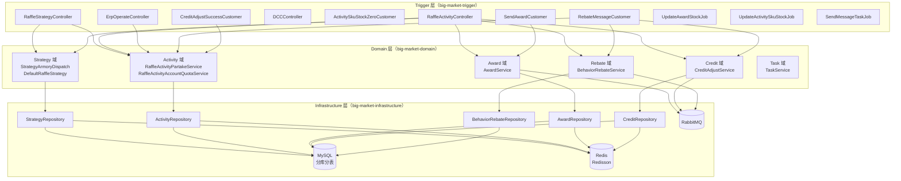

---

## 核心模块关系

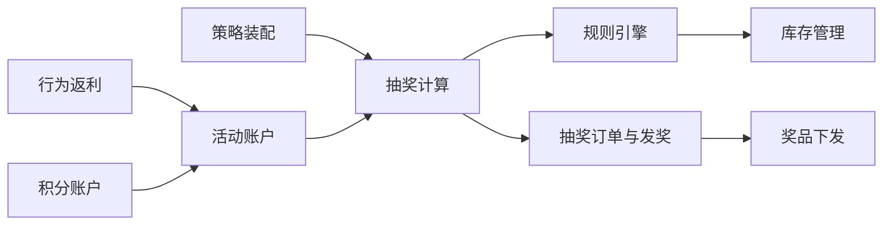

---

## 阅读指引

1. **初次阅读**：建议先看 [01-策略装配](./01-策略装配.md) 了解数据初始化，再看 [02-抽奖计算](./02-抽奖计算.md) 了解主流程。
2. **规则理解**：[03-规则引擎](./03-规则引擎.md) 详细讲解黑名单、权重、锁定、库存等规则的代码实现。
3. **库存专题**：[04-库存管理](./04-库存管理.md) 专注于 Redis + MQ + DB 三层联动的库存方案。
4. **发奖专题**：[05-订单发奖](./05-订单发奖.md) 追踪从"抽中"到"到账"的完整链路。
5. **营销玩法**：[06-行为返利](./06-行为返利.md) 和 [07-积分账户](./07-积分账户.md) 介绍签到返利与积分兑换。

---

## 关键领域对象速查

| 领域对象 | 包路径 | 用途 |
|---------|--------|------|
| `StrategyAwardEntity` | `cn.bugstack.domain.strategy.model.entity` | 策略奖品配置（库存、概率、规则） |
| `RaffleFactorEntity` | `cn.bugstack.domain.strategy.model.entity` | 抽奖入参（userId、strategyId） |
| `RaffleAwardEntity` | `cn.bugstack.domain.strategy.model.entity` | 抽奖结果（awardId、awardIndex） |
| `UserRaffleOrderEntity` | `cn.bugstack.domain.activity.model.entity` | 用户抽奖订单 |
| `ActivityAccountEntity` | `cn.bugstack.domain.activity.model.entity` | 用户活动账户（总/月/日配额） |
| `UserAwardRecordEntity` | `cn.bugstack.domain.award.model.entity` | 用户中奖记录 |
| `DistributeAwardEntity` | `cn.bugstack.domain.award.model.entity` | 奖品下发入参 |
| `CreditAccountEntity` | `cn.bugstack.domain.credit.model.entity` | 用户积分账户 |
| `BehaviorEntity` | `cn.bugstack.domain.rebate.model.entity` | 用户行为（签到等） |

---

### 7.2 策略装配

> *来源文件：docs/01-业务流程解析/01-策略装配.md*

# 01 策略配置与装配

> **功能点**：将策略奖品、规则、概率/权重数据从数据库加载到 Redis，构建抽奖所需的概率区间表和权重查找表。

---

## 1. 功能概述

"策略装配"是抽奖执行的**前置准备步骤**。在用户真正抽奖前，系统需要把该策略下所有奖品的概率、库存、规则等数据预热到 Redis，这样抽奖时才能做到纯内存计算、毫秒响应。

---

## 2. 核心入口

| 层级 | 类/方法 | 文件路径 |
|------|---------|---------|
| HTTP 接口 | `RaffleStrategyController#strategy_armory(Long strategyId)` | `big-market-trigger/src/main/java/cn/bugstack/trigger/http/RaffleStrategyController.java` |
| HTTP 接口 | `RaffleActivityController#armory(Long activityId)` | `big-market-trigger/src/main/java/cn/bugstack/trigger/http/RaffleActivityController.java` |
| 域服务接口 | `IStrategyArmory#assembleLotteryStrategy(Long strategyId)` | `big-market-domain/src/main/java/cn/bugstack/domain/strategy/service/armory/IStrategyArmory.java` |
| 域服务实现 | `StrategyArmoryDispatch#assembleLotteryStrategy(Long strategyId)` | `big-market-domain/src/main/java/cn/bugstack/domain/strategy/service/armory/StrategyArmoryDispatch.java` |
| 活动装配接口 | `IActivityArmory#assembleActivitySkuByActivityId(Long activityId)` | `big-market-domain/src/main/java/cn/bugstack/domain/activity/service/armory/IActivityArmory.java` |
| 活动装配实现 | `ActivityArmory#assembleActivitySkuByActivityId(Long activityId)` | `big-market-domain/src/main/java/cn/bugstack/domain/activity/service/armory/ActivityArmory.java` |
| 仓储接口 | `IStrategyRepository` | `big-market-domain/src/main/java/cn/bugstack/domain/strategy/repository/IStrategyRepository.java` |
| 仓储实现 | `StrategyRepository` | `big-market-infrastructure/src/main/java/cn/bugstack/infrastructure/adapter/repository/StrategyRepository.java` |

---

## 3. 关键领域对象

| 对象 | 包路径 | 字段说明 |
|------|--------|---------|
| `StrategyEntity` | `cn.bugstack.domain.strategy.model.entity` | strategyId、ruleModels（策略级规则） |
| `StrategyAwardEntity` | `cn.bugstack.domain.strategy.model.entity` | strategyId、awardId、awardRate、awardCount、awardCountSurplus、sort、ruleModels |
| `StrategyRuleEntity` | `cn.bugstack.domain.strategy.model.entity` | strategyId、awardId、ruleType、ruleModel、ruleValue、ruleDesc |
| `ActivitySkuEntity` | `cn.bugstack.domain.activity.model.entity` | sku、activityId、activityCountId、stockCount、stockCountSurplus |
| `RuleWeightVO` | `cn.bugstack.domain.strategy.model.valobj` | ruleValue（权重规则值）、weightRange（权重区间） |
| `StrategyAwardStockKeyVO` | `cn.bugstack.domain.strategy.model.valobj` | strategyId、awardId |

---

## 4. 调用链路

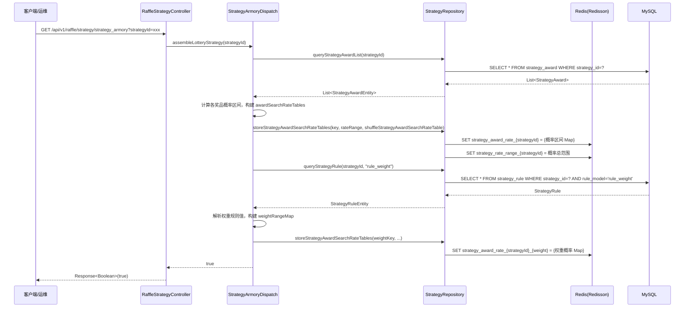

---

## 5. 概率表构建算法

**核心逻辑**（位于 `StrategyArmoryDispatch`）：

1. 获取所有奖品的 `awardRate`（BigDecimal），将其等比扩展为整数区间（例如概率 0.01 扩展为 1/100，则总范围为 100）。
2. 将每个 `awardId` 按其概率份额填入一个随机散列表（`HashMap<Integer, Integer>`）：索引 → awardId。
3. 散列时打乱顺序，防止连号被预测。
4. 存入 Redis：
   - `strategy_rate_range_{strategyId}` → 概率总范围（整数）
   - `strategy_award_rate_{strategyId}` → Map（随机索引 → awardId）

**权重表构建**：
- 若策略配置了 `rule_weight` 规则，对权重规则值（如 `4000:102,103,104,105`）中的每个权重分组分别构建子概率表，key 追加权重值后缀。

---

## 6. 活动 SKU 装配

**入口**：`ActivityArmory#assembleActivitySkuByActivityId(activityId)`

```mermaid
flowchart TD
    A[activityId] --> B[查询活动下所有 SKU\nIRaffleActivitySkuDao.queryActivitySkuListByActivityId]
    B --> C[遍历每个 SKU]
    C --> D[cacheActivitySkuStockCount\n写入 Redis\nactivity_sku_stock_{sku}]
    D --> E[返回装配成功]
```

---

## 7. 存储交互汇总

| 操作 | 数据来源 | 存储目标 | Redis Key 模式 |
|------|---------|---------|---------------|
| 策略奖品概率表 | `strategy_award` 表 | Redis | `strategy_award_rate_{strategyId}` |
| 策略概率总范围 | 计算得出 | Redis | `strategy_rate_range_{strategyId}` |
| 权重概率表 | `strategy_rule` 表 | Redis | `strategy_award_rate_{strategyId}_{weight}` |
| 活动 SKU 库存 | `raffle_activity_sku` 表 | Redis | `activity_sku_stock_{sku}` |
| 策略奖品规则模型 | `strategy_award` 表 | Redis | `strategy_award_rule_model_{strategyId}_{awardId}` |

---

### 7.3 抽奖计算

> *来源文件：docs/01-业务流程解析/02-抽奖计算.md*

# 02 抽奖执行与规则链

> **功能点**：用户发起抽奖后，系统依次经过活动参与（配额校验/扣减）、责任链规则过滤（黑名单/权重/默认）、概率随机摇号、决策树后置规则校验，最终返回奖品结果并落单。

---

## 1. 功能概述

抽奖主流程是整个系统**最核心**的业务链路。从用户点击"抽奖"按钮到最终返回奖品，大致经历：

```
配额校验 → 创建抽奖订单 → 规则链过滤 → 随机摇号 → 决策树校验 → 返回奖品 → 异步发奖
```

---

## 2. 核心入口

| 层级 | 类/方法 | 文件路径 |
|------|---------|---------|
| HTTP 接口 | `RaffleActivityController#draw(ActivityDrawRequestDTO)` | `big-market-trigger/.../RaffleActivityController.java` |
| HTTP 接口（Token） | `RaffleActivityController#draw_by_token(token, ActivityDrawRequestDTO)` | 同上 |
| 策略抽奖接口 | `RaffleStrategyController#random_raffle(RaffleStrategyRequestDTO)` | `big-market-trigger/.../RaffleStrategyController.java` |
| 域服务接口 | `IRaffleStrategy#performRaffle(RaffleFactorEntity)` | `big-market-domain/.../strategy/service/IRaffleStrategy.java` |
| 域服务实现 | `DefaultRaffleStrategy#performRaffle(RaffleFactorEntity)` | `big-market-domain/.../strategy/service/raffle/DefaultRaffleStrategy.java` |
| 活动参与接口 | `IRaffleActivityPartakeService` | `big-market-domain/.../activity/service/IRaffleActivityPartakeService.java` |
| 活动参与实现 | `RaffleActivityPartakeService` | `big-market-domain/.../activity/service/partake/RaffleActivityPartakeService.java` |

---

## 3. 关键领域对象

| 对象 | 说明 |
|------|------|
| `RaffleFactorEntity` | 抽奖入参：`userId`、`strategyId` |
| `RaffleAwardEntity` | 抽奖结果：`awardId`、`awardIndex`、`awardName`、`sort` |
| `UserRaffleOrderEntity` | 用户抽奖订单：`orderId`、`activityId`、`strategyId`、`orderState` |
| `ActivityAccountEntity` | 用户活动账户：`totalCountSurplus`、`monthCountSurplus`、`dayCountSurplus` |
| `CreatePartakeOrderAggregate` | 参与订单聚合根：含账户信息、订单信息 |

---

## 4. 完整调用链路

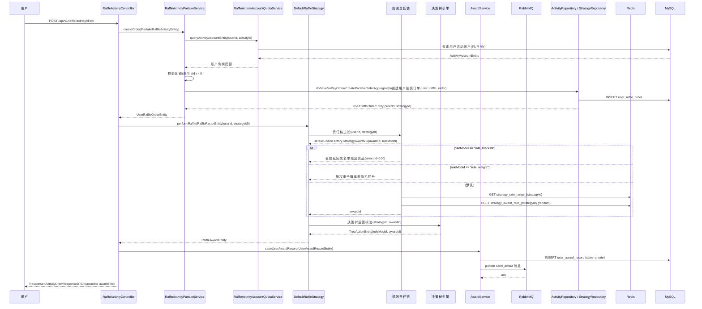

---

## 5. 活动参与（配额扣减）流程

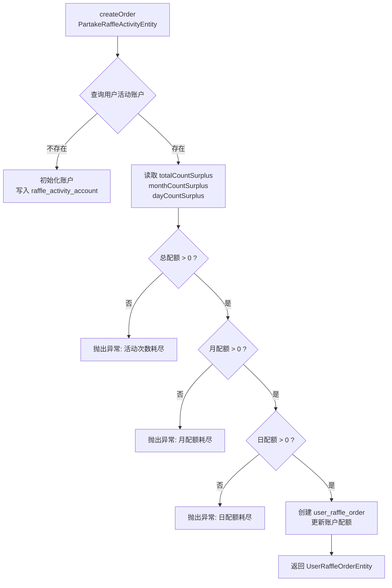

---

## 6. 规则责任链

责任链在 `DefaultChainFactory` 中按策略配置的 `ruleModels` 字段动态组装，执行顺序固定为：

```
BlackListLogicChain → RuleWeightLogicChain → DefaultLogicChain
```

详见 [03-规则引擎.md](./03-规则引擎.md)。

---

## 7. 关键配置与异常兜底

| 场景 | 处理方式 |
|------|---------|
| 用户在黑名单中 | `BlackListLogicChain` 直接返回黑名单奖品（awardId=100）|
| 奖品库存耗尽 | `RuleStockLogicTreeNode` 返回兜底奖品 |
| 奖品未解锁（次数不足） | `RuleLockLogicTreeNode` 返回兜底奖品 |
| 日配额耗尽 | 抛出 `AppException`，HTTP 返回错误码 |
| 月/总配额耗尽 | 同上 |

---

## 8. 数据流转汇总

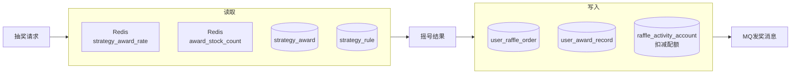

---

### 7.4 规则引擎

> *来源文件：docs/01-业务流程解析/03-规则引擎.md*

# 03 规则引擎与决策树

> **功能点**：通过"责任链（前置规则）"和"决策树（后置规则）"两个模型对抽奖过程进行精细化控制，支持黑名单、权重分配、抽奖次数锁定、库存控制、兜底奖品等多种规则。

---

## 1. 功能概述

规则引擎分两个阶段介入抽奖：

| 阶段 | 模型 | 作用 |
|------|------|------|
| **前置**（摇号前） | 责任链（LogicChain） | 决定"用哪张概率表来摇号" |
| **后置**（摇号后） | 决策树（LogicTree） | 决定"摇到的奖品是否可发/是否替换" |

---

## 2. 前置规则：责任链

### 2.1 责任链组件

| 类名 | 文件路径 | 规则说明 |
|------|---------|---------|
| `ILogicChain`（接口） | `big-market-domain/.../rule/chain/ILogicChain.java` | 链式节点接口，含 `logic()` 和 `next()` |
| `AbstractLogicChain`（抽象） | `big-market-domain/.../rule/chain/AbstractLogicChain.java` | 实现 next 指针管理 |
| `BlackListLogicChain` | `big-market-domain/.../rule/chain/impl/BlackListLogicChain.java` | 黑名单规则 |
| `RuleWeightLogicChain` | `big-market-domain/.../rule/chain/impl/RuleWeightLogicChain.java` | 权重规则（积分区间不同，奖池不同） |
| `DefaultLogicChain` | `big-market-domain/.../rule/chain/impl/DefaultLogicChain.java` | 默认随机抽奖 |
| `DefaultChainFactory` | `big-market-domain/.../rule/chain/factory/DefaultChainFactory.java` | 工厂：根据策略 ruleModels 组装链 |

### 2.2 责任链执行流程

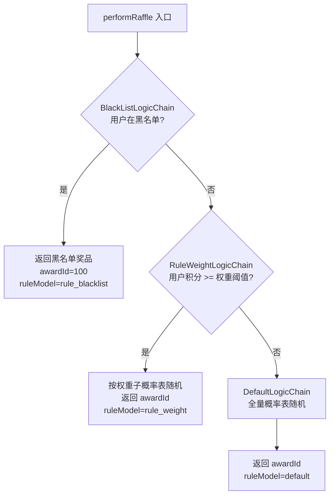

### 2.3 黑名单规则（BlackListLogicChain）

- 规则值存储在 `strategy_rule.rule_value`，格式：`100:user001,user002,user003`
  - `100`：黑名单命中时返回的奖品 ID
  - `user001,...`：被拉黑的用户 ID 列表
- 命中黑名单直接返回，不再往后传递。

### 2.4 权重规则（RuleWeightLogicChain）

- 规则值格式：`4000:102,103,104,105 6000:102,103,104,105,106,107 8000:102,103,104,105,106,107,108,109`
  - 数字（如 4000）表示"用户积分达到此值时适用该权重奖池"
- 查询用户当前积分，找到匹配的最高权重阈值，使用对应子概率表随机。
- 子概率表在装配阶段（`StrategyArmoryDispatch`）已预存到 Redis。

### 2.5 默认规则（DefaultLogicChain）

- 从 Redis 读取策略概率总范围：`strategy_rate_range_{strategyId}`
- `ThreadLocalRandom.current().nextInt(rateRange)` 生成随机索引
- 查 Redis：`HGET strategy_award_rate_{strategyId} {index}` → awardId

---

## 3. 后置规则：决策树

### 3.1 决策树组件

| 类名 | 文件路径 | 规则说明 |
|------|---------|---------|
| `ILogicTreeNode`（接口） | `big-market-domain/.../rule/tree/ILogicTreeNode.java` | 树节点接口，含 `logic()` |
| `RuleLockLogicTreeNode` | `big-market-domain/.../rule/tree/impl/RuleLockLogicTreeNode.java` | 锁定规则（N 次后解锁） |
| `RuleStockLogicTreeNode` | `big-market-domain/.../rule/tree/impl/RuleStockLogicTreeNode.java` | 库存扣减规则 |
| `RuleLuckAwardLogicTreeNode` | `big-market-domain/.../rule/tree/impl/RuleLuckAwardLogicTreeNode.java` | 兜底奖品规则 |
| `DecisionTreeEngine` | `big-market-domain/.../rule/tree/factory/engine/impl/DecisionTreeEngine.java` | 树遍历执行引擎 |
| `DefaultTreeFactory` | `big-market-domain/.../rule/tree/factory/DefaultTreeFactory.java` | 工厂：加载规则树结构 |

### 3.2 规则树数据模型

规则树从数据库 `rule_tree`、`rule_tree_node`、`rule_tree_node_line` 三表读取：

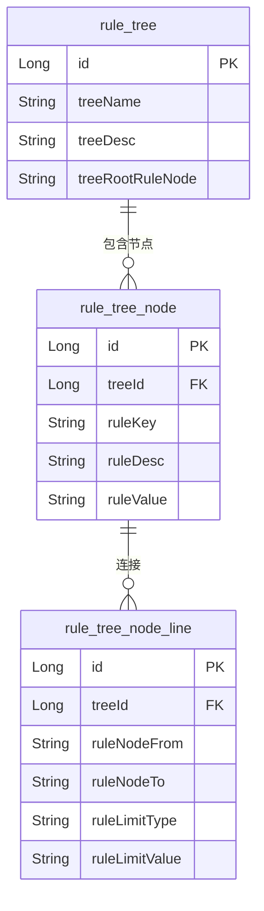

### 3.3 决策树执行流程

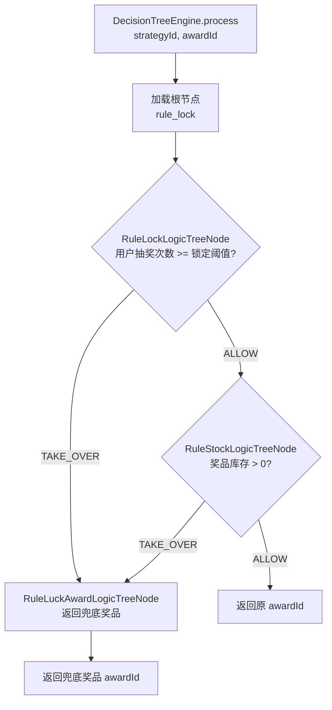

### 3.4 锁定规则（RuleLockLogicTreeNode）

- 规则值（`ruleValue`）为数字，表示"用户需要抽奖 N 次后该奖品才可中奖"
- 查询 Redis 中该用户本轮抽奖次数（key: `rule_lock_count_{strategyId}_{userId}`）
- 次数 < N 则触发 TAKE_OVER，不返回该奖品，转交兜底规则

### 3.5 库存规则（RuleStockLogicTreeNode）

- 原子性扣减 Redis 计数器（`award_stock_count_{strategyId}_{awardId}`）
- 扣减成功 → ALLOW（允许中奖）
- 扣减失败（库存为 0）→ TAKE_OVER（转交兜底）
- 同时往库存消耗队列写入消息，后台 Job 异步回写 DB

### 3.6 兜底规则（RuleLuckAwardLogicTreeNode）

- 直接读取该节点的 `ruleValue` 中配置的兜底奖品 ID
- 无条件返回该奖品，终止树的遍历

---

## 4. 规则模型与策略的绑定

`strategy_award.rule_models` 字段记录了该奖品适用的规则（逗号分隔），例如：

```
rule_lock,rule_stock,rule_luck_award
```

装配时会把这个字段缓存到 Redis（key: `strategy_award_rule_model_{strategyId}_{awardId}`），抽奖时读取，再从 `rule_tree` 表加载对应的树结构执行。

---

## 5. 全量规则执行总览

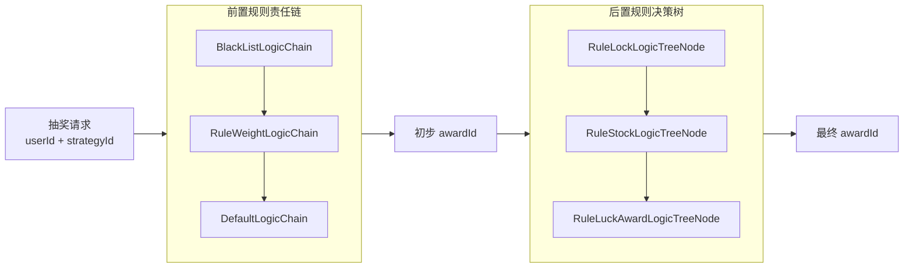

---

## 6. 涉及数据库表

| 表名 | 用途 |
|------|------|
| `strategy` | 策略基本信息，含策略级 `rule_models` |
| `strategy_award` | 奖品配置，含奖品级 `rule_models` |
| `strategy_rule` | 规则定义：`rule_model`、`rule_value` |
| `rule_tree` | 决策树根节点 |
| `rule_tree_node` | 决策树各节点及规则值 |
| `rule_tree_node_line` | 节点连线：条件类型（limit type）和条件值 |

---

### 7.5 库存管理

> *来源文件：docs/01-业务流程解析/04-库存管理.md*

# 04 库存管理

> **功能点**：奖品与活动 SKU 库存采用"Redis 原子扣减 + MQ 异步通知 + 定时 Job 回写 DB"三层联动方案，兼顾高并发性能与最终数据一致性。

---

## 1. 功能概述

库存管理涵盖两类库存：

| 库存类型 | 说明 | 相关表 |
|---------|------|--------|
| **奖品库存** | 单个奖品（awardId）在某策略下可发放数量 | `strategy_award` |
| **活动 SKU 库存** | 活动下某个 SKU 的可参与次数/份数 | `raffle_activity_sku` |

两类库存均遵循相同的分层架构：

```
Redis（原子扣减）→ 队列（Queue/MQ）→ MySQL（最终落库）
```

---

## 2. 核心入口

### 奖品库存

| 层级 | 类/方法 | 文件路径 |
|------|---------|---------|
| 决策树节点 | `RuleStockLogicTreeNode#logic(DecisionMatterEntity)` | `big-market-domain/.../rule/tree/impl/RuleStockLogicTreeNode.java` |
| 仓储接口 | `IStrategyRepository#subtractionAwardStock(StrategyAwardStockKeyVO)` | `big-market-domain/.../strategy/repository/IStrategyRepository.java` |
| 仓储实现 | `StrategyRepository#subtractionAwardStock(...)` | `big-market-infrastructure/.../adapter/repository/StrategyRepository.java` |
| Redis 服务 | `RedissonService#decrement(key)` | `big-market-infrastructure/.../redis/RedissonService.java` |
| 定时 Job | `UpdateAwardStockJob` | `big-market-trigger/.../job/UpdateAwardStockJob.java` |

### 活动 SKU 库存

| 层级 | 类/方法 | 文件路径 |
|------|---------|---------|
| 行动链节点 | `ActivitySkuStockActionChain#logic(...)` | `big-market-domain/.../quota/rule/impl/ActivitySkuStockActionChain.java` |
| 仓储接口 | `IActivityRepository#subtractionActivitySkuStock(...)` | `big-market-domain/.../activity/adapter/repository/IActivityRepository.java` |
| 仓储实现 | `ActivityRepository#subtractionActivitySkuStock(...)` | `big-market-infrastructure/.../adapter/repository/ActivityRepository.java` |
| 定时 Job | `UpdateActivitySkuStockJob` | `big-market-trigger/.../job/UpdateActivitySkuStockJob.java` |
| MQ 消费者 | `ActivitySkuStockZeroCustomer` | `big-market-trigger/.../listener/ActivitySkuStockZeroCustomer.java` |

---

## 3. 奖品库存扣减流程

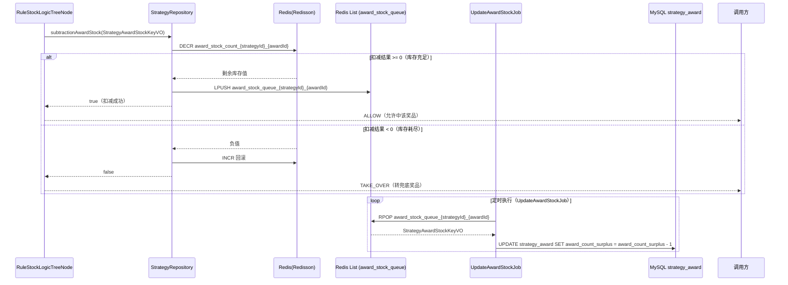

---

## 4. 活动 SKU 库存扣减流程

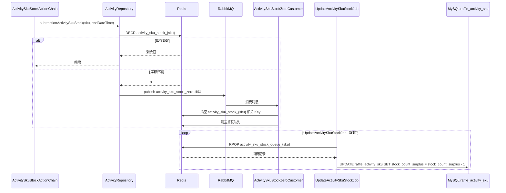

---

## 5. 定时 Job 详情

### UpdateAwardStockJob

- **位置**：`big-market-trigger/src/main/java/cn/bugstack/trigger/job/UpdateAwardStockJob.java`
- **职责**：消费 Redis 队列中的奖品库存扣减记录，批量回写到 `strategy_award` 表
- **执行策略**：Spring `@Scheduled`，固定频率
- **核心调用**：`IRaffleStock#takeQueueValue()` → `IStrategyRepository#updateStrategyAwardStock(...)`

### UpdateActivitySkuStockJob

- **位置**：`big-market-trigger/src/main/java/cn/bugstack/trigger/job/UpdateActivitySkuStockJob.java`
- **职责**：消费 Redis 队列中的 SKU 库存扣减记录，回写到 `raffle_activity_sku` 表
- **核心调用**：`IRaffleActivitySkuStockService#takeQueueValue()` → `IActivityRepository#updateActivitySkuStock(...)`

---

## 6. 库存 Redis Key 规范

| Redis Key | 含义 | 数据类型 |
|-----------|------|---------|
| `award_stock_count_{strategyId}_{awardId}` | 奖品剩余库存 | String（计数器） |
| `award_stock_queue_{strategyId}_{awardId}` | 奖品库存扣减队列 | List |
| `activity_sku_stock_{sku}` | 活动 SKU 剩余库存 | String（计数器） |
| `activity_sku_stock_queue_{sku}` | SKU 库存扣减队列 | List |

---

## 7. 最终一致性保障

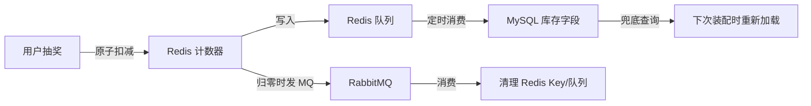

- **不丢数据**：所有扣减先记队列，Job 异步消费回写。
- **不超发**：Redis 原子 DECR，结果 < 0 时立即回滚并拒绝发奖。
- **缓存清理**：库存归零后通过 MQ 清除 Redis key，防止"幽灵库存"。

---

### 7.6 订单发奖

> *来源文件：docs/01-业务流程解析/05-订单发奖.md*

# 05 抽奖订单与奖品下发

> **功能点**：用户中奖后，系统先落单记录奖品结果，再通过 RabbitMQ 异步触发奖品下发，按奖品类型路由到不同的分发策略（积分、OpenAI 配额等）。

---

## 1. 功能概述

抽奖完成后的奖品下发分两个阶段：

| 阶段 | 说明 |
|------|------|
| **落单** | 同步记录中奖信息到 `user_award_record`，状态为 `create` |
| **发奖** | 异步通过 MQ 消费，调用对应奖品分发器，状态更新为 `completed` |

---

## 2. 核心入口

| 层级 | 类/方法 | 文件路径 |
|------|---------|---------|
| 域服务接口 | `IAwardService#saveUserAwardRecord(UserAwardRecordEntity)` | `big-market-domain/.../award/service/IAwardService.java` |
| 域服务实现 | `AwardService#saveUserAwardRecord(...)` | `big-market-domain/.../award/service/AwardService.java` |
| 域服务接口 | `IAwardService#distributeAward(DistributeAwardEntity)` | 同上 |
| 域服务实现 | `AwardService#distributeAward(...)` | `big-market-domain/.../award/service/AwardService.java` |
| MQ 消费者 | `SendAwardCustomer#listener(SendAwardMessageEvent.EventMessage)` | `big-market-trigger/.../listener/SendAwardCustomer.java` |
| 仓储接口 | `IAwardRepository` | `big-market-domain/.../award/adapter/repository/IAwardRepository.java` |
| 仓储实现 | `AwardRepository` | `big-market-infrastructure/.../adapter/repository/AwardRepository.java` |

---

## 3. 关键领域对象

| 对象 | 包路径 | 说明 |
|------|--------|------|
| `UserAwardRecordEntity` | `cn.bugstack.domain.award.model.entity` | 中奖记录：userId、activityId、strategyId、orderId、awardId、awardTitle、awardConfig、state |
| `UserAwardRecordAggregate` | `cn.bugstack.domain.award.model.aggregate` | 聚合根：含 UserAwardRecordEntity + TaskEntity |
| `GiveOutPrizesAggregate` | `cn.bugstack.domain.award.model.aggregate` | 发奖聚合：awardId、userId、orderId、awardConfig |
| `DistributeAwardEntity` | `cn.bugstack.domain.award.model.entity` | 下发入参：userId、orderId、awardId、awardConfig |
| `TaskEntity` | `cn.bugstack.domain.award.model.entity` | 消息任务：topic、messageId、message、state |
| `SendAwardMessageEvent` | `cn.bugstack.domain.award.event` | MQ 事件：userId、orderId、awardId、awardConfig |

---

## 4. 落单流程

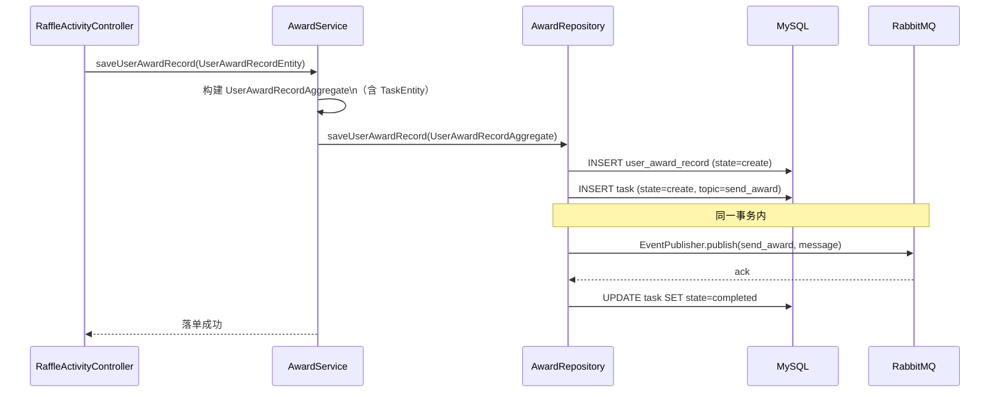

> **注意**：`user_award_record` 与 `task` 表在同一事务内写入，MQ 发送后更新 task 状态。若 MQ 发送失败，task 状态保持 `create`，由 `SendMessageTaskJob` 兜底重试。

---

## 5. 发奖流程（异步消费）

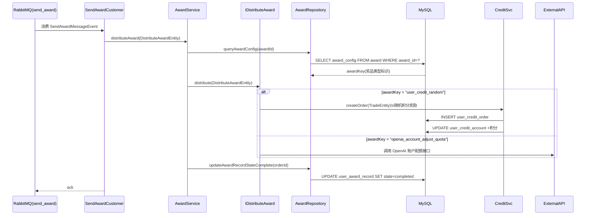

---

## 6. 奖品分发策略（策略模式）

| 实现类 | 文件路径 | 奖品类型 | 处理逻辑 |
|--------|---------|---------|---------|
| `UserCreditRandomAward` | `big-market-domain/.../award/service/distribute/impl/UserCreditRandomAward.java` | 随机积分 | 从 `awardConfig` 解析积分范围，随机生成积分，调用 `CreditAdjustService.createOrder()` 充值 |
| `OpenAIAccountAdjustQuotaAward` | `big-market-domain/.../award/service/distribute/impl/OpenAIAccountAdjustQuotaAward.java` | OpenAI 配额 | 调用外部 OpenAI 账户服务，增加用户 API 配额 |

扩展新奖品类型：实现 `IDistributeAward` 接口，注册 Spring Bean，`awardKey` 与 `award.award_config` 中的类型标识匹配即可。

---

## 7. 消息可靠性兜底

### SendMessageTaskJob

- **位置**：`big-market-trigger/src/main/java/cn/bugstack/trigger/job/SendMessageTaskJob.java`
- **职责**：定期扫描 `task` 表中 `state=create` 的记录，重新发送 MQ 消息
- **流程**：

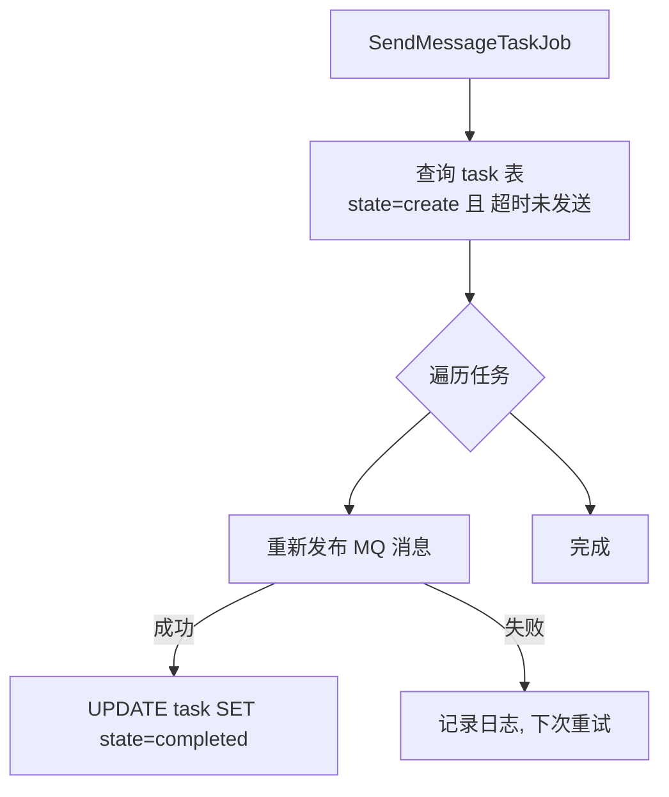

---

## 8. 数据库表

| 表名 | 关键字段 | 说明 |
|------|---------|------|
| `user_award_record` | userId, activityId, orderId, awardId, state | 用户中奖记录，state: create→completed |
| `task` | userId, topic, messageId, message, state | MQ 消息任务表，state: create→completed |
| `award` | awardId, awardKey, awardConfig | 奖品定义，awardKey 决定分发策略 |

---

### 7.7 行为返利

> *来源文件：docs/01-业务流程解析/06-行为返利.md*

# 06 行为返利流程

> **功能点**：用户完成签到、分享等行为后，系统通过 MQ 异步下发返利，返利可以是 SKU 兑换（增加活动参与次数）或积分充值两种形式。

---

## 1. 功能概述

行为返利是一种"做任务 → 得奖励"的营销玩法：

| 行为类型 | 返利类型 | 说明 |
|---------|---------|------|
| 签到（`sign`） | SKU / 积分 | 每日签到赠送活动参与次数或积分 |
| 其他可扩展行为 | SKU / 积分 | 按 `daily_behavior_rebate` 配置 |

---

## 2. 核心入口

| 层级 | 类/方法 | 文件路径 |
|------|---------|---------|
| HTTP 接口 | `RaffleActivityController#calendar_sign_rebate(String userId)` | `big-market-trigger/.../RaffleActivityController.java` |
| HTTP 接口（Token） | `RaffleActivityController#calendar_sign_rebate_by_token(String token)` | 同上 |
| 域服务接口 | `IBehaviorRebateService#createOrder(BehaviorEntity)` | `big-market-domain/.../rebate/service/IBehaviorRebateService.java` |
| 域服务实现 | `BehaviorRebateService#createOrder(BehaviorEntity)` | `big-market-domain/.../rebate/service/BehaviorRebateService.java` |
| MQ 消费者 | `RebateMessageCustomer#listener(SendRebateMessageEvent.EventMessage)` | `big-market-trigger/.../listener/RebateMessageCustomer.java` |
| 仓储接口 | `IBehaviorRebateRepository` | `big-market-domain/.../rebate/repository/IBehaviorRebateRepository.java` |
| 仓储实现 | `BehaviorRebateRepository` | `big-market-infrastructure/.../adapter/repository/BehaviorRebateRepository.java` |

---

## 3. 关键领域对象

| 对象 | 包路径 | 说明 |
|------|--------|------|
| `BehaviorEntity` | `cn.bugstack.domain.rebate.model.entity` | 行为入参：userId、behaviorType（如 sign）、outBusinessNo |
| `BehaviorRebateOrderEntity` | `cn.bugstack.domain.rebate.model.entity` | 返利订单：userId、orderId、behaviorType、rebateType、rebateConfig |
| `BehaviorRebateAggregate` | `cn.bugstack.domain.rebate.model.aggregate` | 聚合根：含 BehaviorRebateOrderEntity + TaskEntity |
| `DailyBehaviorRebateVO` | `cn.bugstack.domain.rebate.model.valobj` | 每日行为返利配置：behaviorType、rebateType、rebateConfig |
| `SendRebateMessageEvent` | `cn.bugstack.domain.rebate.event` | MQ 事件：userId、rebateType、rebateConfig、bizId |
| `SkuRechargeEntity` | `cn.bugstack.domain.activity.model.entity` | SKU 充值入参（用于 SKU 类返利） |
| `TradeEntity` | `cn.bugstack.domain.credit.model.entity` | 积分交易入参（用于积分类返利） |

---

## 4. 完整流程

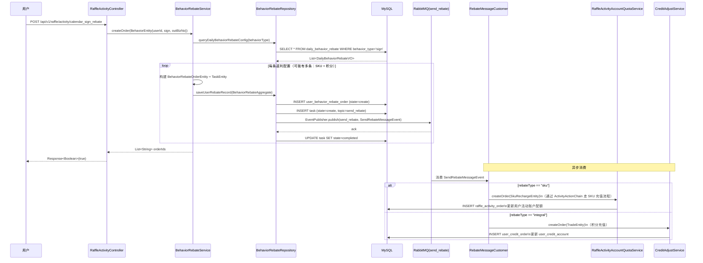

---

## 5. 返利类型路由

`RebateMessageCustomer` 中通过 `rebateType` 字段判断：

```java
// 伪代码
if ("sku".equals(rebateType)) {
    SkuRechargeEntity skuRecharge = buildSkuRechargeEntity(message);
    raffleActivityAccountQuotaService.createOrder(skuRecharge);
} else if ("integral".equals(rebateType)) {
    TradeEntity trade = buildTradeEntity(message);
    creditAdjustService.createOrder(trade);
}
```

---

## 6. 幂等保障

- `BehaviorEntity.outBusinessNo`：由调用方传入的业务唯一号，写入 `user_behavior_rebate_order.out_business_no`
- 若相同 `outBusinessNo` 已存在记录，`BehaviorRebateRepository` 中用唯一索引防重，重复请求直接返回成功（幂等）

---

## 7. 签到查询接口

| 接口 | 说明 |
|------|------|
| `GET /api/v1/raffle/activity/is_calendar_sign_rebate` | 查询用户今日是否已签到，返回 `Boolean` |

- **核心调用**：`IBehaviorRebateService#queryOrderByOutBusinessNo(userId, outBusinessNo)`
- **实现**：查询 `user_behavior_rebate_order` 中是否存在该用户今日签到记录

---

## 8. 涉及数据库表

| 表名 | 说明 |
|------|------|
| `daily_behavior_rebate` | 每日行为返利配置（行为类型、返利类型、返利值） |
| `user_behavior_rebate_order` | 用户行为返利订单（含返利类型、配置、状态） |
| `task` | MQ 消息任务，保证消息可靠投递 |
| `raffle_activity_order` | SKU 类返利生成的活动订单 |
| `user_credit_order` | 积分类返利生成的积分订单 |
| `user_credit_account` | 用户积分账户（积分充值后更新） |

---

### 7.8 积分账户

> *来源文件：docs/01-业务流程解析/07-积分账户.md*

# 07 积分账户与兑换

> **功能点**：用户积分账户的充值（来自抽奖发奖/行为返利）、查询，以及通过积分支付兑换活动 SKU（增加抽奖参与次数）的完整链路。

---

## 1. 功能概述

积分（Credit）体系是平台的虚拟货币系统：

| 场景 | 说明 |
|------|------|
| **积分充值** | 抽中积分奖品后，由 `UserCreditRandomAward` 调用 `CreditAdjustService.createOrder()` 充值 |
| **行为返利充值** | 用户签到等行为触发，由 `RebateMessageCustomer` 消费后调用 `CreditAdjustService.createOrder()` |
| **积分支付兑换 SKU** | 用户用积分购买活动参与次数，调用 `RaffleActivityController#credit_pay_exchange_sku` |
| **积分查询** | 查询用户可用积分余额 |

---

## 2. 核心入口

| 层级 | 类/方法 | 文件路径 |
|------|---------|---------|
| HTTP 接口 | `RaffleActivityController#credit_pay_exchange_sku(SkuProductShopCartRequestDTO)` | `big-market-trigger/.../RaffleActivityController.java` |
| HTTP 接口 | `RaffleActivityController#query_user_credit_account(String userId)` | 同上 |
| HTTP 接口（Token） | `RaffleActivityController#credit_pay_exchange_sku_by_token(token, SkuProductShopCartRequestDTO)` | 同上 |
| 域服务接口 | `ICreditAdjustService#createOrder(TradeEntity)` | `big-market-domain/.../credit/service/ICreditAdjustService.java` |
| 域服务实现 | `CreditAdjustService#createOrder(TradeEntity)` | `big-market-domain/.../credit/service/adjust/CreditAdjustService.java` |
| 域服务接口 | `ICreditAdjustService#queryUserCreditAccount(String userId)` | 同上 |
| MQ 消费者 | `CreditAdjustSuccessCustomer` | `big-market-trigger/.../listener/CreditAdjustSuccessCustomer.java` |
| 仓储接口 | `ICreditRepository` | `big-market-domain/.../credit/repository/ICreditRepository.java` |
| 仓储实现 | `CreditRepository` | `big-market-infrastructure/.../adapter/repository/CreditRepository.java` |

---

## 3. 关键领域对象

| 对象 | 包路径 | 说明 |
|------|--------|------|
| `TradeEntity` | `cn.bugstack.domain.credit.model.entity` | 交易入参：userId、tradeName、tradeType（forward/reverse）、amount、outBusinessNo |
| `CreditOrderEntity` | `cn.bugstack.domain.credit.model.entity` | 积分订单 |
| `CreditAccountEntity` | `cn.bugstack.domain.credit.model.entity` | 积分账户：userId、availableAmount、frozenAmount |
| `TradeAggregate` | `cn.bugstack.domain.credit.model.aggregate` | 聚合根：含 CreditOrderEntity + TaskEntity |
| `TradeNameVO` | `cn.bugstack.domain.credit.model.valobj` | 交易名称枚举（rebate、pay 等） |
| `TradeTypeVO` | `cn.bugstack.domain.credit.model.valobj` | 交易类型：forward（充值+）、reverse（消费-） |
| `CreditAdjustSuccessMessageEvent` | `cn.bugstack.domain.credit.event` | MQ 事件：通知活动层 SKU 订单已支付成功 |
| `SkuProductShopCartRequestDTO` | `cn.bugstack.trigger.api.dto` | 积分兑换入参：userId、sku |

---

## 4. 积分充值流程

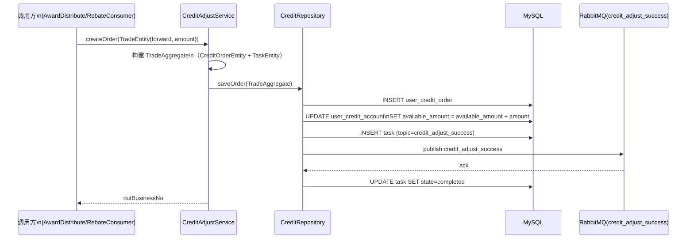

---

## 5. 积分支付兑换 SKU 流程

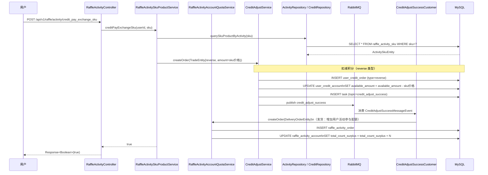

---

## 6. 积分账户查询

- **接口**：`POST /api/v1/raffle/activity/query_user_credit_account`
- **核心调用**：`CreditAdjustService#queryUserCreditAccount(userId)`
- **实现**：查询 `user_credit_account.available_amount`，返回 `BigDecimal`

---

## 7. 交易类型说明

| TradeTypeVO | 含义 | 对账户影响 |
|-------------|------|---------|
| `forward` | 正向交易（充值） | `available_amount` **增加** |
| `reverse` | 逆向交易（消费） | `available_amount` **减少** |

---

## 8. 涉及数据库表

| 表名 | 说明 |
|------|------|
| `user_credit_account` | 用户积分账户（可用余额、冻结余额） |
| `user_credit_order` | 积分交易订单（充值/消费记录） |
| `task` | MQ 消息任务，保证消息可靠投递 |
| `raffle_activity_order` | 兑换后生成的活动参与订单 |
| `raffle_activity_account` | 用户活动账户（配额） |
| `raffle_activity_sku` | 活动 SKU 产品信息（积分价格、库存） |

---

## 9. 兑换 SKU 商品列表查询

- **接口**：`POST /api/v1/raffle/activity/query_sku_product_list_by_activity_id`
- **核心调用**：`IRaffleActivitySkuProductService#querySkuProductEntityListByActivityId(activityId)`
- **返回**：`List<SkuProductResponseDTO>`，包含 SKU、积分价格、库存等信息

---

## 八、URL 走读解析

### 8.1 总览

> *来源文件：docs/02-URL走读解析/README.md*

# Big-Market URL 走读解析（接口入口视角）

> 本文档从 **HTTP 接口（URL）入口**视角对 `big-market` 营销抽奖平台进行代码走读，覆盖项目全部对外接口，逐一追踪每个 URL 的请求参数、调用链路、依赖组件和返回结果。

---

## 目录

| 序号 | 控制器 | 文档 |
|------|--------|------|
| [01](./01-抽奖策略接口.md) | `RaffleStrategyController` | 策略装配、奖品列表查询、权重规则查询、随机抽奖 |
| [02](./02-抽奖活动接口.md) | `RaffleActivityController` | 活动装配、参与抽奖、签到返利、积分查询、SKU 兑换 |
| [03](./03-运营管理接口.md) | `ErpOperateController` | 运营管理：活动上线、阶段列表、用户订单查询 |
| [04](./04-配置中心接口.md) | `DCCController` | 动态配置中心（Zookeeper）：在线变更开关/配置 |

---

## 全局接口入口图

```mermaid
graph TD
    Client([客户端 / 前端 / 运营后台])

    subgraph HTTP["HTTP 接口层（big-market-trigger）"]
        SC["RaffleStrategyController\n/api/v1/raffle/strategy/"]
        AC["RaffleActivityController\n/api/v1/raffle/activity/"]
        EC["ErpOperateController\n/api/v1/raffle/erp/"]
        DC["DCCController\n/api/v1/raffle/dcc/"]
    end

    subgraph Domain["Domain 层（业务逻辑）"]
        SD["Strategy 域\nStrategyArmoryDispatch\nDefaultRaffleStrategy"]
        AD["Activity 域\nRaffleActivityPartakeService\nRaffleActivityAccountQuotaService"]
        AwardD["Award 域\nAwardService"]
        CreditD["Credit 域\nCreditAdjustService"]
        RebateD["Rebate 域\nBehaviorRebateService"]
        StageD["Stage 域\nRaffleActivityStageService"]
    end

    subgraph Infra["基础设施层"]
        Redis[(Redis)]
        MySQL[(MySQL)]
        RabbitMQ[(RabbitMQ)]
        ES[(ElasticSearch)]
        ZK[(Zookeeper)]
    end

    Client --> SC & AC & EC & DC
    SC --> SD
    AC --> AD & AwardD & CreditD & RebateD
    EC --> StageD & SD & ES
    DC --> ZK
    SD & AD & AwardD & CreditD & RebateD & StageD --> Redis & MySQL & RabbitMQ
```

---

## 接口汇总

### RaffleStrategyController（`/api/v1/raffle/strategy/`）

| 方法 | URL | 说明 |
|------|-----|------|
| GET | `strategy_armory` | 装配指定策略（预热 Redis） |
| POST | `query_raffle_award_list` | 查询策略奖品列表 |
| POST | `query_raffle_award_list_by_token` | 查询策略奖品列表（Token 认证） |
| POST | `query_raffle_strategy_rule_weight` | 查询权重规则配置 |
| POST | `random_raffle` | 直接执行随机抽奖（测试/内部调用） |

### RaffleActivityController（`/api/v1/raffle/activity/`）

| 方法 | URL | 说明 |
|------|-----|------|
| GET | `query_stage_activity_id` | 根据渠道/来源查询活动 ID |
| GET | `armory` | 装配活动（SKU 预热） |
| POST | `draw` | 执行抽奖（核心接口） |
| POST | `draw_by_token` | 执行抽奖（Token 认证） |
| POST | `calendar_sign_rebate` | 日历签到返利 |
| POST | `calendar_sign_rebate_by_token` | 日历签到返利（Token 认证） |
| POST | `is_calendar_sign_rebate` | 查询今日是否已签到 |
| POST | `is_calendar_sign_rebate_by_token` | 查询今日是否已签到（Token 认证） |
| POST | `query_user_activity_account` | 查询用户活动账户 |
| POST | `query_user_activity_account_by_token` | 查询用户活动账户（Token 认证） |
| POST | `query_sku_product_list_by_activity_id` | 查询 SKU 商品列表 |
| POST | `query_user_credit_account` | 查询用户积分账户 |
| POST | `query_user_credit_account_by_token` | 查询用户积分账户（Token 认证） |
| POST | `credit_pay_exchange_sku` | 积分兑换 SKU |
| POST | `credit_pay_exchange_sku_by_token` | 积分兑换 SKU（Token 认证） |

### ErpOperateController（`/api/v1/raffle/erp/`）

| 方法 | URL | 说明 |
|------|-----|------|
| GET | `query_user_raffle_order` | 查询用户抽奖订单（ES） |
| POST | `update_stage_activity_2_active` | 将阶段活动上线 |
| GET | `query_raffle_activity_stage_list` | 查询所有阶段活动列表 |

### DCCController（`/api/v1/raffle/dcc/`）

| 方法 | URL | 说明 |
|------|-----|------|
| GET | `update_config` | 更新动态配置（Zookeeper） |

---

## 公共响应格式

所有接口均返回统一包装对象：

```json
{
  "code": "0000",
  "info": "成功",
  "data": { /* 业务数据 */ }
}
```

错误时 `code` 为对应错误码，`info` 为错误描述，`data` 为 null。

---

## 认证机制

部分接口提供 `_by_token` 版本：
- 请求头携带 JWT Token（由 `AuthService` 验证）
- Token 解析出 `userId` 后，透传到业务层
- 无 Token 版本直接接收 `userId` 请求参数（适用于内部服务调用或测试）

---

### 8.2 抽奖策略接口

> *来源文件：docs/02-URL走读解析/01-抽奖策略接口.md*

# 01 RaffleStrategyController 接口走读

> **控制器**：`cn.bugstack.trigger.http.RaffleStrategyController`  
> **文件路径**：`big-market-trigger/src/main/java/cn/bugstack/trigger/http/RaffleStrategyController.java`  
> **Base URL**：`/api/v1/raffle/strategy/`

---

## 接口总览

```mermaid
graph LR
    Client([客户端])
    subgraph RaffleStrategyController
        A1["GET strategy_armory"]
        A2["POST query_raffle_award_list"]
        A3["POST query_raffle_award_list_by_token"]
        A4["POST query_raffle_strategy_rule_weight"]
        A5["POST random_raffle"]
    end
    Client --> A1 & A2 & A3 & A4 & A5
    A1 --> StrategyArmoryDispatch
    A2 & A3 --> IRaffleAward
    A4 --> IRaffleRule
    A5 --> IRaffleStrategy
```

---

## 1. GET `/api/v1/raffle/strategy/strategy_armory`

### 请求参数

| 参数 | 类型 | 位置 | 说明 |
|------|------|------|------|
| `strategyId` | `Long` | Query | 策略 ID |

### 调用链路

```mermaid
sequenceDiagram
    participant Client as 客户端
    participant SC as RaffleStrategyController
    participant SA as StrategyArmoryDispatch
    participant SR as StrategyRepository
    participant DB as MySQL
    participant Redis as Redis

    Client->>SC: GET /strategy_armory?strategyId=100001
    SC->>SA: assembleLotteryStrategy(100001)
    SA->>SR: queryStrategyAwardList(100001)
    SR->>DB: SELECT * FROM strategy_award WHERE strategy_id=100001
    DB-->>SR: List<StrategyAward>
    SR-->>SA: List<StrategyAwardEntity>
    SA->>SA: 计算概率区间表（shuffleStrategyAwardSearchRateTable）
    SA->>SR: storeStrategyAwardSearchRateTables(key, rateRange, table)
    SR->>Redis: SET strategy_rate_range_100001 = 10000
    SR->>Redis: HMSET strategy_award_rate_100001 {0:102, 1:103, ...}
    SA->>SR: queryStrategyRule(100001, "rule_weight")
    SR->>DB: SELECT * FROM strategy_rule WHERE strategy_id=100001 AND rule_model='rule_weight'
    DB-->>SR: StrategyRule
    SA->>SA: 解析权重规则，构建子概率表
    SA->>SR: storeStrategyAwardSearchRateTables(weightKey, ...)
    SR->>Redis: HMSET strategy_award_rate_100001_4000 {...}
    SA-->>SC: true
    SC-->>Client: {"code":"0000","data":true}
```

### 核心处理步骤

1. 调用 `StrategyArmoryDispatch#assembleLotteryStrategy(strategyId)` 启动装配
2. 从 `strategy_award` 表加载所有奖品及概率
3. 构建全量概率散列表并写入 Redis（key: `strategy_award_rate_{strategyId}`）
4. 若存在权重规则（`rule_weight`），按权重阈值分别构建子概率表
5. 缓存各奖品的规则模型配置（`strategy_award_rule_model_...`）

### 返回结果

```json
{"code": "0000", "info": "成功", "data": true}
```

---

## 2. POST `/api/v1/raffle/strategy/query_raffle_award_list`

### 请求参数

```json
{
  "userId": "user001",
  "activityId": 100301
}
```

| 字段 | 类型 | 说明 |
|------|------|------|
| `userId` | String | 用户 ID |
| `activityId` | Long | 活动 ID |

### 调用链路

```mermaid
sequenceDiagram
    participant Client as 客户端
    participant SC as RaffleStrategyController
    participant IR as IRaffleAward
    participant SR as StrategyRepository
    participant Redis as Redis
    participant DB as MySQL

    Client->>SC: POST /query_raffle_award_list
    SC->>IR: queryRaffleStrategyAwardList(strategyId)
    IR->>SR: queryStrategyAwardList(strategyId)
    SR->>DB: SELECT * FROM strategy_award WHERE strategy_id=?
    DB-->>SR: List<StrategyAwardEntity>
    
    loop 每个奖品
        SR->>Redis: GET strategy_award_rule_model_{strategyId}_{awardId}
        Redis-->>SR: ruleModels
    end
    
    IR->>SR: queryStrategyEntityByStrategyId(strategyId)
    SR->>DB: SELECT * FROM strategy WHERE strategy_id=?
    IR-->>SC: List<StrategyAwardStockKeyVO>
    SC->>SC: 转换为 List<RaffleAwardListResponseDTO>
    SC-->>Client: {"code":"0000","data":[...]}
```

### 核心处理步骤

1. 根据 `activityId` 从 `raffle_activity` 查到 `strategyId`
2. 查询 `strategy_award` 获取奖品列表
3. 读取每个奖品的规则模型（Redis 缓存）
4. 组装展示 DTO（含奖品标题、副标题、库存、规则说明）

### 返回结果

```json
{
  "code": "0000",
  "data": [
    {
      "awardId": 101,
      "awardTitle": "OpenAI 聊天模型 GPT-4o-mini 1次",
      "awardSubtitle": "...",
      "sort": 1,
      "awardRuleValue": "..."
    }
  ]
}
```

---

## 3. POST `/api/v1/raffle/strategy/query_raffle_strategy_rule_weight`

### 请求参数

```json
{
  "userId": "user001",
  "activityId": 100301
}
```

### 调用链路

```mermaid
sequenceDiagram
    participant Client as 客户端
    participant SC as RaffleStrategyController
    participant IR as IRaffleRule
    participant SR as StrategyRepository
    participant DB as MySQL

    Client->>SC: POST /query_raffle_strategy_rule_weight
    SC->>IR: queryAwardRuleWeightByStrategyId(strategyId)
    IR->>SR: queryStrategyRuleValue(strategyId, null, "rule_weight")
    SR->>DB: SELECT rule_value FROM strategy_rule\nWHERE strategy_id=? AND rule_model='rule_weight'
    DB-->>SR: ruleValue("4000:102,103 6000:102,103,104")
    
    IR->>SR: queryStrategyAwardList(strategyId)
    SR->>DB: SELECT * FROM strategy_award WHERE strategy_id=?
    
    IR->>IR: 解析权重规则值\n匹配各权重阈值对应的奖品信息
    IR->>SR: queryUserRaffleCount(userId, activityId)
    SR->>DB: 查询用户当前抽奖次数
    
    IR-->>SC: List<RuleWeightVO>
    SC->>SC: 转换为 List<RaffleStrategyRuleWeightResponseDTO>
    SC-->>Client: {"code":"0000","data":[...]}
```

### 返回结果

```json
{
  "code": "0000",
  "data": [
    {
      "ruleWeightCount": 4000,
      "userActivityAccountTotalUseCount": 1500,
      "awardList": [
        {"awardId": 102, "awardTitle": "..."}
      ]
    }
  ]
}
```

---

## 4. POST `/api/v1/raffle/strategy/random_raffle`

> **用途**：不经过活动层，直接对策略发起随机抽奖（主要用于测试或内部调用）。

### 请求参数

```json
{
  "strategyId": 100001
}
```

### 调用链路

```mermaid
sequenceDiagram
    participant Client as 客户端
    participant SC as RaffleStrategyController
    participant RS as DefaultRaffleStrategy
    participant Chain as 规则责任链
    participant Tree as 决策树引擎
    participant Redis as Redis

    Client->>SC: POST /random_raffle
    SC->>RS: performRaffle(RaffleFactorEntity{userId, strategyId})
    RS->>Chain: 执行责任链过滤
    Chain->>Redis: 读取概率表，随机摇号
    Chain-->>RS: StrategyAwardVO{awardId, ruleModel}
    RS->>Tree: 决策树后置校验(strategyId, awardId)
    Tree-->>RS: TreeActionEntity{awardId}
    RS-->>SC: RaffleAwardEntity
    SC-->>Client: {"code":"0000","data":{"awardId":102,"awardIndex":0,"awardName":"..."}}
```

### 关键领域对象

- **输入**：`RaffleStrategyRequestDTO`（strategyId）→ `RaffleFactorEntity`
- **输出**：`RaffleAwardEntity`（awardId、awardIndex、awardName、sort）→ `RaffleStrategyResponseDTO`

### 异常/兜底

| 场景 | 处理 |
|------|------|
| strategyId 未装配 | 抛出 `AppException`，返回错误码 |
| 规则链所有奖品库存耗尽 | 返回兜底奖品（`RuleLuckAwardLogicTreeNode` 配置） |

---

## 5. POST `/api/v1/raffle/strategy/query_raffle_award_list_by_token`

与 `query_raffle_award_list` 逻辑相同，额外：
1. 从请求头/参数读取 JWT Token
2. 调用 `AuthService#decode(token)` 解析出 `userId`
3. 后续逻辑与无 Token 版本一致

---

### 8.3 抽奖活动接口

> *来源文件：docs/02-URL走读解析/02-抽奖活动接口.md*

# 02 RaffleActivityController 接口走读

> **控制器**：`cn.bugstack.trigger.http.RaffleActivityController`  
> **文件路径**：`big-market-trigger/src/main/java/cn/bugstack/trigger/http/RaffleActivityController.java`  
> **Base URL**：`/api/v1/raffle/activity/`

---

## 接口总览

```mermaid
graph TD
    Client([客户端])
    subgraph AC["RaffleActivityController"]
        A1[GET query_stage_activity_id]
        A2[GET armory]
        A3[POST draw / draw_by_token]
        A4[POST calendar_sign_rebate]
        A5[POST is_calendar_sign_rebate]
        A6[POST query_user_activity_account]
        A7[POST query_sku_product_list_by_activity_id]
        A8[POST query_user_credit_account]
        A9[POST credit_pay_exchange_sku]
    end
    Client --> A1 & A2 & A3 & A4 & A5 & A6 & A7 & A8 & A9
```

---

## 1. GET `/api/v1/raffle/activity/query_stage_activity_id`

### 请求参数

| 参数 | 类型 | 说明 |
|------|------|------|
| `channel` | String | 渠道（如 H5、APP） |
| `source` | String | 来源（如特定入口标识） |

### 调用链路

```mermaid
sequenceDiagram
    participant Client as 客户端
    participant AC as RaffleActivityController
    participant SS as RaffleActivityStageService
    participant Repo as ActivityRepository
    participant DB as MySQL

    Client->>AC: GET /query_stage_activity_id?channel=H5&source=xxx
    AC->>SS: queryStageActivityId(channel, source)
    SS->>Repo: queryRaffleActivityStageByChannelAndSource(channel, source)
    Repo->>DB: SELECT activity_id FROM raffle_activity_stage\nWHERE channel=? AND source=? AND state='active'
    DB-->>Repo: activityId
    Repo-->>SS: activityId
    SS-->>AC: Long activityId
    AC-->>Client: {"code":"0000","data":100301}
```

### 说明

- 用于前端根据渠道和来源自动匹配当前激活的活动 ID
- `raffle_activity_stage` 表记录了渠道/来源与活动 ID 的映射关系

---

## 2. GET `/api/v1/raffle/activity/armory`

### 请求参数

| 参数 | 类型 | 说明 |
|------|------|------|
| `activityId` | Long | 活动 ID |

### 调用链路

```mermaid
sequenceDiagram
    participant Client as 运营/定时任务
    participant AC as RaffleActivityController
    participant AA as ActivityArmory
    participant SR as StrategyArmoryDispatch
    participant Repo as ActivityRepository
    participant DB as MySQL
    participant Redis as Redis

    Client->>AC: GET /armory?activityId=100301
    AC->>AA: assembleActivitySkuByActivityId(100301)
    AA->>Repo: queryActivitySkuListByActivityId(100301)
    Repo->>DB: SELECT * FROM raffle_activity_sku WHERE activity_id=100301
    DB-->>Repo: List<ActivitySkuEntity>
    
    loop 每个 SKU
        AA->>Repo: cacheActivitySkuStockCount(sku, stockCount)
        Repo->>Redis: SET activity_sku_stock_{sku} = stockCount
    end
    
    AA->>Repo: queryActivityCountByActivityId(100301)
    Repo->>DB: SELECT * FROM raffle_activity_count WHERE activity_id=100301
    
    AA->>SR: assembleLotteryStrategy(strategyId)
    Note over SR,Redis: 装配策略概率表（见策略接口文档）
    
    AA-->>AC: true
    AC-->>Client: {"code":"0000","data":true}
```

---

## 3. POST `/api/v1/raffle/activity/draw`（核心接口）

### 请求参数

```json
{
  "userId": "user001",
  "activityId": 100301
}
```

### 完整调用链路

```mermaid
sequenceDiagram
    participant Client as 用户
    participant AC as RaffleActivityController
    participant PS as RaffleActivityPartakeService
    participant QS as RaffleActivityAccountQuotaService
    participant RS as DefaultRaffleStrategy
    participant Chain as 规则责任链
    participant Tree as 决策树引擎
    participant AwardS as AwardService
    participant Redis as Redis
    participant DB as MySQL
    participant MQ as RabbitMQ

    Client->>AC: POST /draw {userId, activityId}
    
    %% Step 1: 参与活动（配额校验+落单）
    AC->>PS: createOrder(PartakeRaffleActivityEntity)
    PS->>QS: queryActivityAccountEntity(userId, activityId)
    QS->>DB: SELECT * FROM raffle_activity_account\nWHERE user_id=? AND activity_id=?
    QS-->>PS: ActivityAccountEntity（含月/日/总剩余）
    PS->>PS: 校验各维度配额 > 0
    PS->>DB: INSERT user_raffle_order (state=create)
    PS->>DB: UPDATE raffle_activity_account (扣减配额)
    PS-->>AC: UserRaffleOrderEntity{orderId, strategyId}
    
    %% Step 2: 执行抽奖
    AC->>RS: performRaffle(RaffleFactorEntity{userId, strategyId})
    
    RS->>Chain: 责任链过滤
    Chain->>Redis: 检查黑名单 / 权重 / 随机摇号
    Chain-->>RS: StrategyAwardVO{awardId, ruleModel}
    
    RS->>Tree: 决策树校验(strategyId, awardId)
    Tree->>Redis: DECR award_stock_count（扣库存）
    Tree-->>RS: TreeActionEntity{finalAwardId}
    RS-->>AC: RaffleAwardEntity
    
    %% Step 3: 落单发奖
    AC->>AwardS: saveUserAwardRecord(UserAwardRecordEntity)
    AwardS->>DB: INSERT user_award_record (state=create)
    AwardS->>DB: INSERT task (state=create)
    AwardS->>MQ: publish send_award
    AwardS->>DB: UPDATE task SET state=completed
    
    AC-->>Client: {"code":"0000","data":{"awardId":102,"awardTitle":"..."}}
```

### 关键领域对象

| 对象 | 方向 | 说明 |
|------|------|------|
| `ActivityDrawRequestDTO` | 入参 | userId、activityId |
| `PartakeRaffleActivityEntity` | 内部 | 参与抽奖活动实体 |
| `UserRaffleOrderEntity` | 内部 | 抽奖订单（含 strategyId） |
| `RaffleFactorEntity` | 内部 | 抽奖入参（userId、strategyId） |
| `RaffleAwardEntity` | 内部 | 抽奖结果（awardId） |
| `UserAwardRecordEntity` | 内部 | 中奖记录 |
| `ActivityDrawResponseDTO` | 出参 | awardId、awardTitle、awardIndex |

### 异常/兜底

| 场景 | 处理 |
|------|------|
| 活动未开启/已过期 | 返回错误码，描述"活动未开启" |
| 总/月/日配额耗尽 | 返回对应错误码 |
| 奖品库存耗尽 | 返回兜底奖品（规则树决定） |
| 用户在黑名单 | 直接返回黑名单奖品 |

### 限流降级（Hystrix/RateLimiter 版本）

- `draw_by_token`：在普通 `draw` 基础上额外验证 Token
- `drawRateLimiterError`：触发限流时调用，返回预设错误提示
- `drawHystrixError`：触发熔断时调用，返回熔断降级响应

---

## 4. POST `/api/v1/raffle/activity/calendar_sign_rebate`

### 请求参数

| 参数 | 类型 | 位置 | 说明 |
|------|------|------|------|
| `userId` | String | Body | 用户 ID |

### 调用链路

```mermaid
sequenceDiagram
    participant Client as 用户
    participant AC as RaffleActivityController
    participant BS as BehaviorRebateService
    participant Repo as BehaviorRebateRepository
    participant DB as MySQL
    participant MQ as RabbitMQ
    participant Consumer as RebateMessageCustomer
    participant QS as RaffleActivityAccountQuotaService / CreditAdjustService

    Client->>AC: POST /calendar_sign_rebate {userId}
    AC->>BS: createOrder(BehaviorEntity{userId, sign, outBizNo})
    BS->>Repo: queryDailyBehaviorRebate(sign)
    Repo->>DB: SELECT * FROM daily_behavior_rebate WHERE behavior_type='sign'
    DB-->>Repo: 多条配置（SKU + 积分）
    
    loop 每条返利配置
        BS->>DB: INSERT user_behavior_rebate_order
        BS->>DB: INSERT task
        BS->>MQ: publish send_rebate
        BS->>DB: UPDATE task state=completed
    end
    
    BS-->>AC: List<String> orderIds
    AC-->>Client: {"code":"0000","data":true}
    
    Note over Consumer: 异步消费
    MQ->>Consumer: 消费 SendRebateMessageEvent
    Consumer->>QS: 根据 rebateType 调用 createOrder
    QS->>DB: 更新用户账户/积分
```

### 幂等说明

- `outBusinessNo` = `userId + "_" + 今日日期`（格式如 `user001_20240101`）
- 重复签到时数据库唯一索引拦截，接口幂等返回成功

---

## 5. POST `/api/v1/raffle/activity/is_calendar_sign_rebate`

### 请求参数

| 参数 | 类型 | 说明 |
|------|------|------|
| `userId` | String | 用户 ID |

### 调用链路

```mermaid
sequenceDiagram
    participant Client as 客户端
    participant AC as RaffleActivityController
    participant BS as BehaviorRebateService
    participant Repo as BehaviorRebateRepository
    participant DB as MySQL

    Client->>AC: POST /is_calendar_sign_rebate {userId}
    AC->>BS: queryOrderByOutBusinessNo(userId, outBizNo)
    BS->>Repo: queryOrderByOutBusinessNo(userId, outBizNo)
    Repo->>DB: SELECT 1 FROM user_behavior_rebate_order\nWHERE user_id=? AND out_business_no=?
    DB-->>Repo: 存在/不存在
    BS-->>AC: Boolean
    AC-->>Client: {"code":"0000","data":true/false}
```

---

## 6. POST `/api/v1/raffle/activity/query_user_activity_account`

### 请求参数

```json
{
  "userId": "user001",
  "activityId": 100301
}
```

### 调用链路

```mermaid
sequenceDiagram
    participant Client as 客户端
    participant AC as RaffleActivityController
    participant QS as RaffleActivityAccountQuotaService
    participant Repo as ActivityRepository
    participant DB as MySQL

    Client->>AC: POST /query_user_activity_account
    AC->>QS: queryActivityAccountEntity(userId, activityId)
    QS->>Repo: queryActivityAccountEntity(userId, activityId)
    Repo->>DB: SELECT * FROM raffle_activity_account\nWHERE user_id=? AND activity_id=?
    Repo->>DB: SELECT * FROM raffle_activity_account_month\nWHERE user_id=? AND activity_id=? AND month=?
    Repo->>DB: SELECT * FROM raffle_activity_account_day\nWHERE user_id=? AND activity_id=? AND day=?
    DB-->>Repo: 三张表的配额数据
    QS-->>AC: ActivityAccountEntity
    AC->>AC: 转换为 UserActivityAccountResponseDTO
    AC-->>Client: {"code":"0000","data":{totalCount,monthCount,dayCount,...}}
```

### 返回结果

```json
{
  "code": "0000",
  "data": {
    "totalCount": 10,
    "totalCountSurplus": 8,
    "monthCount": 6,
    "monthCountSurplus": 5,
    "dayCount": 2,
    "dayCountSurplus": 1
  }
}
```

---

## 7. POST `/api/v1/raffle/activity/query_sku_product_list_by_activity_id`

### 请求参数

```json
{"activityId": 100301}
```

### 调用链路

```mermaid
sequenceDiagram
    participant Client as 客户端
    participant AC as RaffleActivityController
    participant PS as RaffleActivitySkuProductService
    participant Repo as ActivityRepository
    participant DB as MySQL

    Client->>AC: POST /query_sku_product_list_by_activity_id
    AC->>PS: querySkuProductEntityListByActivityId(activityId)
    PS->>Repo: querySkuProductListByActivityId(activityId)
    Repo->>DB: SELECT * FROM raffle_activity_sku\nJOIN raffle_activity_count\nWHERE activity_id=?
    DB-->>Repo: List<SkuProductEntity>
    PS-->>AC: List<SkuProductEntity>
    AC->>AC: 转换为 List<SkuProductResponseDTO>
    AC-->>Client: {"code":"0000","data":[{sku, productTitle, productDesc, creditAmount, stockCount}]}
```

---

## 8. POST `/api/v1/raffle/activity/query_user_credit_account`

### 请求参数

| 参数 | 类型 | 说明 |
|------|------|------|
| `userId` | String | 用户 ID |

### 调用链路

```mermaid
sequenceDiagram
    participant Client as 客户端
    participant AC as RaffleActivityController
    participant CS as CreditAdjustService
    participant Repo as CreditRepository
    participant DB as MySQL

    Client->>AC: POST /query_user_credit_account {userId}
    AC->>CS: queryUserCreditAccount(userId)
    CS->>Repo: queryUserCreditAccount(userId)
    Repo->>DB: SELECT available_amount FROM user_credit_account\nWHERE user_id=?
    DB-->>Repo: BigDecimal
    CS-->>AC: BigDecimal availableAmount
    AC-->>Client: {"code":"0000","data":1500.00}
```

---

## 9. POST `/api/v1/raffle/activity/credit_pay_exchange_sku`

### 请求参数

```json
{
  "userId": "user001",
  "sku": 9011
}
```

### 完整调用链路

```mermaid
sequenceDiagram
    participant Client as 用户
    participant AC as RaffleActivityController
    participant SS as RaffleActivitySkuProductService
    participant CS as CreditAdjustService
    participant MQ as RabbitMQ
    participant Consumer as CreditAdjustSuccessCustomer
    participant QS as RaffleActivityAccountQuotaService
    participant DB as MySQL

    Client->>AC: POST /credit_pay_exchange_sku {userId, sku}
    
    AC->>SS: creditPayExchangeSku(userId, sku)
    SS->>DB: SELECT * FROM raffle_activity_sku WHERE sku=?
    DB-->>SS: ActivitySkuEntity（含积分价格、activityId）
    
    SS->>CS: createOrder(TradeEntity{reverse, amount=价格})
    CS->>DB: INSERT user_credit_order
    CS->>DB: UPDATE user_credit_account SET available_amount -= 价格
    CS->>DB: INSERT task
    CS->>MQ: publish credit_adjust_success
    CS->>DB: UPDATE task state=completed
    
    MQ->>Consumer: 消费 CreditAdjustSuccessMessageEvent
    Consumer->>QS: createOrder(DeliveryOrderEntity)
    QS->>DB: INSERT raffle_activity_order
    QS->>DB: UPDATE raffle_activity_account\nSET total_count_surplus += N
    
    SS-->>AC: true
    AC-->>Client: {"code":"0000","data":true}
```

### 关键依赖组件

| 组件 | 职责 |
|------|------|
| `RaffleActivitySkuProductService` | 查询 SKU 信息，编排兑换流程 |
| `CreditAdjustService` | 扣减用户积分，发布 MQ |
| `CreditAdjustSuccessCustomer` | 异步消费，执行 SKU 发货（增加活动配额） |
| `RaffleActivityAccountQuotaService` | 更新用户活动账户配额 |

### 异常/兜底

| 场景 | 处理 |
|------|------|
| 积分不足 | `CreditAdjustService` 抛出业务异常，返回错误码 |
| SKU 不存在 | 返回参数错误 |
| MQ 发送失败 | `SendMessageTaskJob` 定时重试 |

---

### 8.4 运营管理接口

> *来源文件：docs/02-URL走读解析/03-运营管理接口.md*

# 03 ErpOperateController 接口走读

> **控制器**：`cn.bugstack.trigger.http.ErpOperateController`  
> **文件路径**：`big-market-trigger/src/main/java/cn/bugstack/trigger/http/ErpOperateController.java`  
> **Base URL**：`/api/v1/raffle/erp/`
>
> **用途**：运营后台（ERP）管理接口，包含活动阶段上线、活动列表查询、用户抽奖订单查询（ElasticSearch）。

---

## 接口总览

```mermaid
graph LR
    Ops([运营后台])
    subgraph ErpOperateController
        E1["GET query_user_raffle_order"]
        E2["POST update_stage_activity_2_active"]
        E3["GET query_raffle_activity_stage_list"]
    end
    Ops --> E1 & E2 & E3
    E1 --> ES[(ElasticSearch)]
    E2 --> StageService & ActivityArmory & StrategyArmory
    E3 --> StageService
```

---

## 1. POST `/api/v1/raffle/erp/update_stage_activity_2_active`

### 功能说明

将指定的"阶段活动"从 `prepare` 状态更新为 `active`（上线），同时触发活动装配（预热 Redis 缓存）。

### 请求参数

```json
{
  "id": 1
}
```

| 字段 | 类型 | 说明 |
|------|------|------|
| `id` | Long | 阶段活动记录 ID（raffle_activity_stage 表主键） |

### 调用链路

```mermaid
sequenceDiagram
    participant Ops as 运营后台
    participant EC as ErpOperateController
    participant SS as RaffleActivityStageService
    participant AA as ActivityArmory
    participant SA as StrategyArmoryDispatch
    participant Repo as ActivityRepository
    participant DB as MySQL
    participant Redis as Redis

    Ops->>EC: POST /update_stage_activity_2_active {id:1}
    
    EC->>SS: queryStageActivity2ActiveById(id)
    SS->>Repo: queryRaffleActivityStageById(id)
    Repo->>DB: SELECT * FROM raffle_activity_stage WHERE id=?
    DB-->>Repo: RaffleActivityStageEntity{activityId, state=prepare}
    
    EC->>AA: assembleActivitySkuByActivityId(activityId)
    
    AA->>Repo: queryActivitySkuListByActivityId(activityId)
    Repo->>DB: SELECT * FROM raffle_activity_sku WHERE activity_id=?
    DB-->>Repo: List<ActivitySkuEntity>
    
    loop 每个 SKU
        AA->>Redis: SET activity_sku_stock_{sku} = stockCount
    end
    
    AA->>SA: assembleLotteryStrategy(strategyId)
    Note over SA,Redis: 装配策略概率表（写入 Redis）
    
    EC->>SS: updateStageActivity2Active(id, activityId)
    SS->>Repo: updateStageActivityState(id, active)
    Repo->>DB: UPDATE raffle_activity_stage\nSET state='active' WHERE id=?
    
    EC-->>Ops: {"code":"0000","data":true}
```

### 关键领域对象

| 对象 | 说明 |
|------|------|
| `UpdateStageActivity2ActiveRequestDTO` | 入参：id |
| `RaffleActivityStageEntity` | 阶段活动实体：id、channel、source、activityId、state |

### 核心处理步骤

1. 根据 `id` 查询阶段活动，获取 `activityId`
2. 调用 `ActivityArmory` 装配活动 SKU 库存（写 Redis）
3. 调用 `StrategyArmoryDispatch` 装配策略概率表（写 Redis）
4. 更新 `raffle_activity_stage.state` → `active`

### 注意事项

- 此接口执行后，前台 `query_stage_activity_id` 才能查到该活动
- 装配操作是幂等的（可重复执行）

---

## 2. GET `/api/v1/raffle/erp/query_raffle_activity_stage_list`

### 功能说明

查询所有阶段活动配置列表，供运营后台展示和管理。

### 请求参数

无（查询全量）

### 调用链路

```mermaid
sequenceDiagram
    participant Ops as 运营后台
    participant EC as ErpOperateController
    participant SS as RaffleActivityStageService
    participant Repo as ActivityRepository
    participant DB as MySQL

    Ops->>EC: GET /query_raffle_activity_stage_list
    EC->>SS: queryRaffleActivityStageList()
    SS->>Repo: queryRaffleActivityStageList()
    Repo->>DB: SELECT * FROM raffle_activity_stage ORDER BY create_time DESC
    DB-->>Repo: List<RaffleActivityStageEntity>
    SS-->>EC: List<RaffleActivityStageEntity>
    EC->>EC: 转换为 List<RaffleActivityStageResponseDTO>
    EC-->>Ops: {"code":"0000","data":[{id, channel, source, activityId, state}]}
```

### 返回结果

```json
{
  "code": "0000",
  "data": [
    {
      "id": 1,
      "channel": "H5",
      "source": "homepage",
      "activityId": 100301,
      "state": "active",
      "createTime": "2024-01-01 10:00:00"
    }
  ]
}
```

---

## 3. GET `/api/v1/raffle/erp/query_user_raffle_order`

### 功能说明

通过 **ElasticSearch** 查询用户抽奖订单记录，支持全文搜索和多条件筛选，用于运营数据分析。

### 请求参数

无（或通过 Query String 扩展）

### 调用链路

```mermaid
sequenceDiagram
    participant Ops as 运营后台
    participant EC as ErpOperateController
    participant ESRepo as ESUserRaffleOrderRepository
    participant ES as ElasticSearch

    Ops->>EC: GET /query_user_raffle_order
    EC->>ESRepo: queryUserRaffleOrderList()
    ESRepo->>ES: 执行 ES 查询（JDBC/DSL）
    ES-->>ESRepo: List<ESUserRaffleOrder>
    ESRepo-->>EC: List<ESUserRaffleOrder>
    EC->>EC: 转换为 List<ESUserRaffleOrderResponseDTO>
    EC-->>Ops: {"code":"0000","data":[...]}
```

### 关键组件

| 组件 | 文件路径 | 说明 |
|------|---------|------|
| `IErpOperateService` | `big-market-api/.../IErpOperateService.java` | ERP 服务接口 |
| `ESUserRaffleOrderRepository` | `big-market-infrastructure/.../ESUserRaffleOrderRepository.java` | ES 仓储实现 |
| `IElasticSearchUserRaffleOrderDao` | `big-market-infrastructure/.../dao/IElasticSearchUserRaffleOrderDao.java` | ES DAO（JDBC 方式） |

### 配置

ES 连接配置位于 `application-dev.yml`：

```yaml
spring:
  elasticsearch.datasource:
    url: jdbc:es://http://192.168.1.109:9200
```

### 返回结果示例

```json
{
  "code": "0000",
  "data": [
    {
      "userId": "user001",
      "activityId": 100301,
      "orderId": "xxx",
      "awardId": 102,
      "awardTitle": "积分奖励",
      "orderTime": "2024-01-01 12:00:00"
    }
  ]
}
```

---

## 接口对比汇总

| 接口 | 数据来源 | 写操作 | 缓存影响 |
|------|---------|--------|---------|
| `update_stage_activity_2_active` | MySQL | ✅ 更新活动状态 | ✅ 写入 Redis 缓存 |
| `query_raffle_activity_stage_list` | MySQL | ❌ 只读 | ❌ 无 |
| `query_user_raffle_order` | ElasticSearch | ❌ 只读 | ❌ 无 |

---

### 8.5 配置中心接口

> *来源文件：docs/02-URL走读解析/04-配置中心接口.md*

# 04 DCCController 接口走读

> **控制器**：`cn.bugstack.trigger.http.DCCController`  
> **文件路径**：`big-market-trigger/src/main/java/cn/bugstack/trigger/http/DCCController.java`  
> **Base URL**：`/api/v1/raffle/dcc/`
>
> **用途**：动态配置中心（DCC，Dynamic Configuration Center）接口，通过 Zookeeper 实现在线动态变更系统配置（如开关、限流阈值等），无需重启服务。

---

## 1. GET `/api/v1/raffle/dcc/update_config`

### 功能说明

在线更新指定配置项的值。值写入 Zookeeper 节点，应用监听到变更后自动生效。

### 请求参数

| 参数 | 类型 | 位置 | 说明 |
|------|------|------|------|
| `key` | String | Query | 配置项 Key（对应 Zookeeper 节点路径/名称） |
| `value` | String | Query | 配置项新值 |

### 示例请求

```
GET /api/v1/raffle/dcc/update_config?key=draw_switch&value=close
```

---

## 2. 调用链路

```mermaid
sequenceDiagram
    participant Ops as 运营/开发
    participant DC as DCCController
    participant DS as IDCCService / DCCService
    participant ZK as Zookeeper
    participant App as 应用进程(监听器)

    Ops->>DC: GET /update_config?key=xxx&value=yyy
    DC->>DS: updateConfig(key, value)
    DS->>ZK: setData("/dcc/{key}", value)
    ZK-->>DS: 写入成功
    DS-->>DC: true
    DC-->>Ops: {"code":"0000","data":true}
    
    Note over ZK,App: Zookeeper Watch 机制触发
    ZK->>App: 节点数据变更事件
    App->>App: 更新本地配置（@Value 或配置 Bean）
    App->>App: 功能开关/参数立即生效
```

---

## 3. 动态配置工作原理

```mermaid
flowchart TD
    A[运营调用 update_config] --> B[DCCController 接收请求]
    B --> C[DCCService 写入 Zookeeper 节点]
    C --> D[Zookeeper 节点变更]
    D --> E[应用 Watch 监听器触发]
    E --> F{配置类型}
    F -->|功能开关| G[更新 @Value 字段\n如 draw_switch=close]
    F -->|限流参数| H[更新限流器阈值]
    F -->|其他配置| I[更新对应配置 Bean]
    G & H & I --> J[配置立即生效\n无需重启]
```

---

## 4. 关键组件

| 组件 | 文件路径 | 说明 |
|------|---------|------|
| `DCCController` | `big-market-trigger/.../http/DCCController.java` | HTTP 入口 |
| `IDCCService`（接口） | `big-market-api/.../IDCCService.java` | DCC 服务接口 |
| Zookeeper 客户端 | `big-market-app/src/main/java/cn/bugstack/config/` | Curator 框架客户端配置 |

---

## 5. 典型使用场景

| 配置 Key | 说明 | 可能的值 |
|---------|------|---------|
| `draw_switch` | 抽奖开关 | `open` / `close` |
| `rate_limiter_threshold` | 限流阈值 | 数字字符串（如 `100`） |
| `hystrix_enable` | 熔断启用开关 | `true` / `false` |

---

## 6. 安全注意事项

- 此接口**直接变更运行时配置**，建议在生产环境添加权限校验（如管理员 Token）
- Zookeeper 节点路径需规划好命名空间，防止误操作覆盖其他配置
- 变更操作应记录审计日志

---

## 7. 返回结果

```json
{"code": "0000", "info": "成功", "data": true}
```

若 Zookeeper 不可用或节点不存在，返回对应错误码：

```json
{"code": "0001", "info": "Zookeeper 连接失败或节点操作异常", "data": null}
```

---

*文档整合完毕*
