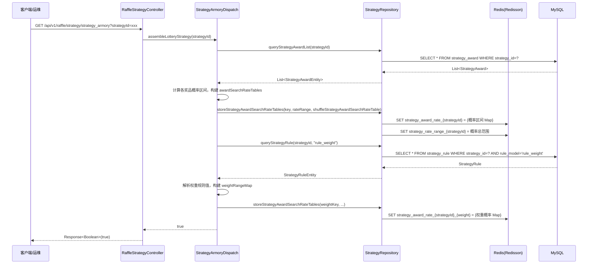

# 01 策略配置与装配

> **功能点**：将策略奖品、规则、概率/权重数据从数据库加载到 Redis，构建抽奖所需的概率区间表和权重查找表。

---

## 1. 功能概述

"策略装配"是抽奖执行的**前置准备步骤**。在用户真正抽奖前，系统需要把该策略下所有奖品的概率、库存、规则等数据预热到 Redis，这样抽奖时才能做到纯内存计算、毫秒响应。

---

## 2. 核心入口

| 层级 | 类/方法 | 文件路径 |
|------|---------|---------|
| HTTP 接口 | `RaffleStrategyController#strategy_armory(Long strategyId)` | `big-market-trigger/src/main/java/cn/bugstack/trigger/http/RaffleStrategyController.java` |
| HTTP 接口 | `RaffleActivityController#armory(Long activityId)` | `big-market-trigger/src/main/java/cn/bugstack/trigger/http/RaffleActivityController.java` |
| 域服务接口 | `IStrategyArmory#assembleLotteryStrategy(Long strategyId)` | `big-market-domain/src/main/java/cn/bugstack/domain/strategy/service/armory/IStrategyArmory.java` |
| 域服务实现 | `StrategyArmoryDispatch#assembleLotteryStrategy(Long strategyId)` | `big-market-domain/src/main/java/cn/bugstack/domain/strategy/service/armory/StrategyArmoryDispatch.java` |
| 活动装配接口 | `IActivityArmory#assembleActivitySkuByActivityId(Long activityId)` | `big-market-domain/src/main/java/cn/bugstack/domain/activity/service/armory/IActivityArmory.java` |
| 活动装配实现 | `ActivityArmory#assembleActivitySkuByActivityId(Long activityId)` | `big-market-domain/src/main/java/cn/bugstack/domain/activity/service/armory/ActivityArmory.java` |
| 仓储接口 | `IStrategyRepository` | `big-market-domain/src/main/java/cn/bugstack/domain/strategy/repository/IStrategyRepository.java` |
| 仓储实现 | `StrategyRepository` | `big-market-infrastructure/src/main/java/cn/bugstack/infrastructure/adapter/repository/StrategyRepository.java` |

---

## 3. 关键领域对象

| 对象 | 包路径 | 字段说明 |
|------|--------|---------|
| `StrategyEntity` | `cn.bugstack.domain.strategy.model.entity` | strategyId、ruleModels（策略级规则） |
| `StrategyAwardEntity` | `cn.bugstack.domain.strategy.model.entity` | strategyId、awardId、awardRate、awardCount、awardCountSurplus、sort、ruleModels |
| `StrategyRuleEntity` | `cn.bugstack.domain.strategy.model.entity` | strategyId、awardId、ruleType、ruleModel、ruleValue、ruleDesc |
| `ActivitySkuEntity` | `cn.bugstack.domain.activity.model.entity` | sku、activityId、activityCountId、stockCount、stockCountSurplus |
| `RuleWeightVO` | `cn.bugstack.domain.strategy.model.valobj` | ruleValue（权重规则值）、weightRange（权重区间） |
| `StrategyAwardStockKeyVO` | `cn.bugstack.domain.strategy.model.valobj` | strategyId、awardId |

---

## 4. 调用链路



---

## 5. 概率表构建算法

**核心逻辑**（位于 `StrategyArmoryDispatch`）：

1. 获取所有奖品的 `awardRate`（BigDecimal），将其等比扩展为整数区间（例如概率 0.01 扩展为 1/100，则总范围为 100）。
2. 将每个 `awardId` 按其概率份额填入一个随机散列表（`HashMap<Integer, Integer>`）：索引 → awardId。
3. 散列时打乱顺序，防止连号被预测。
4. 存入 Redis：
   - `strategy_rate_range_{strategyId}` → 概率总范围（整数）
   - `strategy_award_rate_{strategyId}` → Map（随机索引 → awardId）

**权重表构建**：
- 若策略配置了 `rule_weight` 规则，对权重规则值（如 `4000:102,103,104,105`）中的每个权重分组分别构建子概率表，key 追加权重值后缀。

---

## 6. 活动 SKU 装配

**入口**：`ActivityArmory#assembleActivitySkuByActivityId(activityId)`

```mermaid
flowchart TD
    A[activityId] --> B[查询活动下所有 SKU\nIRaffleActivitySkuDao.queryActivitySkuListByActivityId]
    B --> C[遍历每个 SKU]
    C --> D[cacheActivitySkuStockCount\n写入 Redis\nactivity_sku_stock_{sku}]
    D --> E[返回装配成功]
```

---

## 7. 存储交互汇总

| 操作 | 数据来源 | 存储目标 | Redis Key 模式 |
|------|---------|---------|---------------|
| 策略奖品概率表 | `strategy_award` 表 | Redis | `strategy_award_rate_{strategyId}` |
| 策略概率总范围 | 计算得出 | Redis | `strategy_rate_range_{strategyId}` |
| 权重概率表 | `strategy_rule` 表 | Redis | `strategy_award_rate_{strategyId}_{weight}` |
| 活动 SKU 库存 | `raffle_activity_sku` 表 | Redis | `activity_sku_stock_{sku}` |
| 策略奖品规则模型 | `strategy_award` 表 | Redis | `strategy_award_rule_model_{strategyId}_{awardId}` |
