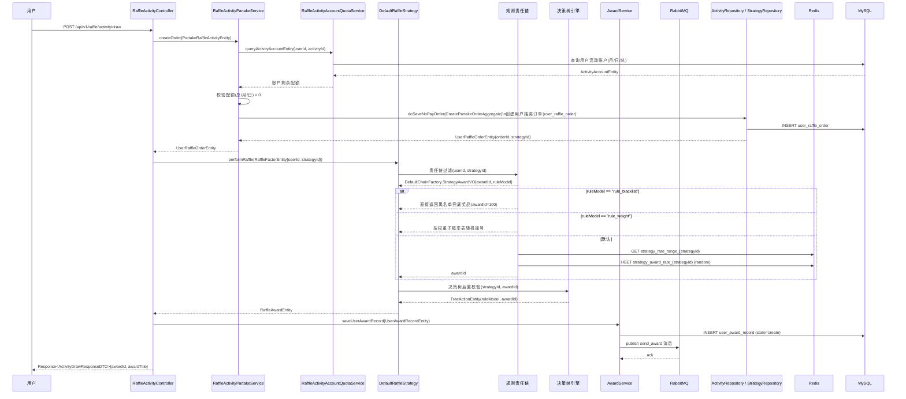
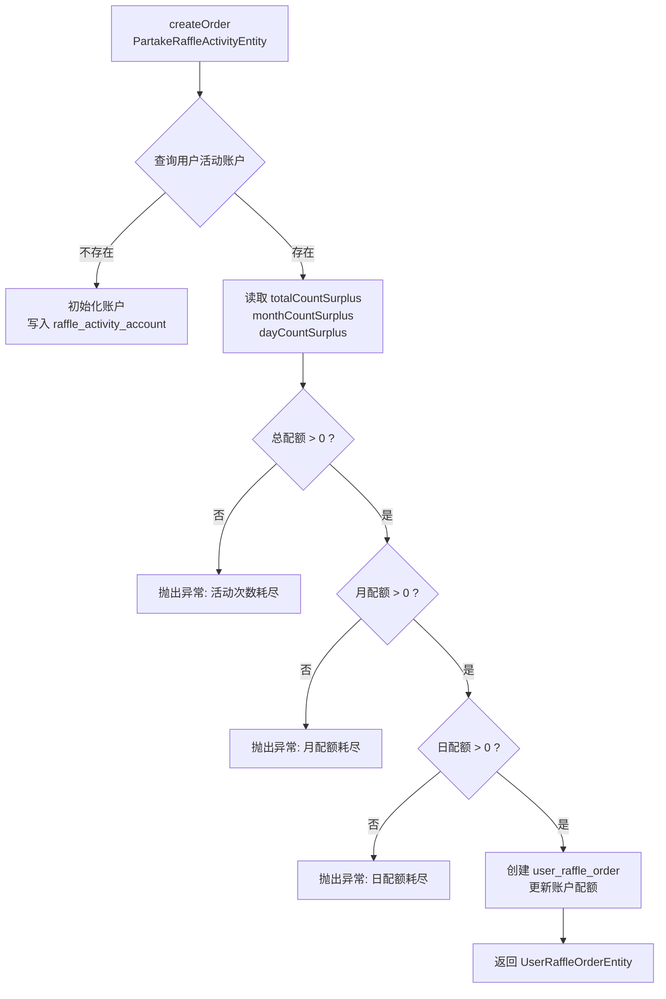
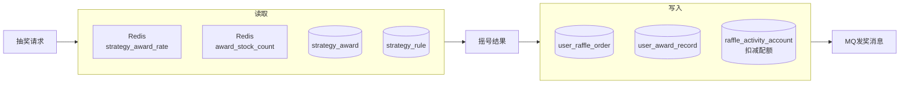

# 02 抽奖执行与规则链

> **功能点**：用户发起抽奖后，系统依次经过活动参与（配额校验/扣减）、责任链规则过滤（黑名单/权重/默认）、概率随机摇号、决策树后置规则校验，最终返回奖品结果并落单。

---

## 1. 功能概述

抽奖主流程是整个系统**最核心**的业务链路。从用户点击"抽奖"按钮到最终返回奖品，大致经历：

```
配额校验 → 创建抽奖订单 → 规则链过滤 → 随机摇号 → 决策树校验 → 返回奖品 → 异步发奖
```

---

## 2. 核心入口

| 层级 | 类/方法 | 文件路径 |
|------|---------|---------|
| HTTP 接口 | `RaffleActivityController#draw(ActivityDrawRequestDTO)` | `big-market-trigger/.../RaffleActivityController.java` |
| HTTP 接口（Token） | `RaffleActivityController#draw_by_token(token, ActivityDrawRequestDTO)` | 同上 |
| 策略抽奖接口 | `RaffleStrategyController#random_raffle(RaffleStrategyRequestDTO)` | `big-market-trigger/.../RaffleStrategyController.java` |
| 域服务接口 | `IRaffleStrategy#performRaffle(RaffleFactorEntity)` | `big-market-domain/.../strategy/service/IRaffleStrategy.java` |
| 域服务实现 | `DefaultRaffleStrategy#performRaffle(RaffleFactorEntity)` | `big-market-domain/.../strategy/service/raffle/DefaultRaffleStrategy.java` |
| 活动参与接口 | `IRaffleActivityPartakeService` | `big-market-domain/.../activity/service/IRaffleActivityPartakeService.java` |
| 活动参与实现 | `RaffleActivityPartakeService` | `big-market-domain/.../activity/service/partake/RaffleActivityPartakeService.java` |

---

## 3. 关键领域对象

| 对象 | 说明 |
|------|------|
| `RaffleFactorEntity` | 抽奖入参：`userId`、`strategyId` |
| `RaffleAwardEntity` | 抽奖结果：`awardId`、`awardIndex`、`awardName`、`sort` |
| `UserRaffleOrderEntity` | 用户抽奖订单：`orderId`、`activityId`、`strategyId`、`orderState` |
| `ActivityAccountEntity` | 用户活动账户：`totalCountSurplus`、`monthCountSurplus`、`dayCountSurplus` |
| `CreatePartakeOrderAggregate` | 参与订单聚合根：含账户信息、订单信息 |

---

## 4. 完整调用链路



---

## 5. 活动参与（配额扣减）流程



---

## 6. 规则责任链

责任链在 `DefaultChainFactory` 中按策略配置的 `ruleModels` 字段动态组装，执行顺序固定为：

```
BlackListLogicChain → RuleWeightLogicChain → DefaultLogicChain
```

详见 [03-规则引擎.md](./03-规则引擎.md)。

---

## 7. 关键配置与异常兜底

| 场景 | 处理方式 |
|------|---------|
| 用户在黑名单中 | `BlackListLogicChain` 直接返回黑名单奖品（awardId=100）|
| 奖品库存耗尽 | `RuleStockLogicTreeNode` 返回兜底奖品 |
| 奖品未解锁（次数不足） | `RuleLockLogicTreeNode` 返回兜底奖品 |
| 日配额耗尽 | 抛出 `AppException`，HTTP 返回错误码 |
| 月/总配额耗尽 | 同上 |

---

## 8. 数据流转汇总


