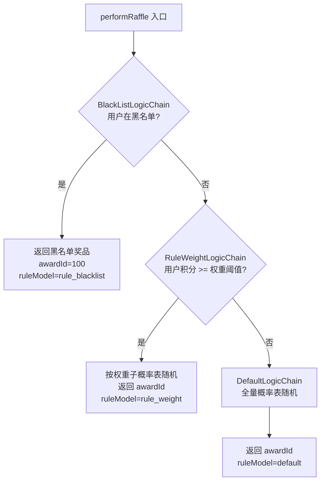
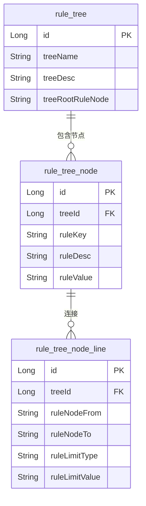
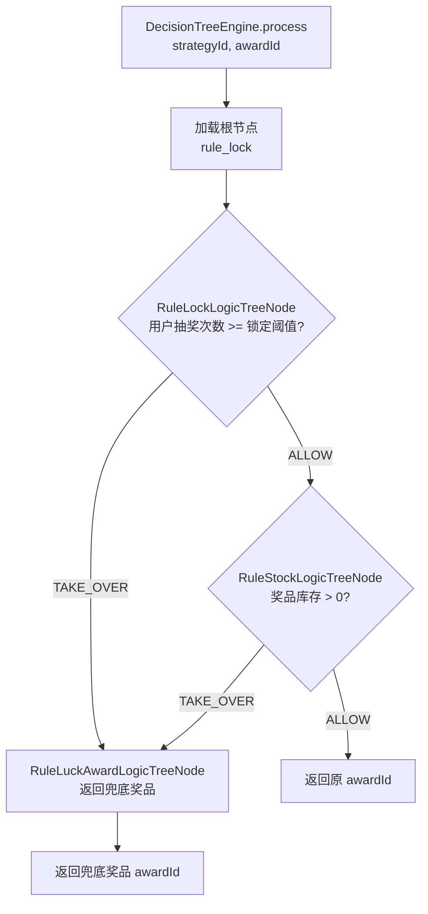
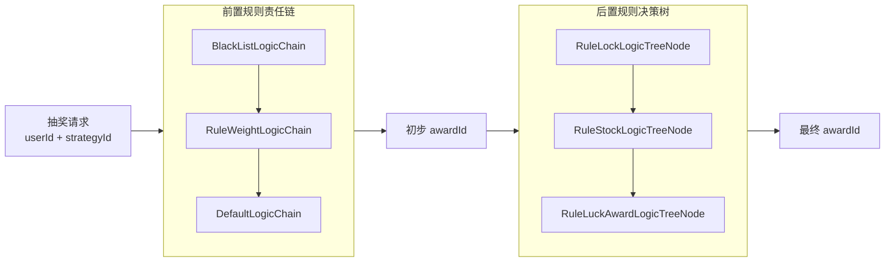

# 03 规则引擎与决策树

> **功能点**：通过"责任链（前置规则）"和"决策树（后置规则）"两个模型对抽奖过程进行精细化控制，支持黑名单、权重分配、抽奖次数锁定、库存控制、兜底奖品等多种规则。

---

## 1. 功能概述

规则引擎分两个阶段介入抽奖：

| 阶段 | 模型 | 作用 |
|------|------|------|
| **前置**（摇号前） | 责任链（LogicChain） | 决定"用哪张概率表来摇号" |
| **后置**（摇号后） | 决策树（LogicTree） | 决定"摇到的奖品是否可发/是否替换" |

---

## 2. 前置规则：责任链

### 2.1 责任链组件

| 类名 | 文件路径 | 规则说明 |
|------|---------|---------|
| `ILogicChain`（接口） | `big-market-domain/.../rule/chain/ILogicChain.java` | 链式节点接口，含 `logic()` 和 `next()` |
| `AbstractLogicChain`（抽象） | `big-market-domain/.../rule/chain/AbstractLogicChain.java` | 实现 next 指针管理 |
| `BlackListLogicChain` | `big-market-domain/.../rule/chain/impl/BlackListLogicChain.java` | 黑名单规则 |
| `RuleWeightLogicChain` | `big-market-domain/.../rule/chain/impl/RuleWeightLogicChain.java` | 权重规则（积分区间不同，奖池不同） |
| `DefaultLogicChain` | `big-market-domain/.../rule/chain/impl/DefaultLogicChain.java` | 默认随机抽奖 |
| `DefaultChainFactory` | `big-market-domain/.../rule/chain/factory/DefaultChainFactory.java` | 工厂：根据策略 ruleModels 组装链 |

### 2.2 责任链执行流程



### 2.3 黑名单规则（BlackListLogicChain）

- 规则值存储在 `strategy_rule.rule_value`，格式：`100:user001,user002,user003`
  - `100`：黑名单命中时返回的奖品 ID
  - `user001,...`：被拉黑的用户 ID 列表
- 命中黑名单直接返回，不再往后传递。

### 2.4 权重规则（RuleWeightLogicChain）

- 规则值格式：`4000:102,103,104,105 6000:102,103,104,105,106,107 8000:102,103,104,105,106,107,108,109`
  - 数字（如 4000）表示"用户积分达到此值时适用该权重奖池"
- 查询用户当前积分，找到匹配的最高权重阈值，使用对应子概率表随机。
- 子概率表在装配阶段（`StrategyArmoryDispatch`）已预存到 Redis。

### 2.5 默认规则（DefaultLogicChain）

- 从 Redis 读取策略概率总范围：`strategy_rate_range_{strategyId}`
- `ThreadLocalRandom.current().nextInt(rateRange)` 生成随机索引
- 查 Redis：`HGET strategy_award_rate_{strategyId} {index}` → awardId

---

## 3. 后置规则：决策树

### 3.1 决策树组件

| 类名 | 文件路径 | 规则说明 |
|------|---------|---------|
| `ILogicTreeNode`（接口） | `big-market-domain/.../rule/tree/ILogicTreeNode.java` | 树节点接口，含 `logic()` |
| `RuleLockLogicTreeNode` | `big-market-domain/.../rule/tree/impl/RuleLockLogicTreeNode.java` | 锁定规则（N 次后解锁） |
| `RuleStockLogicTreeNode` | `big-market-domain/.../rule/tree/impl/RuleStockLogicTreeNode.java` | 库存扣减规则 |
| `RuleLuckAwardLogicTreeNode` | `big-market-domain/.../rule/tree/impl/RuleLuckAwardLogicTreeNode.java` | 兜底奖品规则 |
| `DecisionTreeEngine` | `big-market-domain/.../rule/tree/factory/engine/impl/DecisionTreeEngine.java` | 树遍历执行引擎 |
| `DefaultTreeFactory` | `big-market-domain/.../rule/tree/factory/DefaultTreeFactory.java` | 工厂：加载规则树结构 |

### 3.2 规则树数据模型

规则树从数据库 `rule_tree`、`rule_tree_node`、`rule_tree_node_line` 三表读取：



### 3.3 决策树执行流程



### 3.4 锁定规则（RuleLockLogicTreeNode）

- 规则值（`ruleValue`）为数字，表示"用户需要抽奖 N 次后该奖品才可中奖"
- 查询 Redis 中该用户本轮抽奖次数（key: `rule_lock_count_{strategyId}_{userId}`）
- 次数 < N 则触发 TAKE_OVER，不返回该奖品，转交兜底规则

### 3.5 库存规则（RuleStockLogicTreeNode）

- 原子性扣减 Redis 计数器（`award_stock_count_{strategyId}_{awardId}`）
- 扣减成功 → ALLOW（允许中奖）
- 扣减失败（库存为 0）→ TAKE_OVER（转交兜底）
- 同时往库存消耗队列写入消息，后台 Job 异步回写 DB

### 3.6 兜底规则（RuleLuckAwardLogicTreeNode）

- 直接读取该节点的 `ruleValue` 中配置的兜底奖品 ID
- 无条件返回该奖品，终止树的遍历

---

## 4. 规则模型与策略的绑定

`strategy_award.rule_models` 字段记录了该奖品适用的规则（逗号分隔），例如：

```
rule_lock,rule_stock,rule_luck_award
```

装配时会把这个字段缓存到 Redis（key: `strategy_award_rule_model_{strategyId}_{awardId}`），抽奖时读取，再从 `rule_tree` 表加载对应的树结构执行。

---

## 5. 全量规则执行总览



---

## 6. 涉及数据库表

| 表名 | 用途 |
|------|------|
| `strategy` | 策略基本信息，含策略级 `rule_models` |
| `strategy_award` | 奖品配置，含奖品级 `rule_models` |
| `strategy_rule` | 规则定义：`rule_model`、`rule_value` |
| `rule_tree` | 决策树根节点 |
| `rule_tree_node` | 决策树各节点及规则值 |
| `rule_tree_node_line` | 节点连线：条件类型（limit type）和条件值 |
