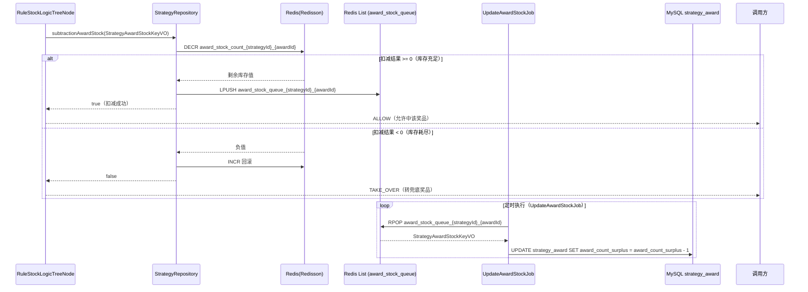
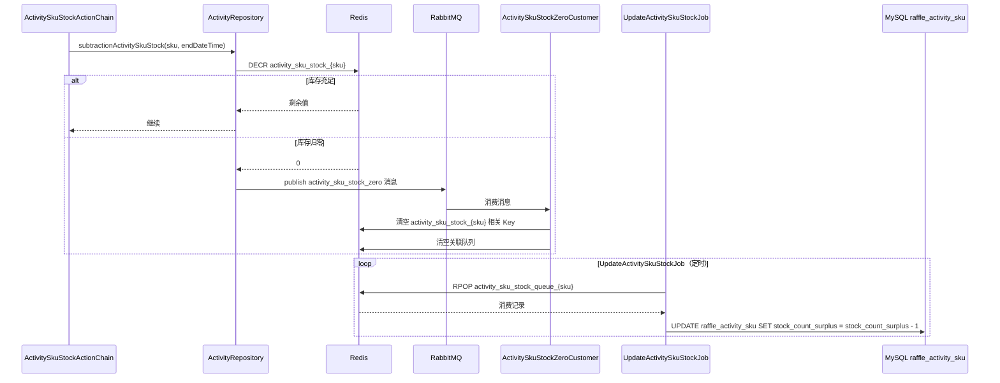
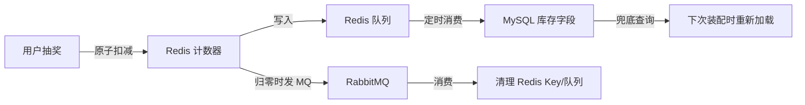

# 04 库存管理

> **功能点**：奖品与活动 SKU 库存采用"Redis 原子扣减 + MQ 异步通知 + 定时 Job 回写 DB"三层联动方案，兼顾高并发性能与最终数据一致性。

---

## 1. 功能概述

库存管理涵盖两类库存：

| 库存类型 | 说明 | 相关表 |
|---------|------|--------|
| **奖品库存** | 单个奖品（awardId）在某策略下可发放数量 | `strategy_award` |
| **活动 SKU 库存** | 活动下某个 SKU 的可参与次数/份数 | `raffle_activity_sku` |

两类库存均遵循相同的分层架构：

```
Redis（原子扣减）→ 队列（Queue/MQ）→ MySQL（最终落库）
```

---

## 2. 核心入口

### 奖品库存

| 层级 | 类/方法 | 文件路径 |
|------|---------|---------|
| 决策树节点 | `RuleStockLogicTreeNode#logic(DecisionMatterEntity)` | `big-market-domain/.../rule/tree/impl/RuleStockLogicTreeNode.java` |
| 仓储接口 | `IStrategyRepository#subtractionAwardStock(StrategyAwardStockKeyVO)` | `big-market-domain/.../strategy/repository/IStrategyRepository.java` |
| 仓储实现 | `StrategyRepository#subtractionAwardStock(...)` | `big-market-infrastructure/.../adapter/repository/StrategyRepository.java` |
| Redis 服务 | `RedissonService#decrement(key)` | `big-market-infrastructure/.../redis/RedissonService.java` |
| 定时 Job | `UpdateAwardStockJob` | `big-market-trigger/.../job/UpdateAwardStockJob.java` |

### 活动 SKU 库存

| 层级 | 类/方法 | 文件路径 |
|------|---------|---------|
| 行动链节点 | `ActivitySkuStockActionChain#logic(...)` | `big-market-domain/.../quota/rule/impl/ActivitySkuStockActionChain.java` |
| 仓储接口 | `IActivityRepository#subtractionActivitySkuStock(...)` | `big-market-domain/.../activity/adapter/repository/IActivityRepository.java` |
| 仓储实现 | `ActivityRepository#subtractionActivitySkuStock(...)` | `big-market-infrastructure/.../adapter/repository/ActivityRepository.java` |
| 定时 Job | `UpdateActivitySkuStockJob` | `big-market-trigger/.../job/UpdateActivitySkuStockJob.java` |
| MQ 消费者 | `ActivitySkuStockZeroCustomer` | `big-market-trigger/.../listener/ActivitySkuStockZeroCustomer.java` |

---

## 3. 奖品库存扣减流程



---

## 4. 活动 SKU 库存扣减流程



---

## 5. 定时 Job 详情

### UpdateAwardStockJob

- **位置**：`big-market-trigger/src/main/java/cn/bugstack/trigger/job/UpdateAwardStockJob.java`
- **职责**：消费 Redis 队列中的奖品库存扣减记录，批量回写到 `strategy_award` 表
- **执行策略**：Spring `@Scheduled`，固定频率
- **核心调用**：`IRaffleStock#takeQueueValue()` → `IStrategyRepository#updateStrategyAwardStock(...)`

### UpdateActivitySkuStockJob

- **位置**：`big-market-trigger/src/main/java/cn/bugstack/trigger/job/UpdateActivitySkuStockJob.java`
- **职责**：消费 Redis 队列中的 SKU 库存扣减记录，回写到 `raffle_activity_sku` 表
- **核心调用**：`IRaffleActivitySkuStockService#takeQueueValue()` → `IActivityRepository#updateActivitySkuStock(...)`

---

## 6. 库存 Redis Key 规范

| Redis Key | 含义 | 数据类型 |
|-----------|------|---------|
| `award_stock_count_{strategyId}_{awardId}` | 奖品剩余库存 | String（计数器） |
| `award_stock_queue_{strategyId}_{awardId}` | 奖品库存扣减队列 | List |
| `activity_sku_stock_{sku}` | 活动 SKU 剩余库存 | String（计数器） |
| `activity_sku_stock_queue_{sku}` | SKU 库存扣减队列 | List |

---

## 7. 最终一致性保障



- **不丢数据**：所有扣减先记队列，Job 异步消费回写。
- **不超发**：Redis 原子 DECR，结果 < 0 时立即回滚并拒绝发奖。
- **缓存清理**：库存归零后通过 MQ 清除 Redis key，防止"幽灵库存"。
