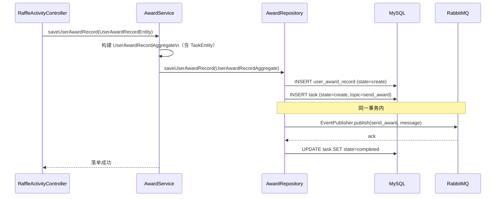
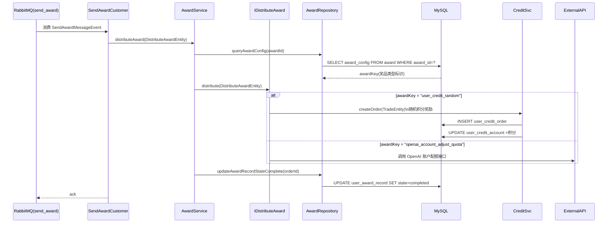
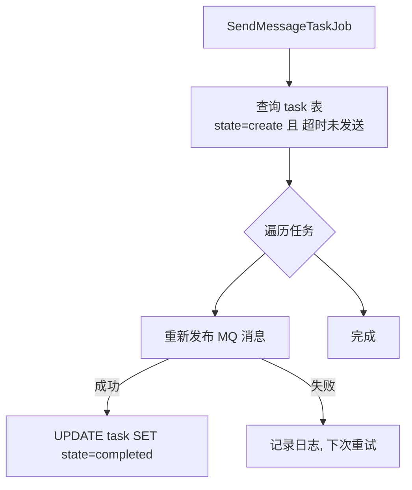

# 05 抽奖订单与奖品下发

> **功能点**：用户中奖后，系统先落单记录奖品结果，再通过 RabbitMQ 异步触发奖品下发，按奖品类型路由到不同的分发策略（积分、OpenAI 配额等）。

---

## 1. 功能概述

抽奖完成后的奖品下发分两个阶段：

| 阶段 | 说明 |
|------|------|
| **落单** | 同步记录中奖信息到 `user_award_record`，状态为 `create` |
| **发奖** | 异步通过 MQ 消费，调用对应奖品分发器，状态更新为 `completed` |

---

## 2. 核心入口

| 层级 | 类/方法 | 文件路径 |
|------|---------|---------|
| 域服务接口 | `IAwardService#saveUserAwardRecord(UserAwardRecordEntity)` | `big-market-domain/.../award/service/IAwardService.java` |
| 域服务实现 | `AwardService#saveUserAwardRecord(...)` | `big-market-domain/.../award/service/AwardService.java` |
| 域服务接口 | `IAwardService#distributeAward(DistributeAwardEntity)` | 同上 |
| 域服务实现 | `AwardService#distributeAward(...)` | `big-market-domain/.../award/service/AwardService.java` |
| MQ 消费者 | `SendAwardCustomer#listener(SendAwardMessageEvent.EventMessage)` | `big-market-trigger/.../listener/SendAwardCustomer.java` |
| 仓储接口 | `IAwardRepository` | `big-market-domain/.../award/adapter/repository/IAwardRepository.java` |
| 仓储实现 | `AwardRepository` | `big-market-infrastructure/.../adapter/repository/AwardRepository.java` |

---

## 3. 关键领域对象

| 对象 | 包路径 | 说明 |
|------|--------|------|
| `UserAwardRecordEntity` | `cn.bugstack.domain.award.model.entity` | 中奖记录：userId、activityId、strategyId、orderId、awardId、awardTitle、awardConfig、state |
| `UserAwardRecordAggregate` | `cn.bugstack.domain.award.model.aggregate` | 聚合根：含 UserAwardRecordEntity + TaskEntity |
| `GiveOutPrizesAggregate` | `cn.bugstack.domain.award.model.aggregate` | 发奖聚合：awardId、userId、orderId、awardConfig |
| `DistributeAwardEntity` | `cn.bugstack.domain.award.model.entity` | 下发入参：userId、orderId、awardId、awardConfig |
| `TaskEntity` | `cn.bugstack.domain.award.model.entity` | 消息任务：topic、messageId、message、state |
| `SendAwardMessageEvent` | `cn.bugstack.domain.award.event` | MQ 事件：userId、orderId、awardId、awardConfig |

---

## 4. 落单流程

> **注意**：`user_award_record` 与 `task` 表在同一事务内写入，MQ 发送后更新 task 状态。若 MQ 发送失败，task 状态保持 `create`，由 `SendMessageTaskJob` 兜底重试。

---

## 5. 发奖流程（异步消费）

---

## 6. 奖品分发策略（策略模式）

| 实现类 | 文件路径 | 奖品类型 | 处理逻辑 |
|--------|---------|---------|---------|
| `UserCreditRandomAward` | `big-market-domain/.../award/service/distribute/impl/UserCreditRandomAward.java` | 随机积分 | 从 `awardConfig` 解析积分范围，随机生成积分，调用 `CreditAdjustService.createOrder()` 充值 |
| `OpenAIAccountAdjustQuotaAward` | `big-market-domain/.../award/service/distribute/impl/OpenAIAccountAdjustQuotaAward.java` | OpenAI 配额 | 调用外部 OpenAI 账户服务，增加用户 API 配额 |

扩展新奖品类型：实现 `IDistributeAward` 接口，注册 Spring Bean，`awardKey` 与 `award.award_config` 中的类型标识匹配即可。

---

## 7. 消息可靠性兜底

### SendMessageTaskJob

- **位置**：`big-market-trigger/src/main/java/cn/bugstack/trigger/job/SendMessageTaskJob.java`
- **职责**：定期扫描 `task` 表中 `state=create` 的记录，重新发送 MQ 消息
- **流程**：

---

## 8. 数据库表

| 表名 | 关键字段 | 说明 |
|------|---------|------|
| `user_award_record` | userId, activityId, orderId, awardId, state | 用户中奖记录，state: create→completed |
| `task` | userId, topic, messageId, message, state | MQ 消息任务表，state: create→completed |
| `award` | awardId, awardKey, awardConfig | 奖品定义，awardKey 决定分发策略 |
