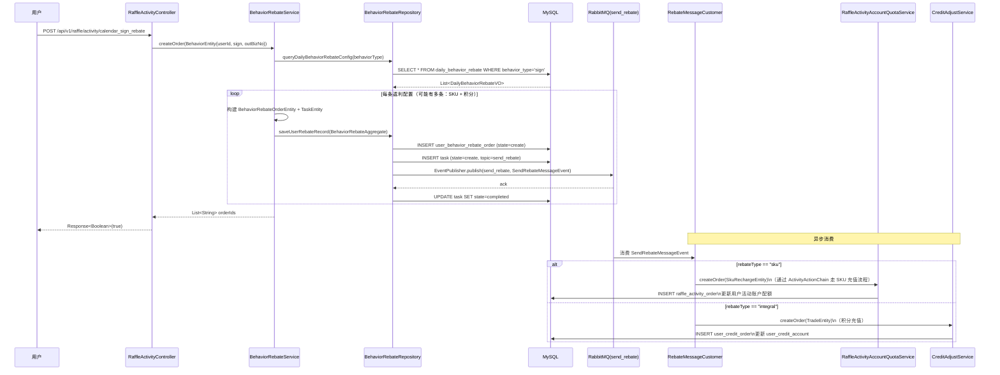

# 06 行为返利流程

> **功能点**：用户完成签到、分享等行为后，系统通过 MQ 异步下发返利，返利可以是 SKU 兑换（增加活动参与次数）或积分充值两种形式。

---

## 1. 功能概述

行为返利是一种"做任务 → 得奖励"的营销玩法：

| 行为类型 | 返利类型 | 说明 |
|---------|---------|------|
| 签到（`sign`） | SKU / 积分 | 每日签到赠送活动参与次数或积分 |
| 其他可扩展行为 | SKU / 积分 | 按 `daily_behavior_rebate` 配置 |

---

## 2. 核心入口

| 层级 | 类/方法 | 文件路径 |
|------|---------|---------|
| HTTP 接口 | `RaffleActivityController#calendar_sign_rebate(String userId)` | `big-market-trigger/.../RaffleActivityController.java` |
| HTTP 接口（Token） | `RaffleActivityController#calendar_sign_rebate_by_token(String token)` | 同上 |
| 域服务接口 | `IBehaviorRebateService#createOrder(BehaviorEntity)` | `big-market-domain/.../rebate/service/IBehaviorRebateService.java` |
| 域服务实现 | `BehaviorRebateService#createOrder(BehaviorEntity)` | `big-market-domain/.../rebate/service/BehaviorRebateService.java` |
| MQ 消费者 | `RebateMessageCustomer#listener(SendRebateMessageEvent.EventMessage)` | `big-market-trigger/.../listener/RebateMessageCustomer.java` |
| 仓储接口 | `IBehaviorRebateRepository` | `big-market-domain/.../rebate/repository/IBehaviorRebateRepository.java` |
| 仓储实现 | `BehaviorRebateRepository` | `big-market-infrastructure/.../adapter/repository/BehaviorRebateRepository.java` |

---

## 3. 关键领域对象

| 对象 | 包路径 | 说明 |
|------|--------|------|
| `BehaviorEntity` | `cn.bugstack.domain.rebate.model.entity` | 行为入参：userId、behaviorType（如 sign）、outBusinessNo |
| `BehaviorRebateOrderEntity` | `cn.bugstack.domain.rebate.model.entity` | 返利订单：userId、orderId、behaviorType、rebateType、rebateConfig |
| `BehaviorRebateAggregate` | `cn.bugstack.domain.rebate.model.aggregate` | 聚合根：含 BehaviorRebateOrderEntity + TaskEntity |
| `DailyBehaviorRebateVO` | `cn.bugstack.domain.rebate.model.valobj` | 每日行为返利配置：behaviorType、rebateType、rebateConfig |
| `SendRebateMessageEvent` | `cn.bugstack.domain.rebate.event` | MQ 事件：userId、rebateType、rebateConfig、bizId |
| `SkuRechargeEntity` | `cn.bugstack.domain.activity.model.entity` | SKU 充值入参（用于 SKU 类返利） |
| `TradeEntity` | `cn.bugstack.domain.credit.model.entity` | 积分交易入参（用于积分类返利） |

---

## 4. 完整流程



---

## 5. 返利类型路由

`RebateMessageCustomer` 中通过 `rebateType` 字段判断：

```java
// 伪代码
if ("sku".equals(rebateType)) {
    SkuRechargeEntity skuRecharge = buildSkuRechargeEntity(message);
    raffleActivityAccountQuotaService.createOrder(skuRecharge);
} else if ("integral".equals(rebateType)) {
    TradeEntity trade = buildTradeEntity(message);
    creditAdjustService.createOrder(trade);
}
```

---

## 6. 幂等保障

- `BehaviorEntity.outBusinessNo`：由调用方传入的业务唯一号，写入 `user_behavior_rebate_order.out_business_no`
- 若相同 `outBusinessNo` 已存在记录，`BehaviorRebateRepository` 中用唯一索引防重，重复请求直接返回成功（幂等）

---

## 7. 签到查询接口

| 接口 | 说明 |
|------|------|
| `GET /api/v1/raffle/activity/is_calendar_sign_rebate` | 查询用户今日是否已签到，返回 `Boolean` |

- **核心调用**：`IBehaviorRebateService#queryOrderByOutBusinessNo(userId, outBusinessNo)`
- **实现**：查询 `user_behavior_rebate_order` 中是否存在该用户今日签到记录

---

## 8. 涉及数据库表

| 表名 | 说明 |
|------|------|
| `daily_behavior_rebate` | 每日行为返利配置（行为类型、返利类型、返利值） |
| `user_behavior_rebate_order` | 用户行为返利订单（含返利类型、配置、状态） |
| `task` | MQ 消息任务，保证消息可靠投递 |
| `raffle_activity_order` | SKU 类返利生成的活动订单 |
| `user_credit_order` | 积分类返利生成的积分订单 |
| `user_credit_account` | 用户积分账户（积分充值后更新） |
