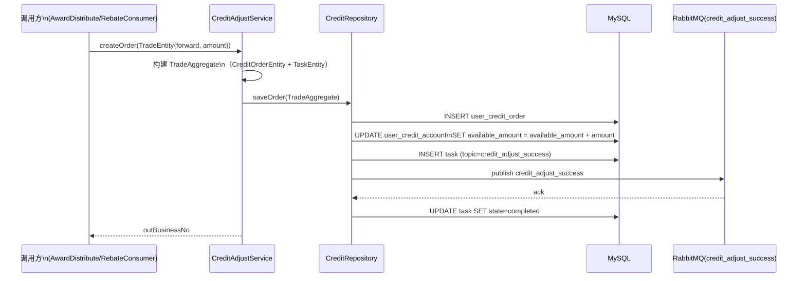
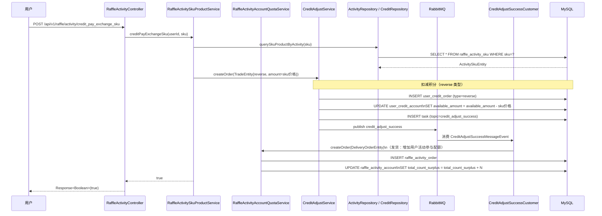

# 07 积分账户与兑换

> **功能点**：用户积分账户的充值（来自抽奖发奖/行为返利）、查询，以及通过积分支付兑换活动 SKU（增加抽奖参与次数）的完整链路。

---

## 1. 功能概述

积分（Credit）体系是平台的虚拟货币系统：

| 场景 | 说明 |
|------|------|
| **积分充值** | 抽中积分奖品后，由 `UserCreditRandomAward` 调用 `CreditAdjustService.createOrder()` 充值 |
| **行为返利充值** | 用户签到等行为触发，由 `RebateMessageCustomer` 消费后调用 `CreditAdjustService.createOrder()` |
| **积分支付兑换 SKU** | 用户用积分购买活动参与次数，调用 `RaffleActivityController#credit_pay_exchange_sku` |
| **积分查询** | 查询用户可用积分余额 |

---

## 2. 核心入口

| 层级 | 类/方法 | 文件路径 |
|------|---------|---------|
| HTTP 接口 | `RaffleActivityController#credit_pay_exchange_sku(SkuProductShopCartRequestDTO)` | `big-market-trigger/.../RaffleActivityController.java` |
| HTTP 接口 | `RaffleActivityController#query_user_credit_account(String userId)` | 同上 |
| HTTP 接口（Token） | `RaffleActivityController#credit_pay_exchange_sku_by_token(token, SkuProductShopCartRequestDTO)` | 同上 |
| 域服务接口 | `ICreditAdjustService#createOrder(TradeEntity)` | `big-market-domain/.../credit/service/ICreditAdjustService.java` |
| 域服务实现 | `CreditAdjustService#createOrder(TradeEntity)` | `big-market-domain/.../credit/service/adjust/CreditAdjustService.java` |
| 域服务接口 | `ICreditAdjustService#queryUserCreditAccount(String userId)` | 同上 |
| MQ 消费者 | `CreditAdjustSuccessCustomer` | `big-market-trigger/.../listener/CreditAdjustSuccessCustomer.java` |
| 仓储接口 | `ICreditRepository` | `big-market-domain/.../credit/repository/ICreditRepository.java` |
| 仓储实现 | `CreditRepository` | `big-market-infrastructure/.../adapter/repository/CreditRepository.java` |

---

## 3. 关键领域对象

| 对象 | 包路径 | 说明 |
|------|--------|------|
| `TradeEntity` | `cn.bugstack.domain.credit.model.entity` | 交易入参：userId、tradeName、tradeType（forward/reverse）、amount、outBusinessNo |
| `CreditOrderEntity` | `cn.bugstack.domain.credit.model.entity` | 积分订单 |
| `CreditAccountEntity` | `cn.bugstack.domain.credit.model.entity` | 积分账户：userId、availableAmount、frozenAmount |
| `TradeAggregate` | `cn.bugstack.domain.credit.model.aggregate` | 聚合根：含 CreditOrderEntity + TaskEntity |
| `TradeNameVO` | `cn.bugstack.domain.credit.model.valobj` | 交易名称枚举（rebate、pay 等） |
| `TradeTypeVO` | `cn.bugstack.domain.credit.model.valobj` | 交易类型：forward（充值+）、reverse（消费-） |
| `CreditAdjustSuccessMessageEvent` | `cn.bugstack.domain.credit.event` | MQ 事件：通知活动层 SKU 订单已支付成功 |
| `SkuProductShopCartRequestDTO` | `cn.bugstack.trigger.api.dto` | 积分兑换入参：userId、sku |

---

## 4. 积分充值流程

---

## 5. 积分支付兑换 SKU 流程

---

## 6. 积分账户查询

- **接口**：`POST /api/v1/raffle/activity/query_user_credit_account`
- **核心调用**：`CreditAdjustService#queryUserCreditAccount(userId)`
- **实现**：查询 `user_credit_account.available_amount`，返回 `BigDecimal`

---

## 7. 交易类型说明

| TradeTypeVO | 含义 | 对账户影响 |
|-------------|------|---------|
| `forward` | 正向交易（充值） | `available_amount` **增加** |
| `reverse` | 逆向交易（消费） | `available_amount` **减少** |

---

## 8. 涉及数据库表

| 表名 | 说明 |
|------|------|
| `user_credit_account` | 用户积分账户（可用余额、冻结余额） |
| `user_credit_order` | 积分交易订单（充值/消费记录） |
| `task` | MQ 消息任务，保证消息可靠投递 |
| `raffle_activity_order` | 兑换后生成的活动参与订单 |
| `raffle_activity_account` | 用户活动账户（配额） |
| `raffle_activity_sku` | 活动 SKU 产品信息（积分价格、库存） |

---

## 9. 兑换 SKU 商品列表查询

- **接口**：`POST /api/v1/raffle/activity/query_sku_product_list_by_activity_id`
- **核心调用**：`IRaffleActivitySkuProductService#querySkuProductEntityListByActivityId(activityId)`
- **返回**：`List<SkuProductResponseDTO>`，包含 SKU、积分价格、库存等信息
