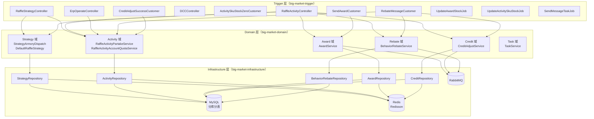
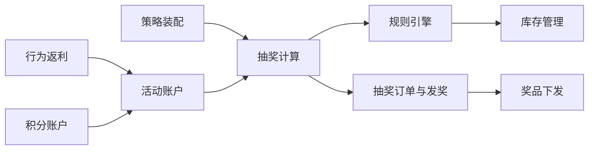

# Big-Market 业务流程解析（功能点视角）

> 本文档从**功能点**视角对 `big-market` 营销抽奖平台进行解析，梳理各核心业务模块的关键代码入口、领域对象、调用链路及数据流转。

---

## 目录

| 序号 | 功能模块 | 说明 |
|------|---------|------|
| [01](./01-策略装配.md) | 策略配置与装配 | 策略/奖品/规则加载、概率表构建、Redis 缓存预热 |
| [02](./02-抽奖计算.md) | 抽奖执行与规则链 | 责任链过滤、随机抽取、决策树规则校验 |
| [03](./03-规则引擎.md) | 规则引擎与决策树 | 黑名单、权重规则、锁定规则、库存规则、兜底规则 |
| [04](./04-库存管理.md) | 库存扣减与缓存同步 | Redis 原子扣减、MQ 异步通知、定时回写数据库 |
| [05](./05-订单发奖.md) | 抽奖订单与奖品下发 | 落单、MQ 异步发奖、多类型奖品分发策略 |
| [06](./06-行为返利.md) | 行为返利流程 | 签到/行为触发、MQ 驱动返利订单、SKU/积分两种返利 |
| [07](./07-积分账户.md) | 积分账户与兑换 | 积分充值、信用支付 SKU、账户查询 |

---

## 整体架构总览

---

## 核心模块关系

---

## 阅读指引

1. **初次阅读**：建议先看 [01-策略装配](./01-策略装配.md) 了解数据初始化，再看 [02-抽奖计算](./02-抽奖计算.md) 了解主流程。
2. **规则理解**：[03-规则引擎](./03-规则引擎.md) 详细讲解黑名单、权重、锁定、库存等规则的代码实现。
3. **库存专题**：[04-库存管理](./04-库存管理.md) 专注于 Redis + MQ + DB 三层联动的库存方案。
4. **发奖专题**：[05-订单发奖](./05-订单发奖.md) 追踪从"抽中"到"到账"的完整链路。
5. **营销玩法**：[06-行为返利](./06-行为返利.md) 和 [07-积分账户](./07-积分账户.md) 介绍签到返利与积分兑换。

---

## 关键领域对象速查

| 领域对象 | 包路径 | 用途 |
|---------|--------|------|
| `StrategyAwardEntity` | `cn.bugstack.domain.strategy.model.entity` | 策略奖品配置（库存、概率、规则） |
| `RaffleFactorEntity` | `cn.bugstack.domain.strategy.model.entity` | 抽奖入参（userId、strategyId） |
| `RaffleAwardEntity` | `cn.bugstack.domain.strategy.model.entity` | 抽奖结果（awardId、awardIndex） |
| `UserRaffleOrderEntity` | `cn.bugstack.domain.activity.model.entity` | 用户抽奖订单 |
| `ActivityAccountEntity` | `cn.bugstack.domain.activity.model.entity` | 用户活动账户（总/月/日配额） |
| `UserAwardRecordEntity` | `cn.bugstack.domain.award.model.entity` | 用户中奖记录 |
| `DistributeAwardEntity` | `cn.bugstack.domain.award.model.entity` | 奖品下发入参 |
| `CreditAccountEntity` | `cn.bugstack.domain.credit.model.entity` | 用户积分账户 |
| `BehaviorEntity` | `cn.bugstack.domain.rebate.model.entity` | 用户行为（签到等） |
