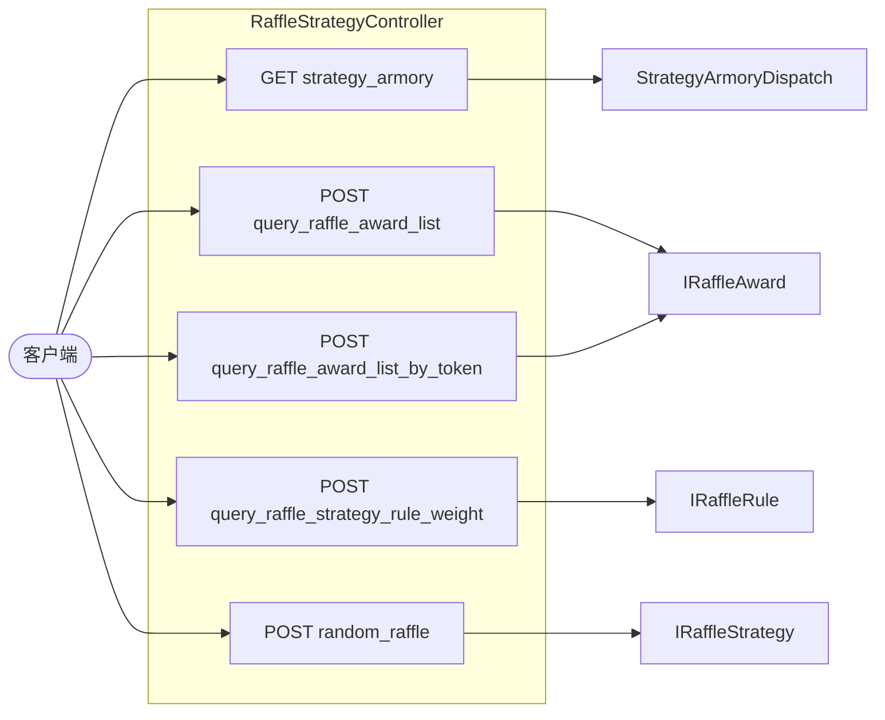
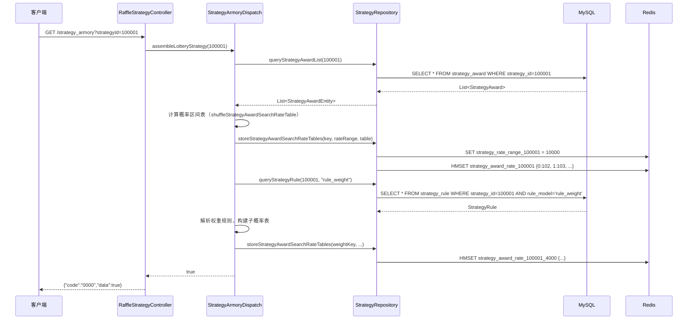
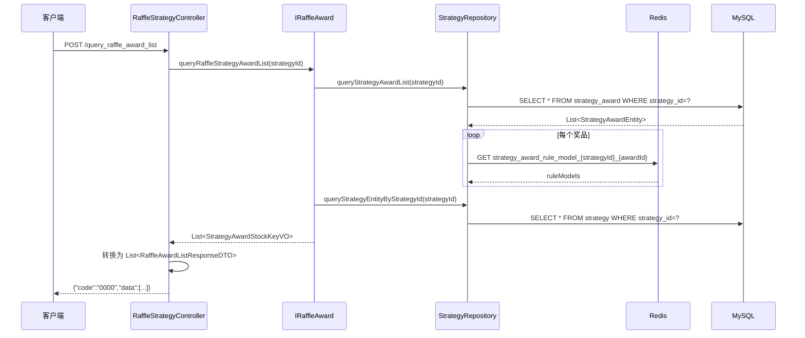
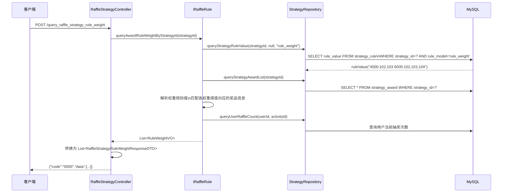
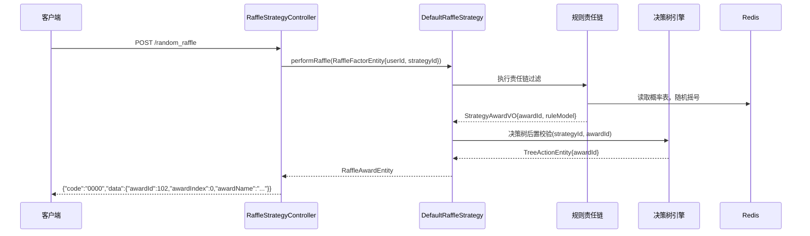

# 01 RaffleStrategyController 接口走读

> **控制器**：`cn.bugstack.trigger.http.RaffleStrategyController`  
> **文件路径**：`big-market-trigger/src/main/java/cn/bugstack/trigger/http/RaffleStrategyController.java`  
> **Base URL**：`/api/v1/raffle/strategy/`

---

## 接口总览



---

## 1. GET `/api/v1/raffle/strategy/strategy_armory`

### 请求参数

| 参数 | 类型 | 位置 | 说明 |
|------|------|------|------|
| `strategyId` | `Long` | Query | 策略 ID |

### 调用链路



### 核心处理步骤

1. 调用 `StrategyArmoryDispatch#assembleLotteryStrategy(strategyId)` 启动装配
2. 从 `strategy_award` 表加载所有奖品及概率
3. 构建全量概率散列表并写入 Redis（key: `strategy_award_rate_{strategyId}`）
4. 若存在权重规则（`rule_weight`），按权重阈值分别构建子概率表
5. 缓存各奖品的规则模型配置（`strategy_award_rule_model_...`）

### 返回结果

```json
{"code": "0000", "info": "成功", "data": true}
```

---

## 2. POST `/api/v1/raffle/strategy/query_raffle_award_list`

### 请求参数

```json
{
  "userId": "user001",
  "activityId": 100301
}
```

| 字段 | 类型 | 说明 |
|------|------|------|
| `userId` | String | 用户 ID |
| `activityId` | Long | 活动 ID |

### 调用链路



### 核心处理步骤

1. 根据 `activityId` 从 `raffle_activity` 查到 `strategyId`
2. 查询 `strategy_award` 获取奖品列表
3. 读取每个奖品的规则模型（Redis 缓存）
4. 组装展示 DTO（含奖品标题、副标题、库存、规则说明）

### 返回结果

```json
{
  "code": "0000",
  "data": [
    {
      "awardId": 101,
      "awardTitle": "OpenAI 聊天模型 GPT-4o-mini 1次",
      "awardSubtitle": "...",
      "sort": 1,
      "awardRuleValue": "..."
    }
  ]
}
```

---

## 3. POST `/api/v1/raffle/strategy/query_raffle_strategy_rule_weight`

### 请求参数

```json
{
  "userId": "user001",
  "activityId": 100301
}
```

### 调用链路



### 返回结果

```json
{
  "code": "0000",
  "data": [
    {
      "ruleWeightCount": 4000,
      "userActivityAccountTotalUseCount": 1500,
      "awardList": [
        {"awardId": 102, "awardTitle": "..."}
      ]
    }
  ]
}
```

---

## 4. POST `/api/v1/raffle/strategy/random_raffle`

> **用途**：不经过活动层，直接对策略发起随机抽奖（主要用于测试或内部调用）。

### 请求参数

```json
{
  "strategyId": 100001
}
```

### 调用链路



### 关键领域对象

- **输入**：`RaffleStrategyRequestDTO`（strategyId）→ `RaffleFactorEntity`
- **输出**：`RaffleAwardEntity`（awardId、awardIndex、awardName、sort）→ `RaffleStrategyResponseDTO`

### 异常/兜底

| 场景 | 处理 |
|------|------|
| strategyId 未装配 | 抛出 `AppException`，返回错误码 |
| 规则链所有奖品库存耗尽 | 返回兜底奖品（`RuleLuckAwardLogicTreeNode` 配置） |

---

## 5. POST `/api/v1/raffle/strategy/query_raffle_award_list_by_token`

与 `query_raffle_award_list` 逻辑相同，额外：
1. 从请求头/参数读取 JWT Token
2. 调用 `AuthService#decode(token)` 解析出 `userId`
3. 后续逻辑与无 Token 版本一致
