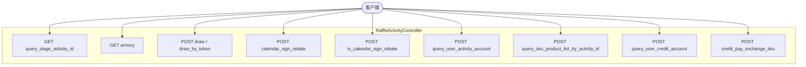
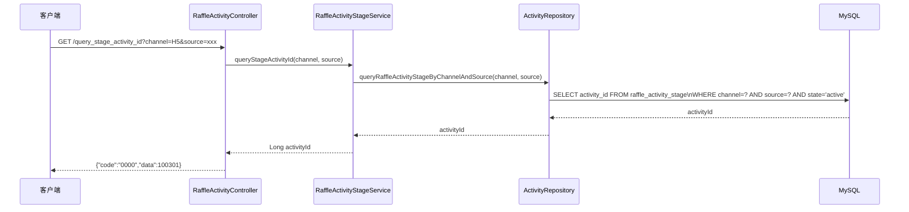
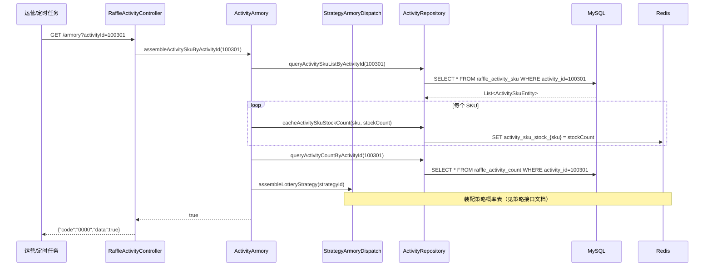
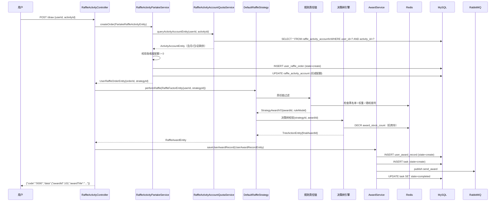
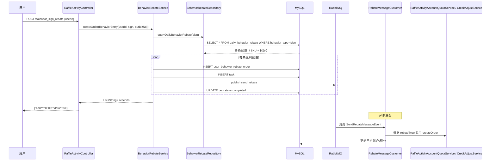
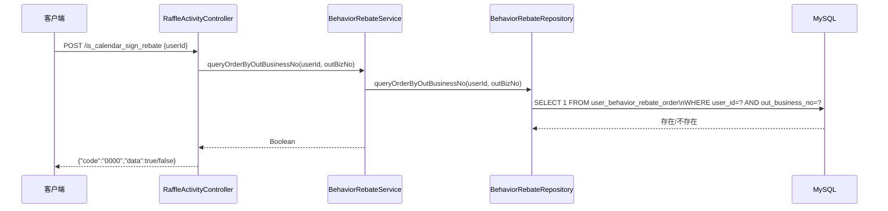
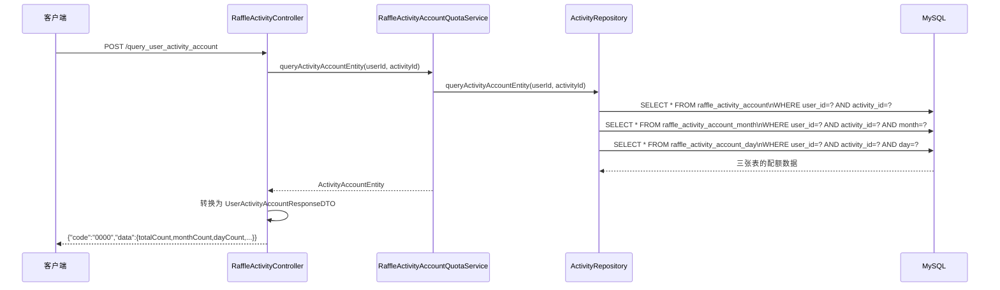
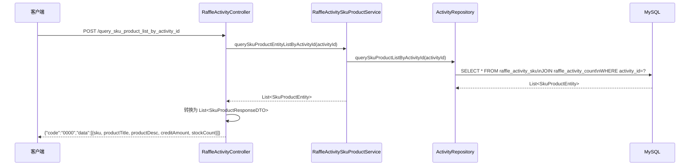
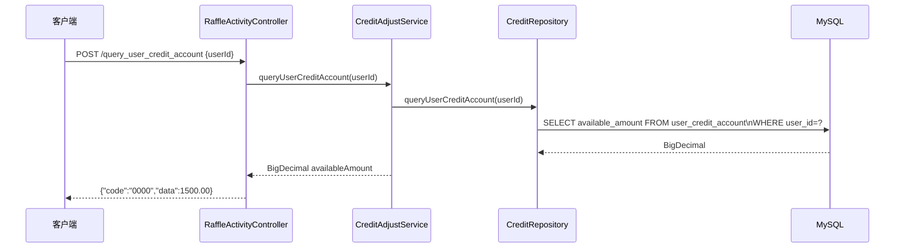
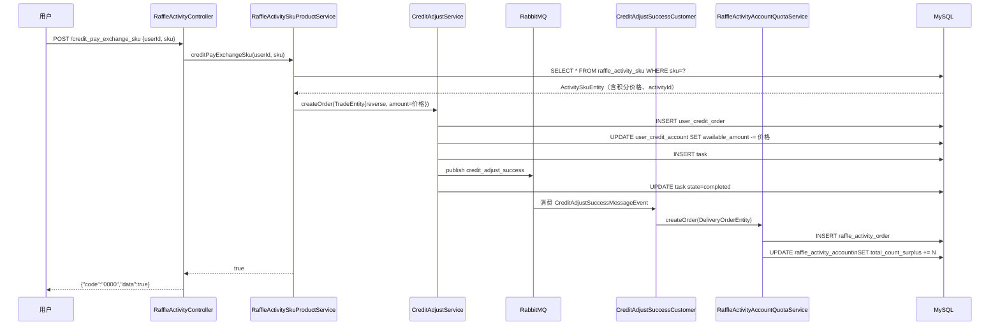

# 02 RaffleActivityController 接口走读

> **控制器**：`cn.bugstack.trigger.http.RaffleActivityController`  
> **文件路径**：`big-market-trigger/src/main/java/cn/bugstack/trigger/http/RaffleActivityController.java`  
> **Base URL**：`/api/v1/raffle/activity/`

---

## 接口总览



---

## 1. GET `/api/v1/raffle/activity/query_stage_activity_id`

### 请求参数

| 参数 | 类型 | 说明 |
|------|------|------|
| `channel` | String | 渠道（如 H5、APP） |
| `source` | String | 来源（如特定入口标识） |

### 调用链路



### 说明

- 用于前端根据渠道和来源自动匹配当前激活的活动 ID
- `raffle_activity_stage` 表记录了渠道/来源与活动 ID 的映射关系

---

## 2. GET `/api/v1/raffle/activity/armory`

### 请求参数

| 参数 | 类型 | 说明 |
|------|------|------|
| `activityId` | Long | 活动 ID |

### 调用链路



---

## 3. POST `/api/v1/raffle/activity/draw`（核心接口）

### 请求参数

```json
{
  "userId": "user001",
  "activityId": 100301
}
```

### 完整调用链路



### 关键领域对象

| 对象 | 方向 | 说明 |
|------|------|------|
| `ActivityDrawRequestDTO` | 入参 | userId、activityId |
| `PartakeRaffleActivityEntity` | 内部 | 参与抽奖活动实体 |
| `UserRaffleOrderEntity` | 内部 | 抽奖订单（含 strategyId） |
| `RaffleFactorEntity` | 内部 | 抽奖入参（userId、strategyId） |
| `RaffleAwardEntity` | 内部 | 抽奖结果（awardId） |
| `UserAwardRecordEntity` | 内部 | 中奖记录 |
| `ActivityDrawResponseDTO` | 出参 | awardId、awardTitle、awardIndex |

### 异常/兜底

| 场景 | 处理 |
|------|------|
| 活动未开启/已过期 | 返回错误码，描述"活动未开启" |
| 总/月/日配额耗尽 | 返回对应错误码 |
| 奖品库存耗尽 | 返回兜底奖品（规则树决定） |
| 用户在黑名单 | 直接返回黑名单奖品 |

### 限流降级（Hystrix/RateLimiter 版本）

- `draw_by_token`：在普通 `draw` 基础上额外验证 Token
- `drawRateLimiterError`：触发限流时调用，返回预设错误提示
- `drawHystrixError`：触发熔断时调用，返回熔断降级响应

---

## 4. POST `/api/v1/raffle/activity/calendar_sign_rebate`

### 请求参数

| 参数 | 类型 | 位置 | 说明 |
|------|------|------|------|
| `userId` | String | Body | 用户 ID |

### 调用链路



### 幂等说明

- `outBusinessNo` = `userId + "_" + 今日日期`（格式如 `user001_20240101`）
- 重复签到时数据库唯一索引拦截，接口幂等返回成功

---

## 5. POST `/api/v1/raffle/activity/is_calendar_sign_rebate`

### 请求参数

| 参数 | 类型 | 说明 |
|------|------|------|
| `userId` | String | 用户 ID |

### 调用链路



---

## 6. POST `/api/v1/raffle/activity/query_user_activity_account`

### 请求参数

```json
{
  "userId": "user001",
  "activityId": 100301
}
```

### 调用链路



### 返回结果

```json
{
  "code": "0000",
  "data": {
    "totalCount": 10,
    "totalCountSurplus": 8,
    "monthCount": 6,
    "monthCountSurplus": 5,
    "dayCount": 2,
    "dayCountSurplus": 1
  }
}
```

---

## 7. POST `/api/v1/raffle/activity/query_sku_product_list_by_activity_id`

### 请求参数

```json
{"activityId": 100301}
```

### 调用链路



---

## 8. POST `/api/v1/raffle/activity/query_user_credit_account`

### 请求参数

| 参数 | 类型 | 说明 |
|------|------|------|
| `userId` | String | 用户 ID |

### 调用链路



---

## 9. POST `/api/v1/raffle/activity/credit_pay_exchange_sku`

### 请求参数

```json
{
  "userId": "user001",
  "sku": 9011
}
```

### 完整调用链路



### 关键依赖组件

| 组件 | 职责 |
|------|------|
| `RaffleActivitySkuProductService` | 查询 SKU 信息，编排兑换流程 |
| `CreditAdjustService` | 扣减用户积分，发布 MQ |
| `CreditAdjustSuccessCustomer` | 异步消费，执行 SKU 发货（增加活动配额） |
| `RaffleActivityAccountQuotaService` | 更新用户活动账户配额 |

### 异常/兜底

| 场景 | 处理 |
|------|------|
| 积分不足 | `CreditAdjustService` 抛出业务异常，返回错误码 |
| SKU 不存在 | 返回参数错误 |
| MQ 发送失败 | `SendMessageTaskJob` 定时重试 |
