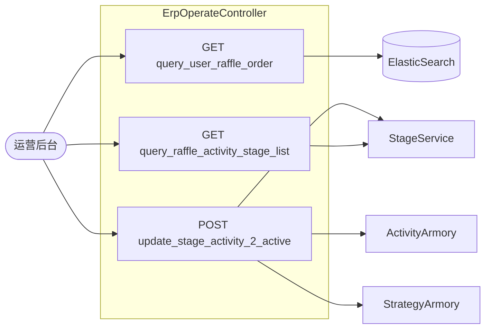
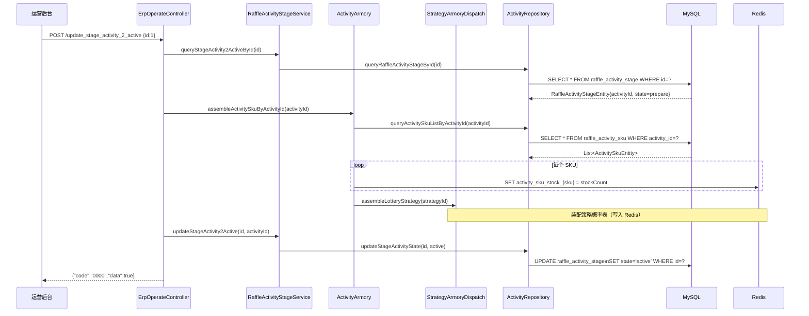
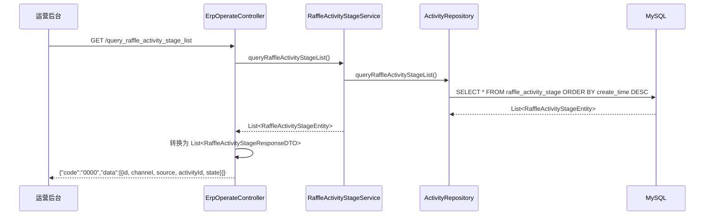
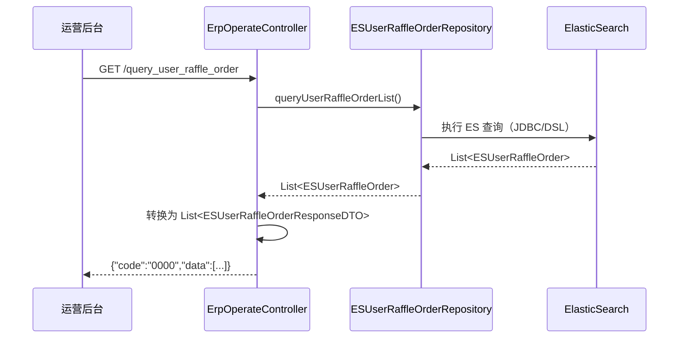

# 03 ErpOperateController 接口走读

> **控制器**：`cn.bugstack.trigger.http.ErpOperateController`  
> **文件路径**：`big-market-trigger/src/main/java/cn/bugstack/trigger/http/ErpOperateController.java`  
> **Base URL**：`/api/v1/raffle/erp/`
>
> **用途**：运营后台（ERP）管理接口，包含活动阶段上线、活动列表查询、用户抽奖订单查询（ElasticSearch）。

---

## 接口总览



---

## 1. POST `/api/v1/raffle/erp/update_stage_activity_2_active`

### 功能说明

将指定的"阶段活动"从 `prepare` 状态更新为 `active`（上线），同时触发活动装配（预热 Redis 缓存）。

### 请求参数

```json
{
  "id": 1
}
```

| 字段 | 类型 | 说明 |
|------|------|------|
| `id` | Long | 阶段活动记录 ID（raffle_activity_stage 表主键） |

### 调用链路



### 关键领域对象

| 对象 | 说明 |
|------|------|
| `UpdateStageActivity2ActiveRequestDTO` | 入参：id |
| `RaffleActivityStageEntity` | 阶段活动实体：id、channel、source、activityId、state |

### 核心处理步骤

1. 根据 `id` 查询阶段活动，获取 `activityId`
2. 调用 `ActivityArmory` 装配活动 SKU 库存（写 Redis）
3. 调用 `StrategyArmoryDispatch` 装配策略概率表（写 Redis）
4. 更新 `raffle_activity_stage.state` → `active`

### 注意事项

- 此接口执行后，前台 `query_stage_activity_id` 才能查到该活动
- 装配操作是幂等的（可重复执行）

---

## 2. GET `/api/v1/raffle/erp/query_raffle_activity_stage_list`

### 功能说明

查询所有阶段活动配置列表，供运营后台展示和管理。

### 请求参数

无（查询全量）

### 调用链路



### 返回结果

```json
{
  "code": "0000",
  "data": [
    {
      "id": 1,
      "channel": "H5",
      "source": "homepage",
      "activityId": 100301,
      "state": "active",
      "createTime": "2024-01-01 10:00:00"
    }
  ]
}
```

---

## 3. GET `/api/v1/raffle/erp/query_user_raffle_order`

### 功能说明

通过 **ElasticSearch** 查询用户抽奖订单记录，支持全文搜索和多条件筛选，用于运营数据分析。

### 请求参数

无（或通过 Query String 扩展）

### 调用链路



### 关键组件

| 组件 | 文件路径 | 说明 |
|------|---------|------|
| `IErpOperateService` | `big-market-api/.../IErpOperateService.java` | ERP 服务接口 |
| `ESUserRaffleOrderRepository` | `big-market-infrastructure/.../ESUserRaffleOrderRepository.java` | ES 仓储实现 |
| `IElasticSearchUserRaffleOrderDao` | `big-market-infrastructure/.../dao/IElasticSearchUserRaffleOrderDao.java` | ES DAO（JDBC 方式） |

### 配置

ES 连接配置位于 `application-dev.yml`：

```yaml
spring:
  elasticsearch.datasource:
    url: jdbc:es://http://192.168.1.109:9200
```

### 返回结果示例

```json
{
  "code": "0000",
  "data": [
    {
      "userId": "user001",
      "activityId": 100301,
      "orderId": "xxx",
      "awardId": 102,
      "awardTitle": "积分奖励",
      "orderTime": "2024-01-01 12:00:00"
    }
  ]
}
```

---

## 接口对比汇总

| 接口 | 数据来源 | 写操作 | 缓存影响 |
|------|---------|--------|---------|
| `update_stage_activity_2_active` | MySQL | ✅ 更新活动状态 | ✅ 写入 Redis 缓存 |
| `query_raffle_activity_stage_list` | MySQL | ❌ 只读 | ❌ 无 |
| `query_user_raffle_order` | ElasticSearch | ❌ 只读 | ❌ 无 |
