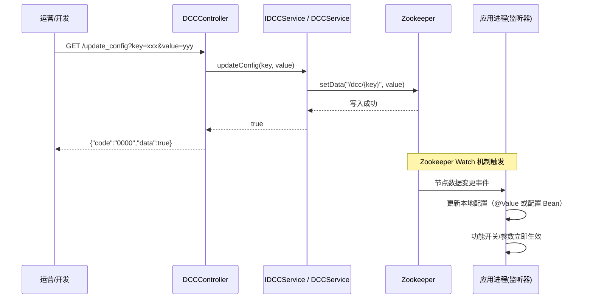
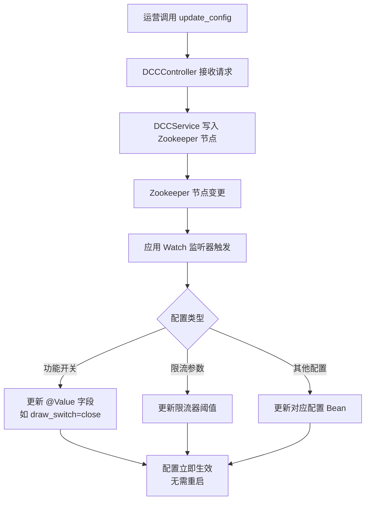

# 04 DCCController 接口走读

> **控制器**：`cn.bugstack.trigger.http.DCCController`  
> **文件路径**：`big-market-trigger/src/main/java/cn/bugstack/trigger/http/DCCController.java`  
> **Base URL**：`/api/v1/raffle/dcc/`
>
> **用途**：动态配置中心（DCC，Dynamic Configuration Center）接口，通过 Zookeeper 实现在线动态变更系统配置（如开关、限流阈值等），无需重启服务。

---

## 1. GET `/api/v1/raffle/dcc/update_config`

### 功能说明

在线更新指定配置项的值。值写入 Zookeeper 节点，应用监听到变更后自动生效。

### 请求参数

| 参数 | 类型 | 位置 | 说明 |
|------|------|------|------|
| `key` | String | Query | 配置项 Key（对应 Zookeeper 节点路径/名称） |
| `value` | String | Query | 配置项新值 |

### 示例请求

```
GET /api/v1/raffle/dcc/update_config?key=draw_switch&value=close
```

---

## 2. 调用链路



---

## 3. 动态配置工作原理



---

## 4. 关键组件

| 组件 | 文件路径 | 说明 |
|------|---------|------|
| `DCCController` | `big-market-trigger/.../http/DCCController.java` | HTTP 入口 |
| `IDCCService`（接口） | `big-market-api/.../IDCCService.java` | DCC 服务接口 |
| Zookeeper 客户端 | `big-market-app/src/main/java/cn/bugstack/config/` | Curator 框架客户端配置 |

---

## 5. 典型使用场景

| 配置 Key | 说明 | 可能的值 |
|---------|------|---------|
| `draw_switch` | 抽奖开关 | `open` / `close` |
| `rate_limiter_threshold` | 限流阈值 | 数字字符串（如 `100`） |
| `hystrix_enable` | 熔断启用开关 | `true` / `false` |

---

## 6. 安全注意事项

- 此接口**直接变更运行时配置**，建议在生产环境添加权限校验（如管理员 Token）
- Zookeeper 节点路径需规划好命名空间，防止误操作覆盖其他配置
- 变更操作应记录审计日志

---

## 7. 返回结果

```json
{"code": "0000", "info": "成功", "data": true}
```

若 Zookeeper 不可用或节点不存在，返回对应错误码：

```json
{"code": "0001", "info": "Zookeeper 连接失败或节点操作异常", "data": null}
```
