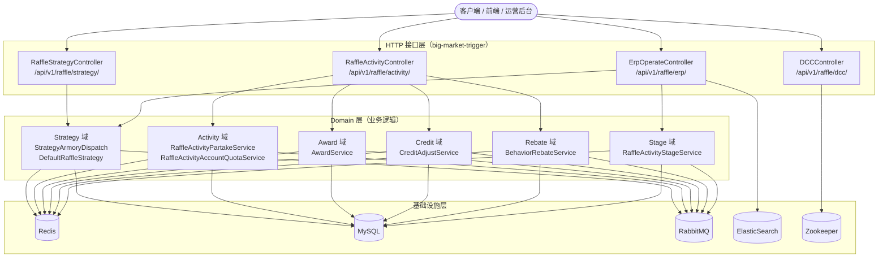

# Big-Market URL 走读解析（接口入口视角）

> 本文档从 **HTTP 接口（URL）入口**视角对 `big-market` 营销抽奖平台进行代码走读，覆盖项目全部对外接口，逐一追踪每个 URL 的请求参数、调用链路、依赖组件和返回结果。

---

## 目录

| 序号 | 控制器 | 文档 |
|------|--------|------|
| [01](./01-抽奖策略接口.md) | `RaffleStrategyController` | 策略装配、奖品列表查询、权重规则查询、随机抽奖 |
| [02](./02-抽奖活动接口.md) | `RaffleActivityController` | 活动装配、参与抽奖、签到返利、积分查询、SKU 兑换 |
| [03](./03-运营管理接口.md) | `ErpOperateController` | 运营管理：活动上线、阶段列表、用户订单查询 |
| [04](./04-配置中心接口.md) | `DCCController` | 动态配置中心（Zookeeper）：在线变更开关/配置 |

---

## 全局接口入口图



---

## 接口汇总

### RaffleStrategyController（`/api/v1/raffle/strategy/`）

| 方法 | URL | 说明 |
|------|-----|------|
| GET | `strategy_armory` | 装配指定策略（预热 Redis） |
| POST | `query_raffle_award_list` | 查询策略奖品列表 |
| POST | `query_raffle_award_list_by_token` | 查询策略奖品列表（Token 认证） |
| POST | `query_raffle_strategy_rule_weight` | 查询权重规则配置 |
| POST | `random_raffle` | 直接执行随机抽奖（测试/内部调用） |

### RaffleActivityController（`/api/v1/raffle/activity/`）

| 方法 | URL | 说明 |
|------|-----|------|
| GET | `query_stage_activity_id` | 根据渠道/来源查询活动 ID |
| GET | `armory` | 装配活动（SKU 预热） |
| POST | `draw` | 执行抽奖（核心接口） |
| POST | `draw_by_token` | 执行抽奖（Token 认证） |
| POST | `calendar_sign_rebate` | 日历签到返利 |
| POST | `calendar_sign_rebate_by_token` | 日历签到返利（Token 认证） |
| POST | `is_calendar_sign_rebate` | 查询今日是否已签到 |
| POST | `is_calendar_sign_rebate_by_token` | 查询今日是否已签到（Token 认证） |
| POST | `query_user_activity_account` | 查询用户活动账户 |
| POST | `query_user_activity_account_by_token` | 查询用户活动账户（Token 认证） |
| POST | `query_sku_product_list_by_activity_id` | 查询 SKU 商品列表 |
| POST | `query_user_credit_account` | 查询用户积分账户 |
| POST | `query_user_credit_account_by_token` | 查询用户积分账户（Token 认证） |
| POST | `credit_pay_exchange_sku` | 积分兑换 SKU |
| POST | `credit_pay_exchange_sku_by_token` | 积分兑换 SKU（Token 认证） |

### ErpOperateController（`/api/v1/raffle/erp/`）

| 方法 | URL | 说明 |
|------|-----|------|
| GET | `query_user_raffle_order` | 查询用户抽奖订单（ES） |
| POST | `update_stage_activity_2_active` | 将阶段活动上线 |
| GET | `query_raffle_activity_stage_list` | 查询所有阶段活动列表 |

### DCCController（`/api/v1/raffle/dcc/`）

| 方法 | URL | 说明 |
|------|-----|------|
| GET | `update_config` | 更新动态配置（Zookeeper） |

---

## 公共响应格式

所有接口均返回统一包装对象：

```json
{
  "code": "0000",
  "info": "成功",
  "data": { /* 业务数据 */ }
}
```

错误时 `code` 为对应错误码，`info` 为错误描述，`data` 为 null。

---

## 认证机制

部分接口提供 `_by_token` 版本：
- 请求头携带 JWT Token（由 `AuthService` 验证）
- Token 解析出 `userId` 后，透传到业务层
- 无 Token 版本直接接收 `userId` 请求参数（适用于内部服务调用或测试）
